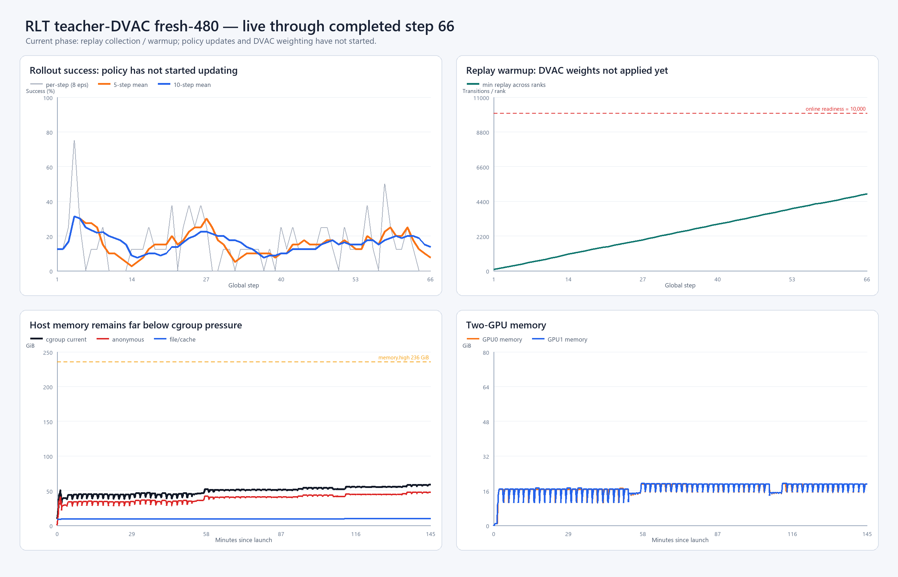

# RLT teacher-DVAC fresh-480：g69简要现场

现场时间：2026-08-24 21:22:39 CST  
操作边界：只读刷新与本地离线作图；没有干预训练。

## 1. 当前结论

- 最新完整cycle为`69/480`（14.4%），下一轮rollout已经开始；wrapper、driver、monitor和6个核心Ray worker
  均存活。
- 当前仍是原RLT的replay warmup：每rank最小replay=`5,097/10,000`，actor/critic update均为0。
- DVAC baseline count约51,600，但`baseline_frozen=0`；所以`[0,2]`权重尚未进入student actor更新。
- g25与g50两个checkpoint均存在；两次fixed-20评估均为`0/20`。
- 精确fatal计数中CUDA OOM、NCCL error/timeout、RayTaskError、WorkerCrashedError和OutOfMemoryError均为0。

因此当前运行机制正常，但现在还不能评价DVAC加权效果：策略尚未开始RL更新。

## 2. 训练与资源快照

图的数据快照截至完整g66；最终存活探针随后确认已到g69。

截至g66：

- training-rollout success累计=`15.15%`，最新5/10步均值=`7.5%/13.75%`；每步只有8条episode，波动较大；
- replay已达到readiness的48.75%，尚未开始actor/critic更新；
- cgroup峰值=`58.54 GiB`，其中最新anonymous约`48.01 GiB`、file/cache约`9.84 GiB`；
- EnvWorker RSS合计约`29.31 GiB`；GPU0/1峰值=`19.31/19.51 GiB`；
- `memory.events high/max/oom/oom_kill`和memory PSI均为0。

当前约40--59 GiB范围内的周期小齿发生在`MemoryHigh≈236 GiB`远下方，因此这段图中的小齿主要反映
环境生命周期/offload与重新分配；cgroup高水位约束尚未触发。

## 3. 本地证据

- 原始训练指标：`evidence/rlt_dvac_formal_live_g65_20260824/raw/metrics.log`
- 原始资源采样：`evidence/rlt_dvac_formal_live_g65_20260824/raw/resources.csv`
- 逐cycle派生表：`evidence/rlt_dvac_formal_live_g65_20260824/step_metrics.csv`
- 机器可读摘要：`evidence/rlt_dvac_formal_live_g65_20260824/summary.json`

