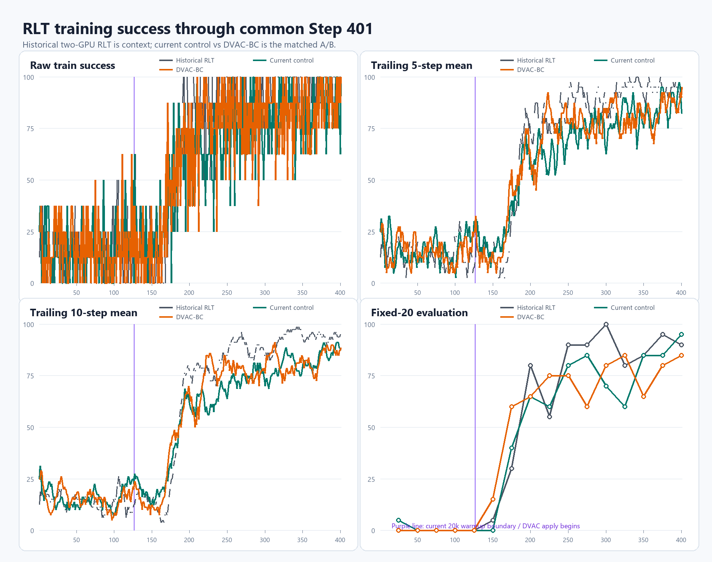

# RLT matched-width live snapshot

刷新时间：2026-08-27 18:00 CST。只读现场，不改变训练。

- control / DVAC-BC：完整 Step `403 / 406`，两条 wrapper 均存活；fatal、CUDA OOM、OOM-kill均为0。
- train success：control累计/末5/末10=`49.10/82.50/88.75%`；DVAC-BC=`50.59/82.50/88.75%`。
- fixed20 Step400：control=`19/20`，DVAC-BC=`17/20`；单点不代表最终效果。
- DVAC-BC权重：p05/mean/p95=`0.745/1.000/1.252`，ESS=`0.977`。
- 资源：RAM当前/峰值=`235.6/236.1 GiB`（cgroup max 240 GiB）；GPU当前=`24.7/18.1 GiB`，峰值=`25.2/25.1 GiB`。
- 时间：control / DVAC-BC ETA约`5h39m / 5h23m`。

同轴图使用两边共同完整到Step401的数据：历史RLT、当前control和DVAC-BC的逐步、5步、10步train success及fixed20。数据见`success_curves.csv`和`summary.json`。

