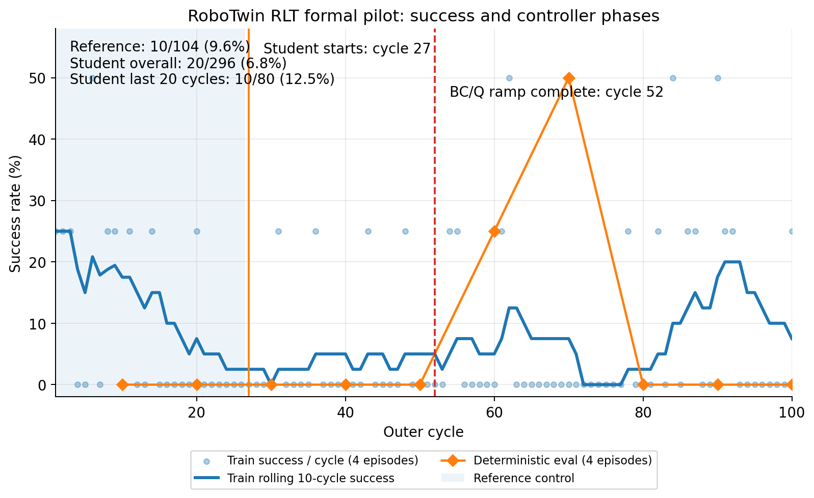
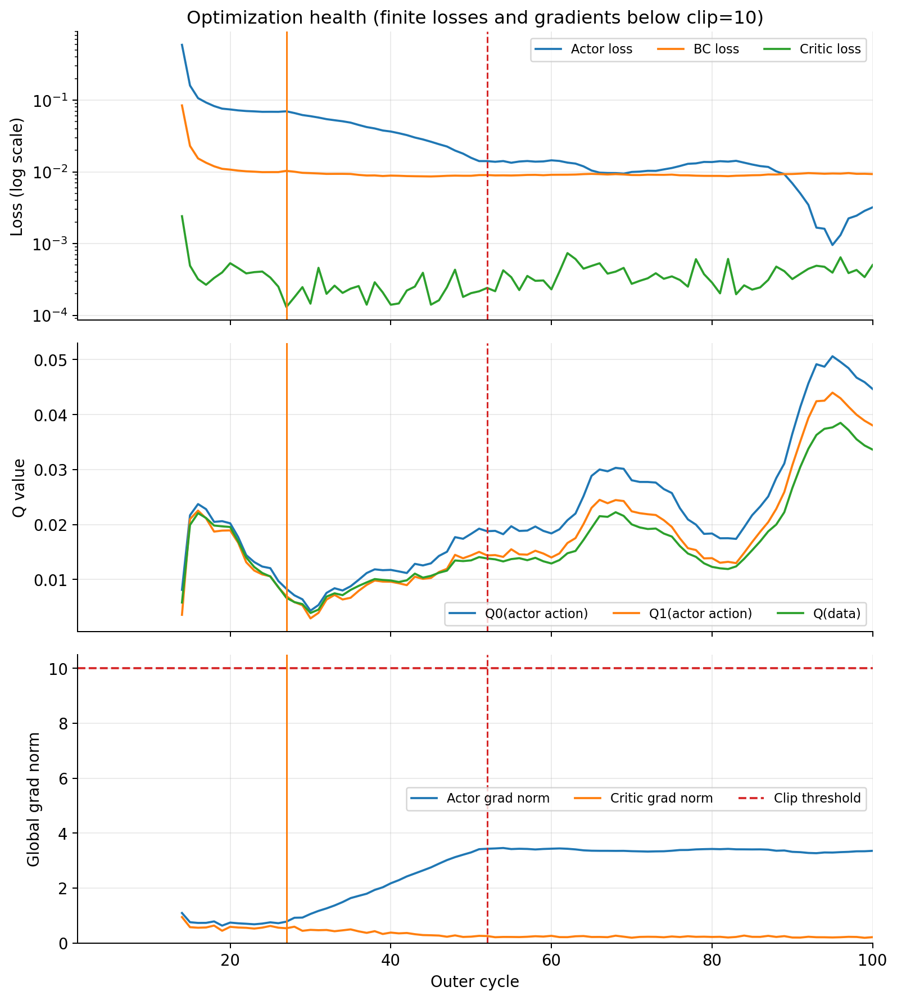
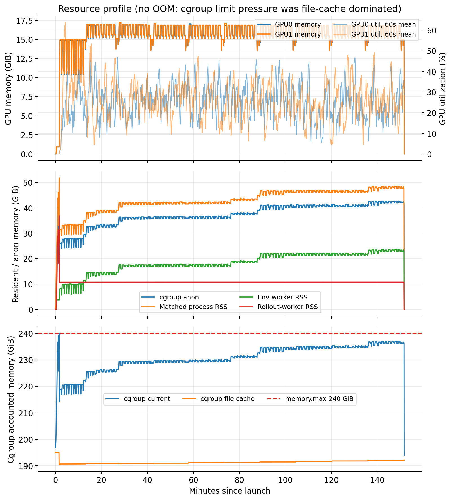
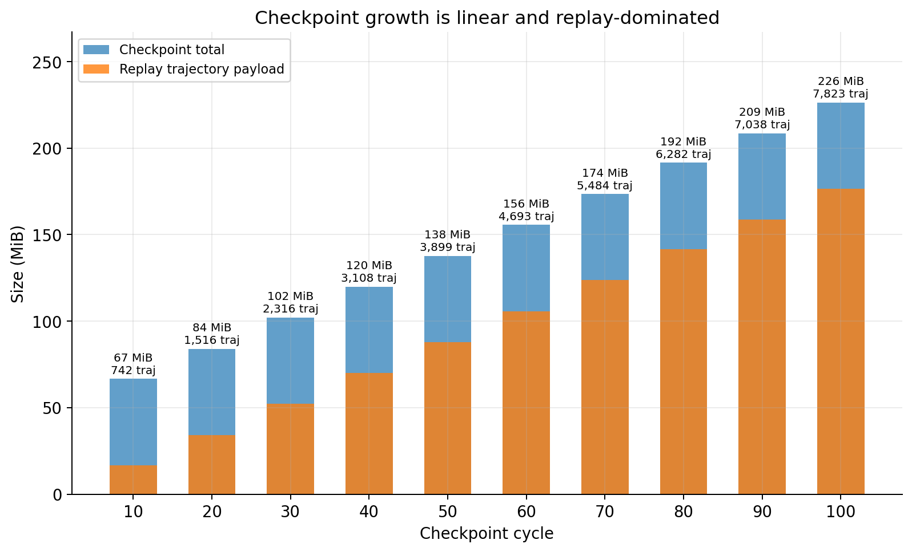

# RoboTwin RLT Stage 2：100-cycle pilot 完成报告

> 2026-07-30 预算口径更正：本 run 永久归类为 **pilot**。它的 400 条 train episodes
> 位于 RLT 论文公开 400–1000 episodes 的下界，并非因为低于 ManiSkill YAML 的
> 5,000-cycle 最大容量就“少 50 倍”；但启动前没有完成多轴规模审批、长期 schedule
> 覆盖不足且每个 eval 点只有 4 条，因此不能作为完整 formal 效果验收。下一次设计见
> [`09_STAGE2_NEXT_FORMAL_SCALE_DESIGN_20260730.md`](09_STAGE2_NEXT_FORMAL_SCALE_DESIGN_20260730.md)。

> 服务器现场观察时间：`2026-07-30T09:54:24+08:00`
> 任务：RoboTwin `adjust_bottle`，不是 ManiSkill。ManiSkill 仅用于核对 RLinf
> 参考实现和量级，不进入本次运行配置。

## 1. 一句话结论

本次 pilot **计算与优化健康，且出现了学习信号，但效果尚未验收通过**：

- 100/100 cycles 正常完成，`exit_code=0`，总时长 2 小时 31 分 44 秒；
- 无 CUDA OOM、NCCL fatal、Ray actor death 或 NaN metric；
- student 最后 20 cycles 的随机 train rollout 成功率为 `10/80=12.5%`，高于
  student 最初 20 cycles 的 `3/80=3.75%`；
- deterministic eval 在 cycle 60、70 分别达到 `1/4`、`2/4`，说明并非完全没有
  学习信号；
- 但 cycle 80、90、100 连续为 `0/4`，最终 endpoint 也是 `0/4`；每次只评 4 条，
  方差很大，不能宣称性能已经稳定改善。

因此 100 cycles 对“低预算 pilot 是否跑通、是否跨过 warm-up/ramp、是否产生学习趋势”
已经足够；对“checkpoint 是否优于 reference、训练是否已经够”仍不够。下一项信息量最高
的工作不是盲目续训，而是用相同固定种子独立评估 reference、checkpoint 70 和 100，
每个至少 20 episodes。

## 2. 运行身份与终态

| 项目 | 现场值 |
|---|---|
| branch / HEAD | `codex/rlt-pi0-robotwin` / `2df23e7f4b3d19d4f0dedab32168767a32845a58` |
| worktree | clean；相对 upstream `0/1`，领先项为既有 docs-only commit |
| started / finished | `2026-07-30T01:15:54+08:00` / `03:47:38+08:00` |
| wall clock | `9,104 s = 2h31m44s` |
| reserved GPU-hours | `5.058`（2 GPUs × wall time） |
| cycles | `100/100` |
| exit | `0` |
| 终态进程 / GPU | 无目标 RLT/Ray 进程；两卡均 `0 MiB / 0%` |
| fatal scan | CUDA OOM 0；NCCL fatal 0；actor death 0；NaN metric 0 |

启动前的 7–10 小时估计明显偏保守。实际稳定 cycle 约由 60 秒 rollout 加约 25 秒更新
构成；每 10 cycles 的 eval 再增加约 67–72 秒。初始化成本只发生一次，因此整段运行比
从 smoke 外推快得多。

## 3. 数据量、阶段和更新量

| 项目 | 完成量 |
|---|---:|
| train episodes | 400（4 env × 100 cycles） |
| eval episodes | 40（每 10 cycles × 4 env） |
| replay macro transitions | 7,821（rank 0/1 为 3,921/3,900） |
| critic optimizer updates | 34,800 |
| actor optimizer updates | 17,400 |
| warm-up anchor | 56 episodes / 1,043 macro transitions |
| 首个 critic 训练 cycle | 14 |
| student 接管 cycle | 27 |
| BC/Q ramp 完成 cycle | 52 |
| 最终 BC/Q 权重 | `2.5 / 0.45` |
| 最终 desired / completed updates | 38,890 / 34,800 |
| 最终 pending update budget | 4,090 |

`pending=4,090` 不是漏跑或崩溃。首次达到 ready 时，5,000-update floor 只能按
`max_updates_per_train_step=400` 分周期执行；之后满长周期新增约 400 desired updates，
也正好被 cap 400 消化，所以旧的约 4.1k debt 保持到终点。若后续续训，合同会从
lifetime counters 和 `update_step` 重新计算它；本轮按用户决定没有做 resume。

H/C/D 为 `50/10/14`。按 C=10，7,821 个 macro transition 最多对应约 78,210 个
action slots；这不是 simulator 精确物理步计数。

## 4. 成功率：有什么、结果怎样

本次确实记录了成功率：

- `env/success_once`：train rollout 中每个 episode 是否曾达到成功；
- `eval/success_once`：deterministic student eval 中是否曾达到成功；
- `success_at_end` 也存在，本次与 `success_once` 数值相同。

### 4.1 汇总

| 切片 | 成功 / episodes | 成功率 |
|---|---:|---:|
| 全部 train rollout | 30 / 400 | 7.50% |
| reference 控制阶段，cycles 1–26 | 10 / 104 | 9.62% |
| student 控制阶段，cycles 27–100 | 20 / 296 | 6.76% |
| student 最初 20 cycles，27–46 | 3 / 80 | 3.75% |
| student 最后 20 cycles，81–100 | 10 / 80 | 12.50% |
| 全部 deterministic eval | 3 / 40 | 7.50% |

train 是带固定 Gaussian 探索噪声、随训练变化的 rollout；eval 是 deterministic mean
policy 和固定 reset。reference 阶段也不是一套独立的 reference-only 固定种子评测，
所以不能把 `9.62%` 与 student `6.76%` 当作严格 A/B。

### 4.2 每 10 cycles 的 deterministic eval

| cycle | 成功 / 4 | rate |
|---:|---:|---:|
| 10 | 0 / 4 | 0% |
| 20 | 0 / 4 | 0% |
| 30 | 0 / 4 | 0% |
| 40 | 0 / 4 | 0% |
| 50 | 0 / 4 | 0% |
| 60 | 1 / 4 | 25% |
| 70 | 2 / 4 | 50% |
| 80 | 0 / 4 | 0% |
| 90 | 0 / 4 | 0% |
| 100 | 0 / 4 | 0% |

4 episodes 太少：`0/4` 的 95% Wilson 上界仍约 49%，`2/4` 的区间也约为 15%–85%。
即使把十次 eval 合并，`3/40=7.5%` 的区间仍约为 2.6%–19.9%。因此：

- cycle 60/70 说明训练产生过可执行的成功行为；
- student train tail 改善说明后半段学习信号增强；
- cycle 70 不能仅凭 `2/4` 被正式选为 best checkpoint；
- endpoint 100 的 `0/4` 也不能仅凭 4 条判死刑；
- 当前证据不足以断言“训练不够”还是“后期 ramp/过训练导致退化”。

## 5. 优化指标是否正常

共有 87 个 train-update 指标点，对应 cycles 14–100。

| 指标 | 首值 | 最后 10 点均值 | 末值 | 判断 |
|---|---:|---:|---:|---|
| actor loss | 0.5913 | 0.00248 | 0.00320 | finite，快速下降后稳定 |
| critic loss | 0.002409 | 0.000448 | 0.000502 | finite，无爆炸 |
| BC loss | 0.08452 | 0.009468 | 0.009321 | reference 锚定稳定 |
| Q0 | 0.00810 | 0.04709 | 0.04467 | 随训练上升 |
| Q1 | 0.00356 | 0.04048 | 0.03804 | 与 Q0 接近但不完全相同 |
| replay action 的 Q | 0.00579 | 0.03549 | 0.03363 | 随训练上升 |
| actor grad norm | 1.089 | 3.308 | 3.352 | 峰值 3.456，低于 clip 10 |
| critic grad norm | 0.942 | 0.207 | 0.210 | 峰值 0.942，低于 clip 10 |

这些指标支持“数值训练健康”：loss 有限、梯度未顶 clip、双 Q 没有完全坍缩成相同输出。
但 sparse reward 下大量 target 接近零，critic loss 很小也可能只是容易拟合零回报，
不能单独证明 Q 的排序对策略有用。最终效果仍以独立成功率评估为准。

## 6. 并行有没有顶满

结论是：**两张 GPU 都被对称使用，但 GPU 并行远未顶满；当前主要受 rollout /
simulator 和 train/collect 交替影响，不是显存或纯 GPU 算力瓶颈。**

| 资源 | GPU 0 | GPU 1 | 解释 |
|---|---:|---:|---|
| 显存峰值 | 17,543 MiB | 17,626 MiB | 各约占 80 GiB 的 21.4%/21.5% |
| active mean util | 25.59% | 26.17% | 大部分时间不是连续 GPU 计算 |
| util peak | 100% | 100% | 更新/推理阶段有短时满载 |
| median 显存 | 约 15.9 GiB | 约 16.0 GiB | 两 rank 负载均衡 |

CPU/RAM 侧：

| 指标 | 峰值 / 最低值 |
|---|---:|
| matched process RSS | 51.78 GiB |
| env-worker RSS | 23.59 GiB |
| rollout RSS（含初始化瞬态） | 36.87 GiB |
| cgroup anon | 47.47 GiB |
| cgroup file cache | 195.05 GiB |
| cgroup memory current | 约 240.00 GiB |
| cgroup memory.max | 240 GiB |
| host available 最低 | 933.40 GiB |
| cgroup `high` / OOM / OOM-kill 增量 | 0 / 0 / 0 |

整机 RAM 很充足，真实匿名内存也正常；但 cgroup current 曾被约 195 GiB 的可回收 file
cache 顶到 240 GiB 上限，并产生 23,372 次 `memory.events:max`。这不是 OOM，也没有杀进程，
但说明不能只看 17.6 GiB 显存就直接把 4 env 扩到 8/16。扩大 env 并发有机会减少 GPU
等待，但应先做单独的 6/8-env 资源 smoke 或处理 cache/limit，不能在正式科学比较中顺手改。

## 7. 产物有哪些、占多少

### 7.1 服务器权威路径

- run root：
  `/root/autodl-tmp/experiments/rlt_stage2_formal_100c_20260730_v1`
- experiment：
  `/root/autodl-tmp/experiments/rlt_stage2_formal_100c_20260730_v1/robotwin_adjust_bottle_rlt_stage2_formal_100c_v1`
- runtime：
  `/root/autodl-tmp/experiment_exports/rlt_stage2_formal_100c_20260730_v1/runtime`
- TensorBoard：
  `/root/autodl-tmp/experiments/rlt_stage2_formal_100c_20260730_v1/tensorboard`

### 7.2 体积和内容

- run root 总计 `1,541,864,422 bytes`，约 1.44 GiB；
- checkpoint 共 10 个：`global_step_{10,20,...,100}`；
- 10 个 completion manifest 均为 `complete=true`，world size 2；
- 最终 checkpoint `237,293,208 bytes`，约 226.3 MiB；
- 其中 trajectory/replay `184,948,025 bytes`，约 176.4 MiB，共 7,823 个文件；
- 最终 checkpoint 还包括两个 rank 的 DCP、聚合 actor 权重、target model、trainer state、
  replay metadata 和 completion manifest；
- 整个 run 的 `.pt` 文件 42,931 个，主要是各 checkpoint 的 replay snapshot；
- 没有保存视频或图片，因此现有产物不能做失败动作的视觉诊断。

checkpoint 体积从 step 10 的 66.6 MiB 线性增长到 step 100 的 226.3 MiB，主要由 replay
增长驱动；不是模型权重重复膨胀或 checkpoint 泄漏。

本地保存了完整日志、TensorBoard、资源 CSV、十份 completion manifest、最终 trainer
state/replay metadata，以及派生 CSV/JSON/PNG；未复制大 checkpoint 和 replay：
[`status_20260730_0954/README.md`](evidence/stage2_formal_100c_20260730/status_20260730_0954/README.md)。

## 8. ManiSkill 训练量对应本项目多少

锁定的 RLinf ManiSkill Stage 2 可执行 YAML 是：

- 5,000 outer cycles；
- 64 train env、256 eval env；
- 每 cycle 最多 500 primitive steps/env；
- action chunk 10；
- `update_epoch=5`、`train_every_transitions=5`，在当前同步 worker 中是有效
  macro-UTD 1；
- critic:actor 为 4；
- warm-up 为 10k replay rows/rank 和 30k critic updates；
- per-cycle update cap 也为 400。

不同“步”口径会给出完全不同的倍数：

| 口径 | ManiSkill reference | 本次 RoboTwin | 粗略倍数 |
|---|---:|---:|---:|
| outer cycles | 5,000 | 100 | 50× |
| train env-cycles | 320,000 | 400 | 800× |
| 最大 primitive/action slots | 160,000,000 | 80,000 | 2,000× |
| 最大 macro chunks | 16,000,000 | 约 8,000；实际 7,821 | 约 2,000× |
| critic updates 上界 | 2,000,000 | 34,800 | 约 57.5× |
| actor updates 上界 | 500,000 | 17,400 | 约 28.7× |

ManiSkill 的更新数写成“上界”，因为 5,000 cycles × cap 400 不代表每个周期实际都达到
cap；官方示例没有在这里给出一条已完成 run 的最终 counters。

不能把 5,000 ManiSkill cycles 机械换成约 200,000 RoboTwin cycles：

1. ManiSkill 是 GPU 并行 simulator，64 env；RoboTwin 当前只有 4 env；
2. ManiSkill route 只记录 simulator-specific critical phase；本项目 full-task route
   记录全任务；
3. 动作、episode、reward、任务难度和 base policy 都不同；
4. 本项目采用 macro-UTD5、critic:actor=2，单条交互比 ManiSkill YAML 做更多更新；
5. RoboTwin simulator/query 的 wall-clock 成本也完全不同。

所以这些倍数只说明本 pilot **远小于 ManiSkill 参考规模**，不定义我们必须复制的预算。

## 9. RLT 采样高效，100 cycles 是否可能已经够

RLT 的采样效率来源于：冻结大 VLA 表征，只在线训练小 actor/twin-Q；利用 reference
动作作 BC 锚点；把环境交互存进 replay 并以较高 UTD 复用。论文/项目页报告的是在预训练
π0.6、任务关键阶段和真机设置下，用数小时实践快速改善，而不是“任意移植跑 100 cycles
就必然收敛”。

本项目和论文条件有重要偏离：

- π0 RoboTwin，而不是论文的 π0.6 真机系统；
- full-task route，没有 ManiSkill geometry gate，也没有论文中的人类 critical-phase
  supervision；
- Stage 1 只有 clean-50，是低预算 task-specific token artifact；
- success 稀疏，且每个 checkpoint 只有 4 条 deterministic eval。

综合判断：

- **对工程 pilot：够。** 已经过 warm-up、student switch 和完整 BC/Q ramp，获得 74 个
  student cycles、34.8k critic updates，足以发现 crash、数值不稳和完全不学习。
- **对“存在学习信号”：基本够。** eval 曾非零，student train tail 从 3.75% 到 12.5%。
- **对“已经比 reference 好”：不够。** 没有同 seed reference-only baseline，eval 太少。
- **对“最佳 checkpoint / 是否过训练”：不够。** cycle 70 的 2/4 与 endpoint 的 0/4
  都处在极宽置信区间。
- **对“正式性能结论”：明显不够。** 既未达到 ManiSkill 参考量级，也没有稳定成功率。

因此现在不应在“已经足够”和“直接补到 5,000 cycles”之间二选一。先做小而严格的独立
评估，可以决定后续是：

1. checkpoint 70 稳定优于 100：重点检查 ramp、后期 Q 偏移或过训练；
2. 70/100 都优于 reference 但置信度不足：再按固定预算续训/增加 eval；
3. 都不优于 reference：优先检查 route、reward、token/usefulness，而不是只加步数。

## 10. 建议的下一道门

不改变训练状态，另开 deterministic evaluation：

- controllers：frozen reference/base、checkpoint 70、checkpoint 100；
- 相同的至少 20 个固定 seeds/controller；
- 报 `success_once`、`success_at_end`、置信区间和逐 seed 配对结果；
- 可选只为失败诊断保存少量视频，不扩大训练 sweep。

这是约 60 个 evaluation episodes，信息量高于立即再跑 100 或 1,000 个训练 cycles。
本报告只做了服务器只读审计、证据下载和本地分析，没有启动新评估、续训、resume 或删除
任何服务器产物。
