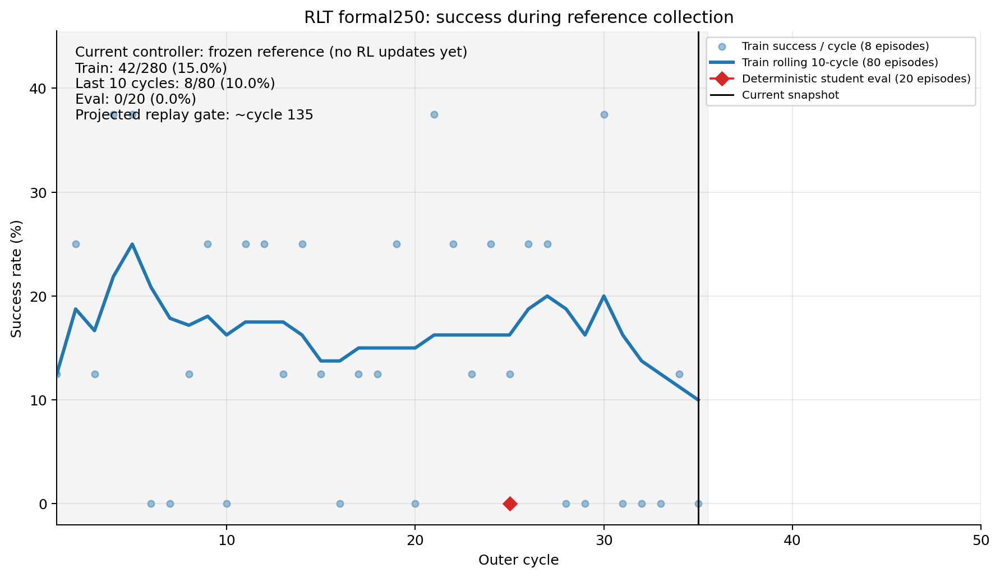
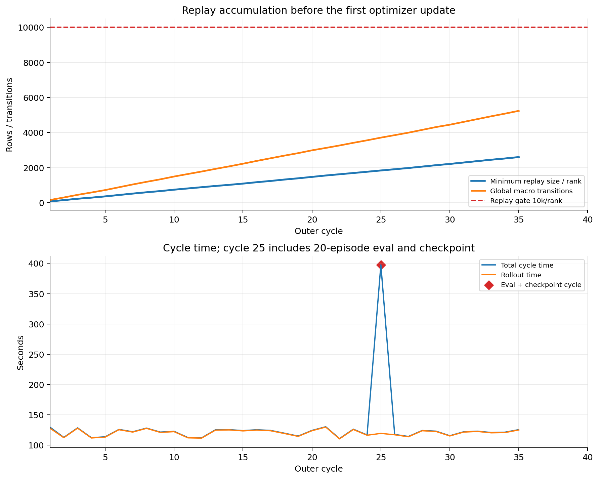
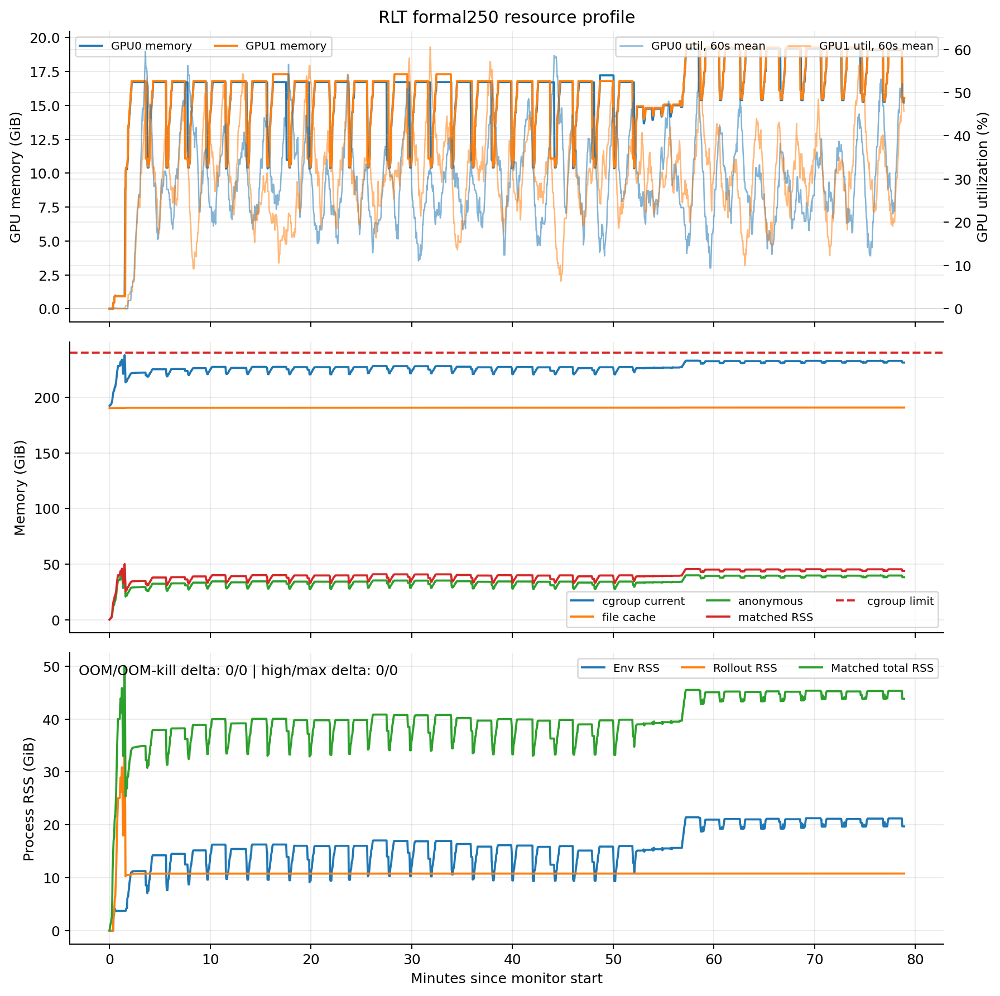

# RoboTwin RLT Stage 2 formal250：运行中状态

> 服务器审计时间：2026-07-30 12:53:54+08:00
> 本地证据冻结时间：2026-07-30 12:56:18+08:00
> 这是运行中快照；后续状态必须重新只读刷新

## 1. 结论

训练仍健康运行，但现在还在 **frozen π0 reference 收集 replay** 的阶段，尚未开始
actor/critic 优化。因此：

- driver `154857`、monitor `154858` 与唯一训练进程均存活；
- console 已完成 cycle 36/250；TensorBoard稳定落盘到cycle 35，二者相差1个flush；
- TensorBoard已有280条train episodes、20条deterministic eval episodes和5,237条
  global macro transitions；
- 较慢rank replay为2,599/10,000，warm-up完成26.0%；按当前斜率约在cycle 135过门；
- `update_step=0`、critic/actor updates均为0、actor switch为0，完全符合配置；
- 没有CUDA OOM、NCCL fatal、NaN/Inf、Ray rank death或cgroup OOM；
- 当前没有触发任何停止条件，应继续运行。

runner显示的`ETA 07:38`只按当前无optimizer阶段外推，偏乐观。启动前完整预算估计仍更可信：
从11:37起约10–13小时，即大致在21:30–次日00:30完成；进入30k critic floor后每cycle会变慢。

## 2. 成功率与阶段



| 指标 | 当前值 | 解释 |
|---|---:|---|
| train success | 42/280 = 15.0% | 全部由frozen π0 reference控制，不是RLT student成绩 |
| 最近10 cycles | 8/80 = 10.0% | 样本仍少；不能据此声称reference退化 |
| cycle25 eval | 0/20 | eval始终强制deterministic student；此时student尚未训练，因此0/20不异常 |
| actor switch | 0 | 尚未交给student |
| critic / actor updates | 0 / 0 | replay门未到，符合合同 |

train raw点每个包含8条episode，所以步长为12.5%；蓝线是最近10 cycles、即80条episode的
滚动成功率。红点是同一个20-seed bank上的deterministic student eval，步长为5%。
下一次eval在cycle50。

## 3. Replay、吞吐和周期耗时



| 指标 | 当前值 |
|---|---:|
| global macro transitions | 5,237 |
| 平均macro/cycle | 149.63 |
| min replay/rank | 2,599 |
| replay gate进度 | 25.99% |
| 预计过10k门 | 约cycle135 |
| 最近10 cycles总耗时均值 | 120.68s |
| 最近10 cycles rollout均值 | 120.22s |
| cycle25总耗时 | 397.52s |
| cycle25 eval本身 | 272.81s |
| 当前采样吞吐 | 约213 train episodes/h、3,983 macros/h |

cycle25同时执行20条eval和第一个checkpoint，因此出现约398秒尖峰；其余周期约2分钟且平稳。
过replay门后会先追30k critic floor，此后才出现actor/critic loss、Q和梯度指标。

## 4. 资源



| 指标 | 当前 / 峰值 |
|---|---:|
| GPU0显存 | 15,837 / 19,641MiB |
| GPU1显存 | 15,920 / 19,976MiB |
| 两卡active mean util | 30.1% / 31.2% |
| matched RSS | 43.83 / 50.02GiB |
| env RSS | 19.70 / 21.43GiB |
| rollout RSS | 10.79 / 35.00GiB |
| cgroup anon | 38.20 / 45.32GiB |
| cgroup file cache | 190.76 / 190.76GiB |
| cgroup current | 231.23 / 237.91GiB |
| host available最低 | 936.22GiB |
| 数据盘available | 824.21GiB |
| high / max / OOM / OOM-kill增量 | 0 / 0 / 0 / 0 |
| 当前memory PSI | some/full均0 |

两卡负载对称，显存峰只约80GiB容量的24%。cycle25 exact-20 eval后，env/matched RSS从约
16/40GiB升到约21/45GiB；最近300个资源点已在19.4–21.3/43.5–45.4GiB内周期波动，
没有继续单调增长。由于目前只有一次20-episode eval，下一次cycle50应重点确认是否再出现
新的永久阶梯。

`cgroup current`接近240GiB仍主要由约190.8GiB file cache构成；本次运行期间
`high/max`计数没有新增，OOM为0、PSI为0，因此没有新的回收压力证据，也不应手工
`drop_caches`。

## 5. 产物

运行入口：

```text
/root/autodl-tmp/experiments/rlt_stage2_formal_8env_250c_20260730_v1
/root/autodl-tmp/experiment_exports/rlt_stage2_formal_8env_250c_20260730_v1/runtime
```

12:53时run root为140,630,856 bytes（134.12MiB）。主要运行产物：

| 产物 | 当前状态 |
|---|---|
| `driver.log` | 12:56副本258,287 bytes；持续增长 |
| `metrics.log` | 214,814 bytes |
| `resources.csv` | 343,878 bytes，2,085行，median采样间隔2秒 |
| TensorBoard event | 114,493 bytes；57个scalar tags |
| resolved/provenance/budget/stop contract | 均存在，resolved SHA仍为`586644cd...f2a3e` |
| `finished_at.txt` / `exit_code.txt` | 运行中不存在，正常 |

第一个checkpoint：

```text
global_step_25
bytes=140,307,188
files=3,722
completion=true
actor_world_size=2
update_step=0
contract_sha256=82cd409b...cad1fc9
rank0 replay=1,874
rank1 replay=1,835
```

双rank trainer state均存在且各4,580 bytes。checkpoint在warm-up前保存，故
`update_step=0`、warm-up anchors为null正确。下一个checkpoint为cycle50。

Git现场仍为：

```text
branch=codex/rlt-pi0-robotwin
HEAD=46a2d19bae629eaa57830f5faeac71ac81a1a494
worktree=clean
HEAD vs upstream=0 behind / 2 ahead
```

push仍因先前GitHub大陆线路超时而延后，不影响活进程加载的代码与provenance。

## 6. 非阻塞提示与下一检查点

日志中2个traceback来自两个EnvWorker初始化时可选Curobo模块缺失
`curobo.types.math`；这与资源smoke相同。其后真实rollout、20条eval和checkpoint均成功，
所以不是训练异常。

下一次高信息量检查建议在以下任一节点：

1. cycle50之后：核验第二次20-seed eval、第二个checkpoint和eval后RSS是否再阶梯增长；
2. min replay接近10k/cycle约135：确认首次critic updates、loss/Q/grad全部finite；
3. `update_step>=30k`：确认student真正接管；阶段边界以实际tag为准，不靠预计cycle。

本地高信息量副本位于：

[`evidence/stage2_formal_8env250_20260730/status_20260730_1254/`](evidence/stage2_formal_8env250_20260730/status_20260730_1254/)

只下载18个小文件，共962,772 bytes；没有下载replay payload或大checkpoint。
