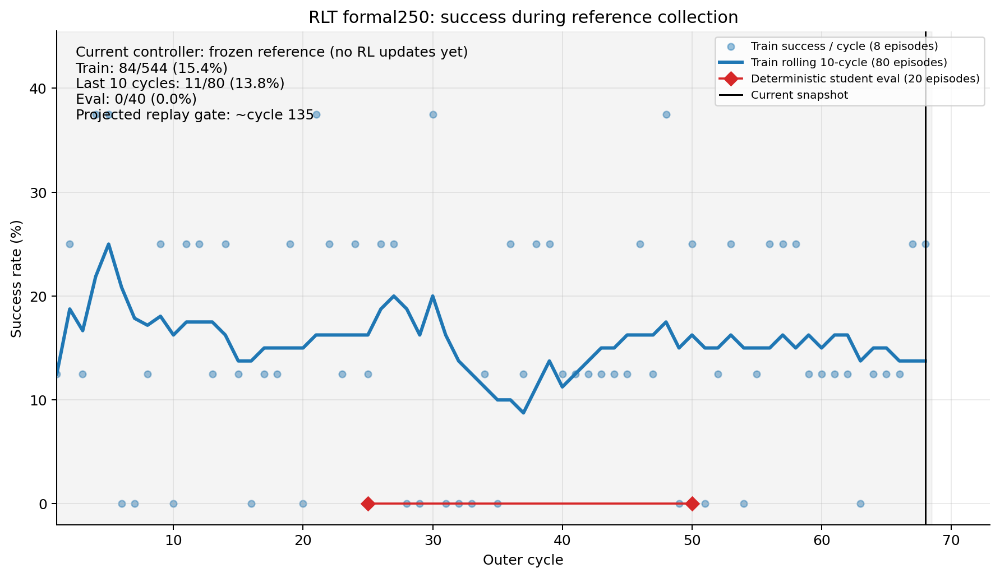
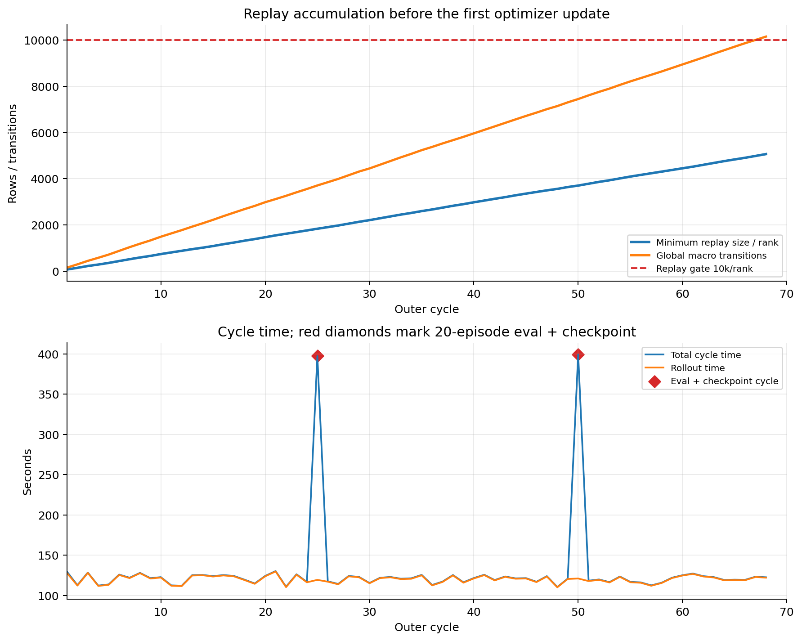
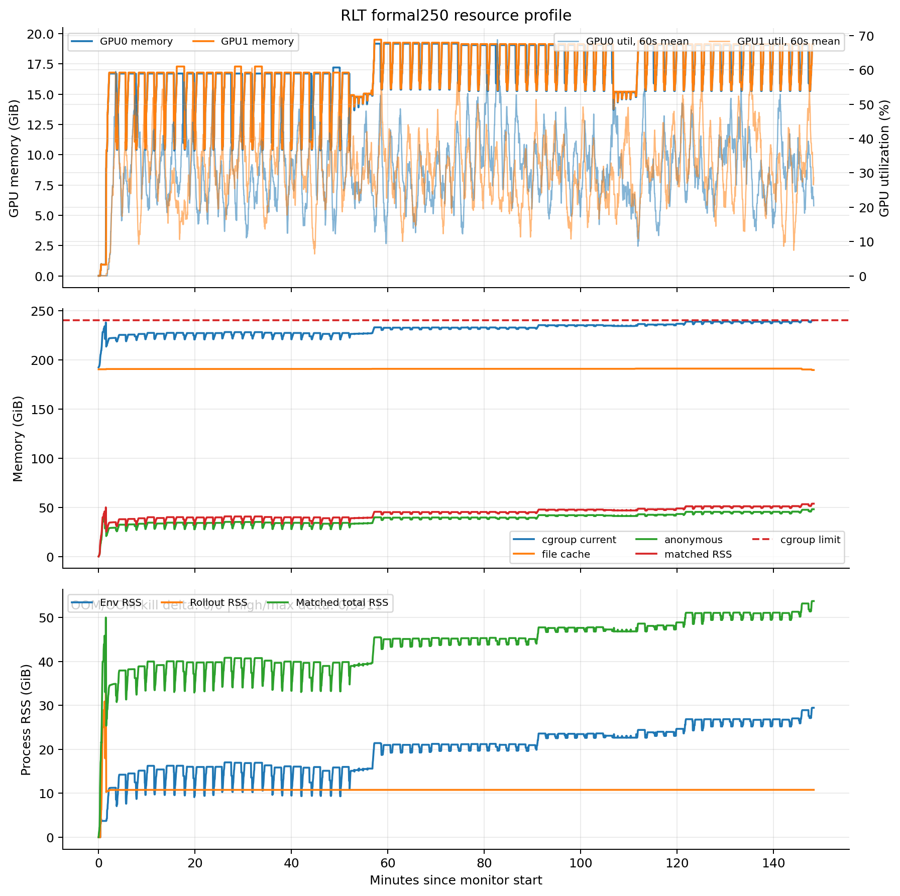

# RoboTwin RLT Stage 2 formal250：cycle 68 运行中状态

> 服务器审计：2026-07-30 14:05:16+08:00
> 本地证据冻结：2026-07-30 14:05:48+08:00
> 内存压力补充探针：2026-07-30 14:08:01+08:00
> 本文是运行中快照；后续状态必须重新只读刷新

## 1. 结论

训练进程和数值主链仍健康，但目前仍处于 **frozen reference 收集 replay** 阶段，尚未发生
任何 RLT optimizer update：

- TensorBoard和console均已完成cycle 68/250（27.2%）；
- 544条train episodes，global macro transitions为10,153；
- 较慢rank replay为5,067/10,000（50.67%），当前斜率仍指向约cycle135过门；
- `update_step=0`，critic/actor updates均为0，student尚未接管；
- 没有CUDA OOM、NCCL fatal、NaN/Inf、Ray rank death或cgroup OOM；
- cycle 25、50两次20-seed deterministic student eval均为0/20；student尚未训练，
  不能据此判断最终学习效果。

与12:56快照相比，训练成功率和周期吞吐基本稳定；真正的新风险是 **EnvWorker相关RSS与
cgroup匿名内存继续阶梯增长**。cgroup已触碰240GiB并触发`memory.max`回收，因此上一快照
“没有新的回收压力”已经失效。本轮只读检查没有停止进程；该风险应在cycle75后优先复核。

## 2. 成功率与阶段



| 指标 | cycle 68 | 相对cycle 35快照 |
|---|---:|---:|
| train episodes | 544 | +264 |
| train success | 84/544 = 15.44% | 新增区间42/264 = 15.91% |
| 最近10 cycles | 11/80 = 13.75% | 上次8/80 = 10.0% |
| cycle25 eval | 0/20 | 不变 |
| cycle50 eval | 0/20 | 新增 |
| critic / actor updates | 0 / 0 | 不变 |
| actor switch | 0 | 不变 |

train仍完全由frozen π0 reference控制，所以15.44%不是RLT student成绩。两次eval使用同一
20-seed bank并强制deterministic student；当前student未训练，0/40只证明评估口径稳定，
不证明方法失败。

## 3. Replay、周期耗时与ETA



| 指标 | 当前值 |
|---|---:|
| global macro transitions | 10,153 |
| 平均macro/cycle | 149.31 |
| min replay/rank | 5,067 |
| replay门进度 | 50.67% |
| 预计过10k/rank门 | 约cycle135 |
| 最近10 cycles总耗时均值 | 122.50s |
| 最近10 cycles rollout均值 | 122.06s |
| cycle50 eval+checkpoint总耗时 | 399.52s |
| cycle50 eval本身 | 266.21s |
| 当前采样吞吐 | 约220 train episodes/h、4,105 macros/h |

runner在cycle68显示剩余`06:30:31`，但它只按尚无optimizer的周期外推。cycle135后先追30k
critic floor，周期会明显变慢；仍应使用启动前总计约10–13小时的预算估计，而不是据此断言
20:36左右必然完成。

## 4. 资源与内存风险



资源CSV有3,920个样本，覆盖11:37:25–14:05:48；median采样间隔2秒、最大3秒。

| 指标 | 当前 / 峰值 | 12:56当前值 |
|---|---:|---:|
| GPU0显存 | 19,520 / 19,776MiB | 15,837MiB |
| GPU1显存 | 19,602 / 19,976MiB | 15,920MiB |
| 两卡active mean util | 31.14% / 30.91% | 30.10% / 31.19% |
| env RSS | 29.47 / 29.47GiB | 19.70GiB |
| matched RSS | 53.76 / 53.76GiB | 43.83GiB |
| cgroup anon | 48.11 / 48.11GiB | 38.20GiB |
| cgroup file | 189.57 / 191.01GiB | 190.76GiB |
| cgroup current | 239.96 / 240.00GiB | 231.23GiB |
| host available最低 | 930.33GiB | 936.22GiB |
| 数据盘available | 823.99GiB | 824.21GiB |
| high / max / OOM / OOM-kill增量 | 0 / 5,911 / 0 / 0 | 0 / 0 / 0 / 0 |

两卡显存、利用率和磁盘均健康。内存则不能再解释成“只是file cache虚高”：

- 约69.5分钟内，env RSS、matched RSS、anon分别净增约9.77/9.92/9.91GiB；
- cycle25评估前后5分钟中位数出现约5.1–5.3GiB永久阶梯；
- cycle50即时只增加约0.5GiB，但之后普通cycle期间仍继续阶梯增长，所以不只由eval触发；
- 最后约3分钟新增5,911次`memory.max`事件，同时file cache开始回收；
- 14:08补充探针为cgroup current 239.97GiB、anon 49.37GiB、file 188.30GiB；
  memory PSI some/full的avg60均为0.09%，OOM/OOM-kill仍为0。

因此当前不是立即OOM，也没有吞吐恶化；但它已经是“疑似EnvWorker retained allocation/
泄漏”的橙色风险，并接近已批准的`sustained memory pressure/anon growth`停止条件。
下一次应先看cycle75后的anon斜率、`memory.max`增量、PSI和cycle time；若继续同步恶化，
不能等到OOM后才处理。

## 5. 产物

服务器入口：

```text
/root/autodl-tmp/experiments/rlt_stage2_formal_8env_250c_20260730_v1
/root/autodl-tmp/experiment_exports/rlt_stage2_formal_8env_250c_20260730_v1/runtime
```

14:05时run root为370,009,292 bytes（352.87MiB）。第二个完整checkpoint已经落盘：

| checkpoint | 大小 | 文件数 | completion | update_step | replay rank0/rank1 |
|---|---:|---:|---:|---:|---:|
| cycle25 | 133.81MiB | 3,722 | true | 0 | 1,874 / 1,835 |
| cycle50 | 218.46MiB | 7,463 | true | 0 | 3,704 / 3,746 |

两个checkpoint均为actor world size2、双rank trainer state完整、resume contract SHA一致。
下一次eval/checkpoint在cycle75。`finished_at.txt`和`exit_code.txt`仍不存在，符合运行中状态。

Git现场仍为：

```text
branch=codex/rlt-pi0-robotwin
HEAD=46a2d19bae629eaa57830f5faeac71ac81a1a494
worktree=clean
HEAD vs upstream=0 behind / 2 ahead
```

## 6. 日志与本地证据

日志仍只有两个已知、非阻塞的可选Curobo导入traceback；CUDA OOM、NCCL fatal、Ray death和
NaN计数均为0。真实rollout、两次exact-20 eval和两个checkpoint均已完成。

本地冻结副本：

[`evidence/stage2_formal_8env250_20260730/status_20260730_1405/`](evidence/stage2_formal_8env250_20260730/status_20260730_1405/)

下载23个小型高信息量文件，共1,779,880 bytes；包含runtime日志/资源、TensorBoard、
两次checkpoint的completion/replay metadata/trainer state，不含大replay payload或模型权重。
