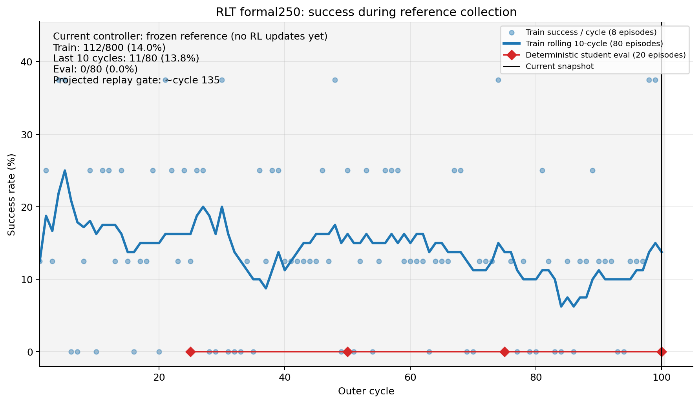
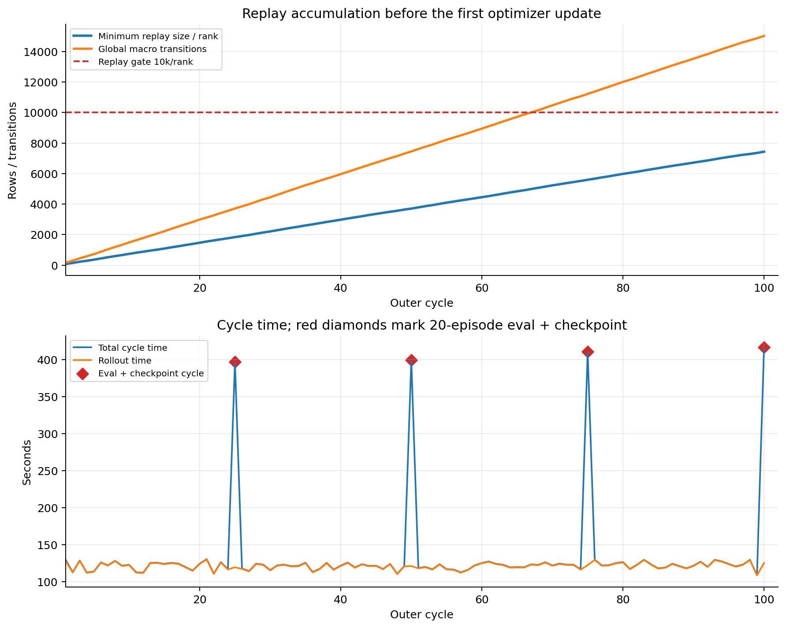
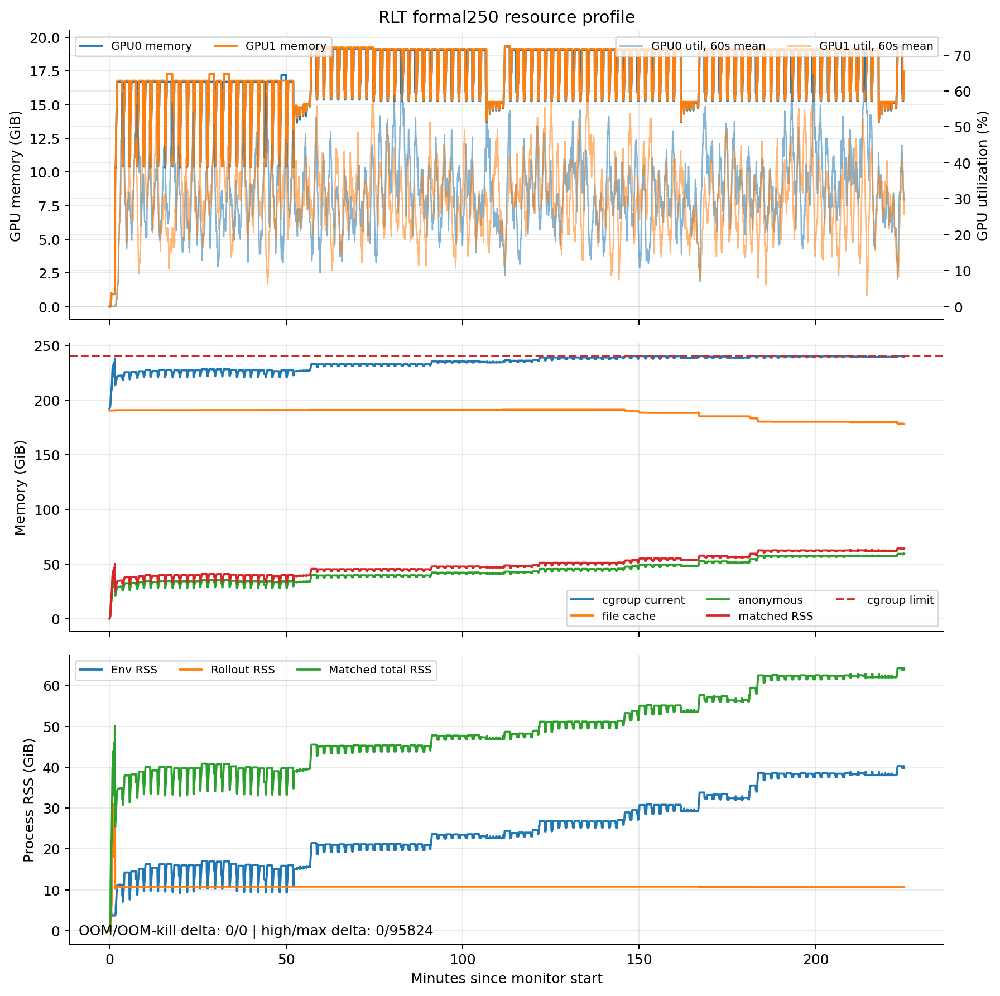

# RoboTwin RLT Stage 2 formal250：cycle 100 指标与问题审计

> 服务器现场：2026-07-30 15:22:14+08:00
> 本地证据冻结：2026-07-30 15:22:28+08:00
> TensorBoard完整到cycle 100；console现场已完成cycle 101
> 本文是运行中快照；后续状态必须重新只读刷新

## 1. 结论

训练进程、采样主链、GPU和数值仍在工作，但这次检查确认了两个必须分开的事实：

1. **RLT优化尚未开始。** cycle 100时较慢rank replay为`7,433/10,000`，
   `update_step=critic_updates=actor_updates=0`，train rollout仍全部由frozen reference
   π0控制。因此当前成功率变化不是student学习或退化，loss/Q/grad尚不存在也是调度合同
   的预期结果。
2. **内存风险已从“观察”升级为满足预设停止条件。** cycle 100评估后Env RSS、
   matched RSS和cgroup anon再次同步抬升约2.2GiB；四次周期评估后均出现不同幅度的
   retained-memory阶梯。cgroup持续贴近240GiB，累计新增95,824次`memory.max`事件，
   cycle 100后现场PSI some/full avg60均为0.04%。虽然仍无OOM，重复阶梯已经满足启动包
   中的`sustained memory pressure/anon growth`停止定义。

本轮授权仅为只读检查，所以没有停止或修改训练。cycle 100的完整checkpoint已经落盘，
是当前最自然的安全停点；建议取得用户明确授权后优雅停止，而不是等到cgroup OOM。

## 2. 成功率确实“看起来下降”，但不能叫训练退化



| train区间 | 成功 | 成功率 | Wilson 95%区间 |
|---|---:|---:|---:|
| cycle 1–25 | 34/200 | 17.00% | 12.43%–22.82% |
| cycle 26–50 | 29/200 | 14.50% | 10.29%–20.05% |
| cycle 51–75 | 27/200 | 13.50% | 9.45%–18.93% |
| cycle 76–100 | 22/200 | 11.00% | 7.38%–16.09% |
| 全部 | 112/800 | 14.00% | — |
| 最近10 cycles | 11/80 | 13.75% | 7.85%–22.97% |

名义分段是连续下降的，但证据还不足以宣称真实漂移：

- 前50与后50 cycles为15.75%和12.25%，Fisher双侧`p=0.185`；
- 逐cycle线性斜率为每cycle约`-0.0597`个百分点，`p=0.127`；
- 四段置信区间大幅重叠，且这些计算还乐观地假定episode相互独立；
- rolling-10曾在cycle 84附近降到6.25%，之后已回升，cycle 98/99单点均为3/8。

train seed来自固定伪随机分区并顺序推进；当前产物没有逐episode seed ID，因此还不能把
波动分解成seed难度、抽样波动或环境隐状态漂移。这是可观测性缺口，但不是本次中途改代码
的理由。最关键的反事实是actor从未切换、模型从未更新，所以不可能是RLT把策略“训坏了”。

四次deterministic student eval在cycle 25/50/75/100均为0/20，合计0/80。student尚未
训练，这只建立了“初始化student不可用”的基线，不能与reference train的14%直接比较，
也不能评价RLT最终效果。

## 3. 当前阶段、什么时候开始SAC式优化



| 指标 | cycle 100 |
|---|---:|
| global macro transitions | 15,025 |
| 平均macro/cycle | 150.25 |
| min replay/rank | 7,433 |
| replay门进度 | 74.33% |
| 当前投影的10k/rank过门点 | 约cycle 135 |
| critic / actor updates | 0 / 0 |
| actor switch | 0 |

源码级精确语义是：

1. 两rank都达到10k replay前，`skip_reason=1`，不调用optimizer；
2. 约cycle 135过门后，SAC式更新立即开始：每个update都更新critic，每2个critic
   update约更新1次actor；
3. 前30k `update_step`期间rollout仍由frozen reference控制，但actor已经以早期强BC、
   弱Q目标训练，并非“critic-only”；
4. cap为1,600 updates/cycle，因此约19个cycle后、约cycle 154达到30k，student才接管
   train rollout；
5. actor权重在前20k updates为BC/Q=`7/.05`，随后用50k updates过渡到`2.5/.45`。

所以loss、Q、BC、grad、LR等指标应在约cycle 135首次出现；真正的student train成功率要
到约cycle 154后才有解释力。

250-cycle预算预计只剩约96个student-controlled cycles（约768条train episodes）。
它足以验证“replay过门→离线更新→student接管→在线更新”的完整phase transition，也可能
看到方向性变化；但相对ManiSkill的5,000-cycle参考量级，不能预先承诺收敛或论文级效果。
因此从效果口径看它仍是低预算正式移植运行，而不是充分训练量的等规模复刻。

## 4. 57类细粒度指标：哪些正常，哪些尚不能判断

cycle 100 TensorBoard共有57个scalar tags、5,028个点，全部finite，NaN/+Inf/-Inf均为0。

### 正常

- `env/num_trajectories=8`、`env/episode_len=200`每cycle稳定；后者是固定horizon统计，
  不能解释为“成功都发生在第200步”。
- `record_transition_rate=1`，intervention/requested均为0，符合full-task、无人类expert
  的pre-ready reference route。
- `global_total_transitions`、`global_min_replay_size`和cache严格单调增长；
  rank0/rank1在checkpoint100为7,433/7,592，只差约2.1%，负载可接受。
- `transition_count`约65.5–80/rank/cycle，失败episode更常跑满horizon，因此成功率较低
  的区间transition略多；`done_rate`约5.36%，与C10、H200的约20个macro决策相符。
- `env/return`、`env/reward`、`replay/reward_mean`和`reward_positive_rate`随成功率同向；
  这是稀疏0/1 reward的同一信号，不是四个独立退化证据。
- 最近10个普通rollout均值约123.0秒；cycle100 exact-20 eval为267.77秒，含checkpoint的
  总cycle为416.96秒。没有30分钟无进展或吞吐崩塌。
- GPU峰值19,776/19,976MiB，远未接近80GiB显存上限；两卡负载对称。

### 现在没有、但属预期

`sac/critic_loss`、`sac/actor_loss`、`critic/q_data`、actor Q/BC分量、BC/Q权重、
actor/critic grad norm、LR和entropy均未出现，因为optimizer尚未执行一次，不是日志漏记。
过门后必须检查：

- 所有loss/Q/grad是否finite；
- critic loss与Q尺度是否爆炸，grad是否长期撞`clip=10`；
- critic:actor实际步数是否约2:1；
- BC/Q权重是否按20k+50k时间轴变化；
- actor相对reference偏差是否在student接管前后突跳。

### 需要继续标红

- 40%外层预算仍完全用于replay fill，学习窗口偏后且偏短；
- reference成功率有名义下行但统计证据不足，且缺少逐episode seed日志；
- `env_interact_step`有轻微内部变慢信号，但总rollout耗时无显著恶化；它应与内存阶梯
  一起调查，当前还不是独立stall；
- 资源 retained-memory 阶梯是本次唯一已经达到预设停止定义的问题。

## 5. 资源与停止判断



资源CSV有5,943行，覆盖11:37:25–15:22:28；median/max采样间隔2/3秒。

| 指标 | 当前 / 峰值 |
|---|---:|
| GPU0显存 | 17,806 / 19,776MiB |
| GPU1显存 | 17,888 / 19,976MiB |
| EnvWorker RSS | 40.21 / 40.24GiB |
| matched进程RSS | 64.17 / 64.20GiB |
| cgroup anon | 59.29 / 59.68GiB |
| cgroup file | 177.96 / 191.01GiB |
| cgroup current | 239.60 / 240.00GiB |
| host available最低 | 918.07GiB |
| 数据盘available | 823.28GiB |
| high / max / OOM / OOM-kill增量 | 0 / 95,824 / 0 / 0 |

以每个评估cycle完成前4分钟中位数，对比完成后1–6分钟中位数：

| eval节点 | Env RSS变化 | matched变化 | anon变化 | file变化 | max事件变化 |
|---|---:|---:|---:|---:|---:|
| cycle25 | +5.75GiB | +5.97GiB | +5.96GiB | +0.14GiB | 0 |
| cycle50 | +1.22GiB | +1.25GiB | +1.25GiB | +0.22GiB | 0 |
| cycle75 | +3.92GiB | +3.52GiB | +4.22GiB | -3.24GiB | +24,149 |
| cycle100 | +2.21GiB | +2.21GiB | +2.22GiB | -1.43GiB | +13,146 |

cycle100后窗口只有约80秒，仍已重现同步阶梯。anon增长、file cache回收、贴顶和
`memory.max`增加共同说明这不是单纯“可随时回收的file cache虚高”。根因目前只能定位到
周期eval/随后EnvWorker路径的retained allocation，尚不能从现有聚合RSS证明是Python对象、
simulator renderer、规划器还是底层allocator。

现场仍无OOM，PSI也只有轻微瞬时压力；因此不是灾难性崩溃。但是启动前冻结的停止条件明确
包含`sustained memory pressure/anon growth`而不是“等到OOM”。四次重复阶梯已经满足该
条件，建议在完整cycle100 checkpoint后停止并另做最小内存定位。

## 6. 产物

服务器入口：

```text
/root/autodl-tmp/experiments/rlt_stage2_formal_8env_250c_20260730_v1
/root/autodl-tmp/experiment_exports/rlt_stage2_formal_8env_250c_20260730_v1/runtime
```

15:22时run root为1,097,692,292 bytes（1.022GiB）。checkpoint100为408,791,932 bytes
（389.85MiB）、15,038个文件，`completion=true`、actor world size2、双rank trainer state
和一致的resume contract均齐全，`update_step=0`，replay为7,433/7,592。

cycle25/50/75/100四个checkpoint均完整。由于尚未优化，它们的模型训练状态相同，主要区别
是replay和lifetime counters；cycle100是当前最完整的可恢复采集端点。

现场Git仍为：

```text
branch=codex/rlt-pi0-robotwin
HEAD=46a2d19bae629eaa57830f5faeac71ac81a1a494
worktree=clean
HEAD vs upstream=0 behind / 2 ahead
```

CUDA OOM、NCCL fatal、Ray death、NaN metric均为0；两个traceback仍只是已知的可选Curobo
导入提示。driver/monitor和Ray在本轮结束时仍运行，本轮没有进程控制。

本地冻结副本：

[`evidence/stage2_formal_8env250_20260730/status_20260730_1522/`](evidence/stage2_formal_8env250_20260730/status_20260730_1522/)

共33个小型证据文件、2,652,489 bytes；包含runtime日志/资源、TensorBoard、四个checkpoint
的completion/replay metadata/trainer state，不含大replay payload或模型权重。
