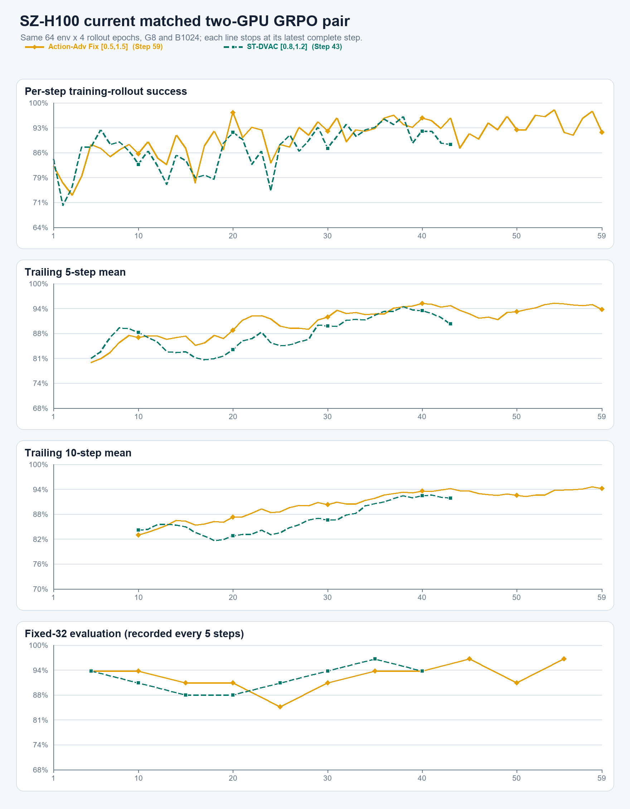
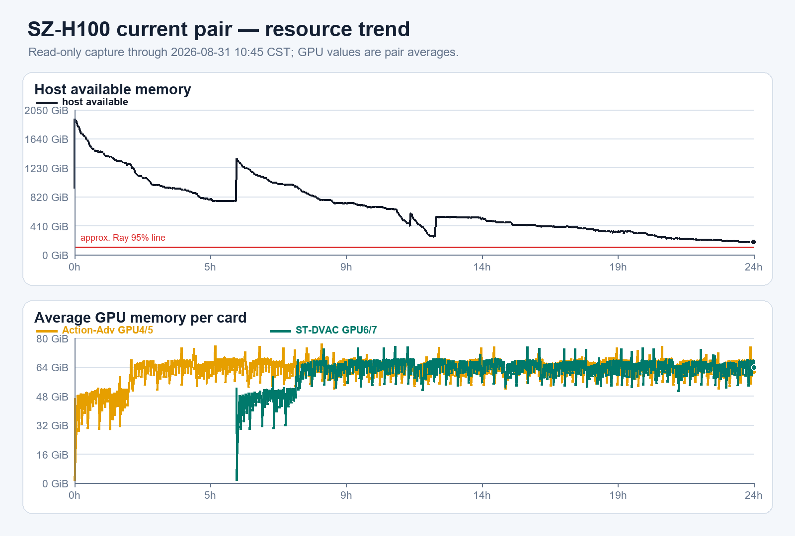

# 2026-08-31 10:43 CST 只读刷新

本轮仅用固定 host-key 的 `chenyiteng` 只读路线刷新现场并下载两份小日志；未停止、启动或修改任何进程。

## 训练

| 实验 | 最新完整步 | raw | MA5 | MA10 | 最新 fixed-32 | 累计 fixed |
|---|---:|---:|---:|---:|---:|---:|
| Action-Adv Fix `[0.5,1.5]` | 59/100 | 91.80% | 93.75% | 94.57% | Step55 `31/32` | `325/352` |
| ST-DVAC `[0.8,1.2]` local-shard v2 | 43/100 | 88.28% | 90.00% | 92.23% | Step40 `30/32` | `235/256` |

- 两个 wrapper 与各15个 Ray named actors 均存活，fatal计数均为0。
- Action最新checkpoint为Step50；ST最新checkpoint为Step40，ST含两份rank-local shard。
- 最近10步平均约为Action `23.05 min/step`、ST `24.45 min/step`。

## 资源与整机

- GPU0--3无计算任务；GPU4--7由本pair占用，现场约`69 GiB/card`。
- 主机MemAvailable约`179 GiB`；最近1小时下降约`16 GiB`，swap已基本用尽。按当前一小时斜率，
  距Ray约95%节点内存线约剩5小时缓冲；这是线性风险估计，不是已发生故障。
- `/`、`/home`、`/data`分别余约`226 GiB / 1.4 TiB / 1.4 TiB`，inode充足。
- Mihomo active；代理访问GitHub/Hugging Face均HTTP 200；systemd failed unit为0。
- 其他用户无GPU任务，也没有大内存进程；本轮未打扰其进程。

原始小文件：`raw/*/runtime/{driver.log,resource.csv}`；机器可读汇总：`summary.json`、`curves.csv`。
