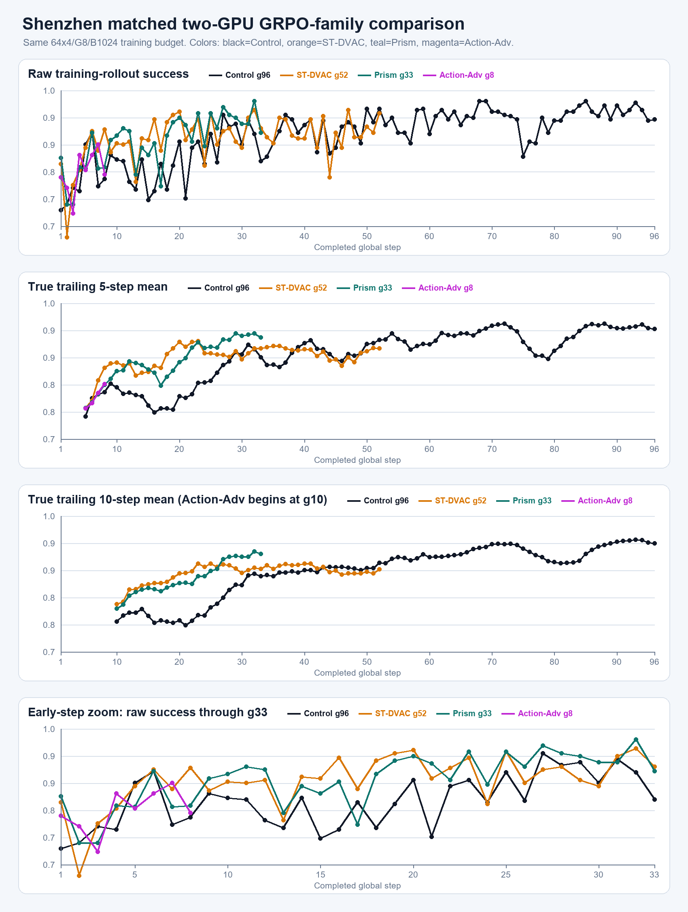

# 深圳两卡 GRPO 系列对照（2026-08-28 14:31 CST）

四条实验均使用两卡、`64 train env × 4 rollout epochs`、G8、B1024 的matched训练预算。Control与
ST-DVAC已按用户授权停止；Prism和Action-Adv为本次服务器只读现场。

| 方法 | 完整step | raw | MA5 | MA10 | 同窗口train均值相对Control | 同窗口fixed32 |
| --- | ---: | ---: | ---: | ---: | ---: | ---: |
| clean GRPO Control | 96 | 92.97% | 94.69% | 94.73% | -- | 570/608终态 |
| ST-DVAC `[0,2]` | 52 | 94.53% | 90.31% | 89.34% | +3.13 pp（g1--52） | 296/320 vs Control 294/320 |
| Prism-DVAC | 33 | 89.45% | 92.81% | 92.54% | +5.48 pp（g1--33） | 173/192 vs Control 174/192 |
| Action-Adv `[0,2]` | 8 | 78.52% | 82.34% | 尚无 | +1.90 pp（g1--8） | 28/32 vs Control 28/32 |

当前只能说ST-DVAC和Prism的早期training-rollout均值高于Control；matched fixed32尚未显示稳定领先。
Action-Adv不足10步，不能判断。

逐步数据见[`curves.csv`](curves.csv)，机器可读摘要见[`summary.json`](summary.json)。
