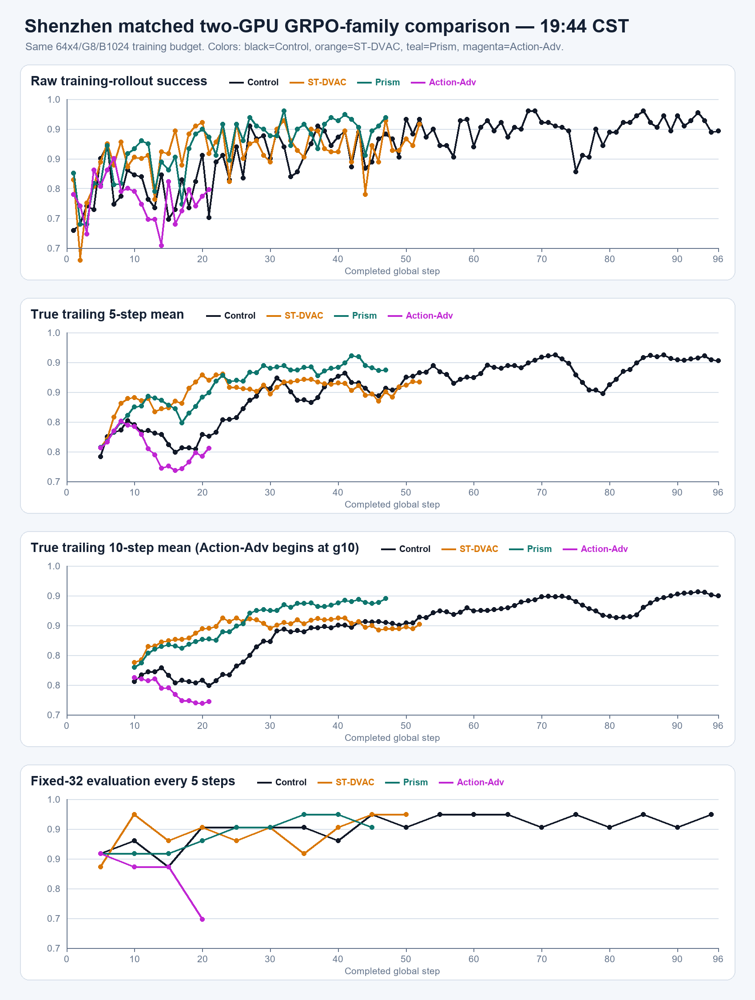

# 深圳两卡 GRPO 四版本对照（2026-08-28 19:44 CST）

四条实验均采用`2 GPU / 64 train env × 4 rollout epochs / G8 / B1024 / fixed32-eval5`。横轴统一为
Step0--最长的Control Step96；Step0不虚构数据，每条方法曲线从真实Step1开始并在自己的真实终点停止，
不补线、不外推。

| 方法 | 完整step | raw | MA5 | MA10 | 同窗口train均值相对Control | 同窗口fixed32 |
|---|---:|---:|---:|---:|---:|---:|
| clean GRPO Control | 96 | 92.97% | 94.69% | 94.73% | -- | 570/608终态 |
| ST-DVAC `[0,2]` | 52 | 94.53% | 90.31% | 89.34% | +3.13 pp（g1--52） | 296/320 vs 294/320 |
| Prism-DVAC | 47 | 96.09% | 92.81% | 94.26% | +5.14 pp（g1--47） | 265/288 vs 264/288 |
| Action-Adv `[0,2]` | 21 | 78.91% | 76.80% | 74.49% | -1.45 pp（g1--21） | 105/128 vs 114/128 |

当前只可得出：ST与Prism在各自已覆盖窗口的training-rollout均值高于Control，但matched fixed32差异很小；
Action-Adv到Step21在训练与fixed32上都落后。Action-Adv仍在运行，因此这里只是中间快照。

逐步数据见[`curves.csv`](curves.csv)，机器可读摘要见[`summary.json`](summary.json)。
