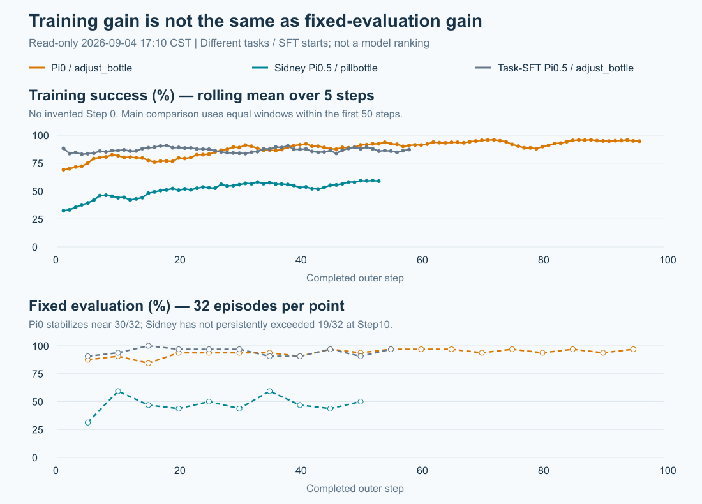

# Sidney π0.5 与深圳旧 π0 GRPO：学习速度、模型与实现核查

现场范围：2026-09-04 17:03—17:10:52 CST；仅普通账号只读 SSH。未改训练、代码或配置，未执行推理/恢复测试，未停止任何进程。

## 1. 结论与等预算曲线

**固定评估持续改善不如旧 π0；但不能说训练成功率爬升更慢，更不能说墙钟训练更慢。**
本次选取此前深圳两卡 `adjust_bottle` 的纯 GRPO Control，而非四卡512轨迹、DVAC方法组或旧AutoDL运行。
主比较统一到前50个完整外层step：每步256条训练轨迹、两次optimizer call，即12,800条轨迹、100次更新。
任务、SFT起点和动作表示不同，因此这是解释差异的审计，不是模型优劣的严格因果对照。

| 前50步指标 | 旧π0 / adjust_bottle | Sidney π0.5 / move_pillbottle_pad |
|---|---:|---:|
| Step1—10训练成功率均值 | 78.36% | 41.68% |
| Step11—20均值 | 78.55% | 49.41% |
| Step21—30均值 | 86.02% | 54.30% |
| Step31—40均值 | 89.14% | 55.35% |
| Step41—50均值 | 89.61% | 57.23% |
| 首10步→末10步增幅 | +11.25个百分点 | +15.55个百分点 |
| fixed32：Step5→10→50 | 28→29→30 /32 | 10→19→16 /32 |
| 启动到完整Step50 | 22.37小时 | 19.52小时 |
| 前50步平均外层耗时，含周期评估/保存 | 26.80分钟 | 23.36分钟 |

上表首10步已包含RL更新，**不是未经训练的SFT baseline**。不同起点下，百分点增幅也不能当成模型样本效率排名。
Sidney fixed32全序列（Step5/10/15/20/25/30/35/40/45/50）为 `10,19,15,14,16,14,19,15,14,16 /32`。
旧π0同区间为 `28,29,27,30,30,30,30,29,31,30 /32`。问题更准确地说是：训练分布上的改善没有稳定转化为固定评估改善。

[交互图：可开关曲线与悬停查看数值](pi05-pi0-comparison-20260904/dashboard.html) · [优化指标图](pi05-pi0-comparison-20260904/optimization.png) · [耗时图](pi05-pi0-comparison-20260904/resources.png)

另加灰色历史参考：官方任务专用SFT π0.5在 `adjust_bottle` 上，前10步均值84.88%、Step41—50均值87.07%，fixed32 Step15达32/32、Step50为29/32。
它的起点本来就高，不能说RL从低成功率学到了100%；但足以提醒我们，不应把Sidney当前结果归因成“π0.5架构普遍不适合GRPO”。

## 2. 实际配置：相同的训练壳，不同的任务与策略分布

| 字段 | 旧π0 | Sidney π0.5 |
|---|---|---|
| SFT | RLinf任务专用 adjust_bottle | Sidney多任务 RoboTwin，50k checkpoint |
| 任务 | adjust_bottle | move_pillbottle_pad |
| 物理GPU / 数量 | 4/5，2卡 | 4/5，2卡 |
| train并行 × 串行采样 | 64 × 4 = 256轨迹 | 相同 |
| GRPO组大小 | G8，即每步32组 | 相同 |
| 全局batch / microbatch / update_epoch | 1024 / 32 / 2 | 相同 |
| 每rank梯度累积 / 每外层optimizer call | 16 / 2 | 相同 |
| action horizon / 执行chunk / 环境上限 | H50 / C50 / 200 | 相同 |
| 去噪步数M | 4 | 10 |
| Flow-SDE noise | 0.5 | 0.5，但物理探索尺度不等价 |
| actor LR | 5.6e-6 | 5.0e-6，低约10.7% |
| 模型内部关节动作 | delta，输出后还原absolute；夹爪保留absolute | absolute |
| normalization | 旧checkpoint自身mean/std | Sidney自身mean/std，不是quantile |
| 训练范围 | train_expert_only，冻结VLM | 相同标志，但state经过的可训练路径不同 |
| advantage / reward / logprob | 组内GRPO标准化、稀疏成功奖励、chunk级 | 相同 |
| clip / KL惩罚 / entropy bonus | ±0.2 / 0 / 0 | 相同 |
| reward group filter | 组均值0.1—0.9 | 相同 |
| optimizer | Adam系β=(0.9,0.95)，WD0.01，grad clip1 | 相同 |
| critic / DVAC / LoRA | 均关闭 | 相同 |
| actor / rollout offload | true / true | 相同 |
| train环境offload | false，覆盖全局env=true | 相同 |
| 三相机、clean环境、OIDN | 三相机，clean，OIDN开启 | 相同；Fast noOIDN不影响Sidney |
| fixed评估 / 保存 | fixed32每5步 / 每10步 | 相同 |
| train视频 / checkpoint格式 | 开启 / DCP默认路径 | 关闭 / 显式local_shard |

完整resolved逐叶差异为52行，保存在分析JSON的 `diff`；很多是路径、日志名、未启用的value/DVAC字段或rollout配置展开，不能都算作有效科学变量。
旧run的 `rollout.model` 仅写path/precision，Sidney展开完整actor alias；实际 `huggingface_worker.py:53` 在训练模式从actor.model取配置，再覆盖路径/精度，因此不是旧rollout模型参数漏配。

## 3. 为什么当前固定评估提升不明显：按证据强弱排序

### 3.1 最强已知差异：任务和SFT起点

旧 `adjust_bottle.py:92—96` 主要检查对应一侧的位置和瓶子功能点高度>0.9。
新 `move_pillbottle_pad.py:29—35,105—111` 随机取5类药瓶模型，瓶子与垫子位置随机，并要求最终xy每轴误差<3cm、z误差<5mm、双夹爪打开。
新任务需要抓取→搬运→准确放置→松爪，而非只完成拿起；不同SFT起点和任务条件完全足以使绝对成功率不同。

[Sidney模型卡](https://huggingface.co/SidneyXie/pi05_robotwin) 在自身100回合评估下报告adjust_bottle 100%、move_pillbottle_pad 74%，也显示任务差异。
但模型卡未明确与本地一致的horizon，且本地跳过了未经RL的同协议fixed32 Control；**74%不能当成本地训练前成功率，也不能据此断言RL把74%训坏了**。

### 3.2 值得优先排查：200-action与稀疏终点奖励

两者同为200-action，只说明预算相同，不说明完成任务的余量相同。H=C50意味着至多4次策略查询。
RoboTwin现场 `task_config/_eval_step_limit.yml:36` 为pill任务列400；当前用户选定配置将train/eval三处上限都锁200。
若不少轨迹已抓住瓶子、到达垫子附近却来不及完成落稳/松爪，它们仍是0奖励，GRPO不区分这些进展与更早失败。
这是一条具体、可检查的瓶颈假设，**本轮未看足够失败轨迹，尚不能证明200不够**；也未擅自改400。
`episode_len=200` 是调度预算/吸收态口径，不能据此推导所有失败都是超时。

### 3.3 训练成功率与固定评估不是同一分布

`openpi_action_model.py:1064—1078`：train每次推理随机选一个去噪步做SDE探索，其余走ODE；eval不做该SDE扰动，走ODE路径。
但 `:993—995,1033—1035` 在两种模式都采初始Gaussian噪声；fixed环境seed不等于固定动作噪声，更不等于完全确定性评估。
另外train使用循环训练seed bank，eval是另一套固定32条件。训练256条也包含G8相关采样，不能当成256个独立泛化样本。
fixed32每条就是3.125个百分点，在50%附近单批二项近似标准误约8.8个百分点，适合提示量级而非严格独立重复置信区间。
因此当前可说“未见持续固定评估改善”，不能仅凭几次波动认定过拟合或完全没有学习。

### 3.4 模型内部路径不同：不能只照抄noise和学习率

两者仍属PaliGemma2B + Gemma300M action expert家族，不是π0.5因为参数大很多才慢。
锁定的OpenPI源码和[官方配置源码](https://github.com/Physical-Intelligence/openpi/blob/main/src/openpi/models/pi0_config.py)均表明：

- π0连续state直接进入action-expert侧，state projection可训练；π0.5把离散state编码进VLM前缀，时间条件使用adaRMSNorm。
- `train_expert_only` 冻结PaliGemma视觉/语言部分（实际模型 `openpi_action_model.py:1435—1440`），所以两者虽然都“只训expert”，state相关路径并不等价。这可能影响适配方式，但不是已证实的失败根因，更不是现在就解冻VLM的理由。
- dataconfig实际选择：旧π0 `extra_delta_transform=True`；Sidney `False`、`adapt_to_pi=False`、`use_quantile_norm=False`。旧模型内部预测关节增量，再加当前state得到绝对位置；Sidney直接预测绝对位置。两者给环境的都是absolute14D，不能混淆内部与外部动作表示。
- 自身norm也不同：左关节0的action std约0.21047 vs0.41572，左关节4约0.08059 vs0.27155。同样noise0.5不代表同样的物理扰动。
- M4→M10还把线性时间步长从0.25变0.1；SDE噪声公式含sqrt(dt)及时间项（`:1151—1154,1207—1214`）。不宜仅凭M变大推断探索更强/更弱。M10也不是10次optimizer更新。

这些差异主要是在尊重各checkpoint的原生动作合同，不是建议为了对齐旧π0而改错Sidney的delta/norm。

### 3.5 已有更新信号，不支持“根本没训起来”

前50步approx KL均值：旧π0 0.01563、Sidney 0.01759；clip fraction约6.78% vs5.16%；记录的裁剪前grad norm约26.68 vs20.72。
Sidney LR只低约10.7%；结合实际两次更新循环与非零KL/梯度，未发现没有更新、全模型误冻结、少做epoch这类明显错误。
但这些是日志聚合值，不是精确valid加权全局统计。G8全成或全败的组都被过滤；整体58%既可能来自大量混合组，也可能来自一半容易组、一半困难组。
当前日志没有逐组有效数量，不能从总体成功率反推出有效GRPO学习信号充足，也不应仅因clip略低就加LR。

## 4. 实现核对、尚未闭合的适配风险

实际actor类是 `rlinf/workers/actor/embodied_fsdp_actor_worker.py`，不是名字相近的generic `fsdp_actor_worker.py`。
已读实际类：Sidney版本约131行决定累积16，319—366行执行组过滤，707—748行遍历两个update epoch，916行按累积数缩放loss。
其与旧分支存在DVAC opt-in代码差异；本轮DVAC=false，878—883行action-level分支不生效。**不声称整个actual actor文件完全相同**。

相比旧run启动commit，OpenPI action模型和GRPO advantages代码一致；rollout模型worker、RoboTwin wrapper也一致。
选中去噪步与采样chain被保存用于new logprob重放（`openpi_action_model.py:724—755`），没有查到Sidney另写一套失配的GRPO目标。
旧工作树从启动0e28ac6f到当前ab098849的模型/advantages/loss目标文件diff为空；不同工作树中loss的差异主要是关闭的DVAC action-level入口。

当前adapter既有验收证据：813/813权重key匹配、零missing/unexpected/shape mismatch、逐tensor一致；224×224输入下token/mask/norm/M10 action通过官方容差。
这降低“漏载权重、错误norm、模型核心不一致”的嫌疑，但不覆盖全部raw-image链：native float Torch resize与当前uint8 JAX resize/round从480×640到224×224不逐像素相同。
因此core parity不等于整条真实观测管线完全等价；先前闭环/Step1 smoke能跑通也不等于同协议SFT成功率已验证。
原验收和剩余边界见[adapter实施账本](CURRENT_RLINF_ADAPTER_IMPLEMENTATION_LEDGER_20260903.md)与[专题SSOT第5节](../00_INDEX_AND_EXECUTION.md#5-formal-前的参数口径)。

官方资料边界：[RLinf RoboTwin示例](https://rlinf.readthedocs.io/en/latest/rst_source/examples/embodied/robotwin.html)的π0/π0.5高成功率表对应PPO；不能拿该表当作“官方π0.5 GRPO在同配置上已成功”的证据。
本地旧π0 GRPO确实有效，但它是本地可追溯Control，不因此变成官方现成π0.5 GRPO recipe。
[RLinf #1268](https://github.com/RLinf/RLinf/issues/1268)也有π0.5绝对关节GRPO不稳定报告，任务/动作chunk等不同，未提供可以直接照抄的已验证根因或修法。

## 5. 耗时与最新现场边界

17:10:52：Sidney完整Step53，Step53训练145/256=56.64%，最近10步均值58.48%；最近fixed为Step50 16/32。
本轮所查driver fatal/OOM/OIDN/Traceback/RuntimeError均未检出；17:03文件级核验Step50双rank shard与full_weights在，未测试恢复。
旧π0是历史用户停止在96步的运行，不是完成formal100；官方任务SFT π0.5历史运行停止于58步。不同run不拼接曲线。

首50步计时均值：rollout/predict旧π0约10.45秒 vs Sidney15.01秒；actor_training21.98秒 vs25.24秒；env/bootstrap_step1095.53秒 vs891.54秒。
这些是worker日志聚合计时，不是隔离单query基准。环境生成/reset占主要耗时，足以使M10推理工作更多却整轮更快。
因此不能把当前固定评估平台归咎于“模型太慢/GPU不够”，也不能把历史墙钟差异当同负载性能benchmark。

## 6. 我的建议：先查一个最能解释曲线的问题

不动现役训练，不立即加LR/noise、不改delta合同、不解冻VLM，也不借机套用Fast渲染补丁。
下一项最有信息量的工作是：**比较原始SFT与当前checkpoint的同协议表现，同时看失败是否集中在200动作内没完成放置/松爪**。
用少量相同物理seed、相同初始推理噪声的成对轨迹，先区分“模型原本在本地就低”“RL进步没转化到eval”“已经接近完成但时间不足”。
如果大量是临门一脚超时，再讨论200→400；这是明确增加交互预算的实验改动，不冒充纯工程修复。
若主要是早期抓取或方向错误，再针对真实图像处理、state/动作探索分布做窄核对；不用先全改一遍再等待一晚。
有效G8组数可以补充解释训练信号，但需另行授权修改日志；本轮不作任何生产实现或额外模型评估。

## 7. Source lock、原始证据与可复算入口

### 7.1 精确运行身份

- 旧π0：`/data/chenyiteng/results/rlinf-shenzhen/grpo/runs/grpo-control-formal100-2gpu64x4-b1024-fixed32-eval5-phys45-v2`；2026-08-26 16:01:33启动，launch `0e28ac6f09f821ea12e7d54eba7118ce0000ca86`；SFT `RLinf-Pi0-RoboTwin-SFT-adjust_bottle@92684e50`。
- Sidney：`/data/chenyiteng/results/rlinf-shenzhen/pi05-sidney/runs/move-pillbottle-pad-grpo-formal100-2gpu64x4-g8-b1024-u2-m10-noise0p5-h200-fixed32-eval5-phys45-localshard-v1`；2026-09-03 20:23:41启动，code `f50e235c5ab1f4390f0ba92bfb13390ed0a86810`，checkpoint `SidneyXie/pi05_robotwin@e49e2ab6c11f07511573b67261bd129e88d0a416`。
- 灰色参考：`/data/chenyiteng/results/rlinf-shenzhen/pi05/runs/pi05-grpo-control-formal100-2gpu64x4-g8-b1024-u2-m5-fixed32-eval5-phys45-localshard-v2`。
- 本轮工作树HEAD/dirty已刷新：`pi0-dvac-grpo-current@ab0988498a04311385600210c5b5ad34f16df1ce`、`pi05-robotwin-rl@ae7e5da72acf4a47a54cecff4f802ebc174b397a`、`sidney-pi05-current-rlinf@f50e235c5ab1f4390f0ba92bfb13390ed0a86810`，均clean。当前树不自动替代历史launch lock。

### 7.2 数据与命令记录

- [17:03现场、进程、GPU/RAM/checkpoint/git](PI05_PI0_COMPARISON_LIVE_20260904.txt)
- [17:05三run完整resolved、TB scalar、源码、seed与Git记录](PI05_PI0_COMPARISON_DATA_SOURCE_20260904.txt)
- [17:08安装模型源码、dataconfig/norm与运行合同](PI05_PI0_COMPARISON_SUPPLEMENT_20260904.txt)
- [17:10 actual embodied actor、种子划分与Step53最新scalar](PI05_PI0_COMPARISON_ACTOR_20260904.txt)
- [结构化分析：完整曲线、52项resolved差异、hash与统计](PI05_PI0_COMPARISON_ANALYSIS_20260904.json)

只读采集命令由 `local_scripts/sz_pi05_pi0_{comparison,supplement,actor}_readonly_20260904.py` 经已验证密码SSH发送；普通账号、固定host key、不用密钥/agent、不写远端。
主采集最后的可选文件名检索因服务器没有rg而退出1；此前RUN/SOURCE/SEEDS/GIT记录均完整。后续supplement通过find/精确文件读取补齐，不把诊断命令退出当成训练异常。
本地使用 `analyze_pi05_pi0_comparison_20260904.cjs` 合并最新scalar、统一completed step并计算等预算窗口；`render_pi05_pi0_comparison_20260904.cjs` 生成3张PNG和离线HTML。
三图已目视核查；优化图KL坐标上限扩到0.12，保留早期真实峰值。Fontconfig只报缓存目录不可写，出图成功，无系统设置变更。
本地git只读状态通过命令级 `-c safe.directory=...` 查询，未写全局配置；用户已有未跟踪目录/文件均保留。
