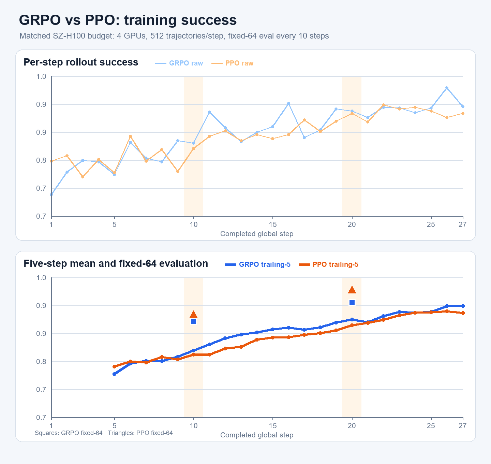
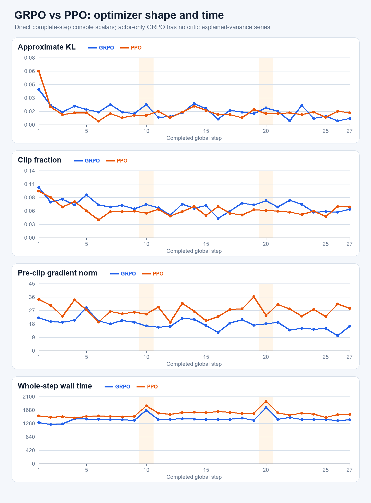
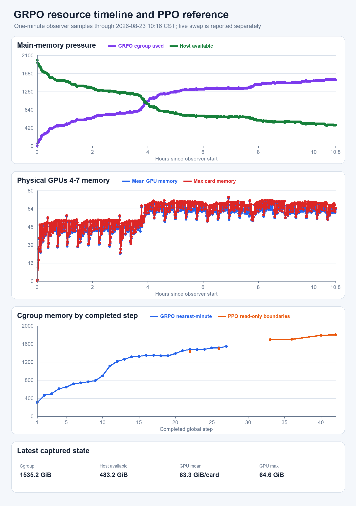

# 深圳 current RLinf GRPO：Step 27 现场、曲线、资源与 PPO 对照

取数窗口：2026-08-23 10:14–10:24 CST。服务器操作均为只读；没有停止、修改或重启训练，没有改
配置或服务器文件。图表冻结在本次下载时最新的连续完整 `Global Step 1–27`；训练此后继续运行。

## 1. 结论先行

- **训练链正常**：v2 已连续完成 27 个 GRPO outer step，`metrics.log` 的 NaN/Inf token 扫描为 0，
  driver / metrics / observer 的 fatal-pattern 扫描均为 0；4 actor + 4 rollout + 4 env worker、1 GCS、
  1 raylet 均在。
- **训练成功率已到高位**：GRPO Step 21–27 平均 `92.30%`，Step 23–27 trailing-5 为 `92.85%`；
  Step 27 单步为 `92.38%`。但 fixed-64 只有 Step 10/20 两点 `57/64`、`60/64`，不能据两点宣称收敛。
- **与同轴 PPO 接近、当前训练曲线略高**：同样只比较 Step 1–27 时，GRPO/PPO 训练 success 均值为
  `85.77/84.93%`，最新 trailing-5 为 `92.85/91.09%`；但 fixed-64 的 GRPO 两点分别比 PPO 少
  `1/64`、`2/64`。这不是配对随机种子 A/B，差异只作描述。
- **数值优化稳定**：Step 27 的 KL/clip/grad norm/ratio-abs 为
  `0.0073/0.059/16.298/0.069`；Step 1–27 全部 finite，KL、clip 与 grad 没有持续上冲。
- **真正风险仍是主存**：1 分钟 observer 显示 cgroup 从初始化增长到最新约 `1535.2 GiB`，峰值
  `1547.1 GiB`；Step 27 最近分钟对齐点为 `1542.8 GiB`。现场已使用约 `5.95 GiB` swap，虽仍有
  `483.2 GiB` host MemAvailable 且 memory events 全 0，但曲线仍是阶梯上升，**不能称为平台化**。

## 2. Success：逐步、5-step 与 fixed-64

两条训练曲线都使用完整 step 的 `512 trajectories`；GRPO 是 `64 × G8` group-relative actor-only，
PPO 是 GAE + critic，因此公共横轴是训练采样预算，不代表两种 objective 完全等价。

| 口径 | GRPO | PPO（同 Step 1–27） | GRPO−PPO |
|---|---:|---:|---:|
| Step 1 | 70.31% | 78.71% | -8.40 pp |
| Step 27 | 92.38% | 90.63% | +1.76 pp |
| Step 1–27 平均 | 85.77% | 84.93% | +0.84 pp |
| Step 23–27 trailing-5 | 92.85% | 91.09% | +1.76 pp |
| Step 1–10 平均 | 78.75% | 79.18% | -0.43 pp |
| Step 11–20 平均 | 88.22% | 86.46% | +1.76 pp |
| Step 21–27 平均 | 92.30% | 90.96% | +1.34 pp |

fixed-64 是当前更重要的同一 held-out 口径：

| Checkpoint/eval step | GRPO | PPO |
|---|---:|---:|
| Step 10 | `57/64 = 89.06%` | `58/64 = 90.63%` |
| Step 20 | `60/64 = 93.75%` | `62/64 = 96.88%` |

因此当前最稳妥的读法是：GRPO 的训练 rollout 已进入约 `92–93%` 高位，且没有 collapse；held-out
也从 Step 10 到 20 增加 3 条成功，但尚不足以判断相对 PPO 的最终胜负或统计收敛。下一自然信息点是
Step 30 fixed-64/checkpoint，无需另造额外检查。

## 3. 优化形态与速度

| 指标 | GRPO Step 27 | GRPO Step 1–27 范围 | PPO Step 27 |
|---|---:|---:|---:|
| approximate KL | 0.0073 | 0.0045–0.042 | 0.014 |
| clip fraction | 0.059 | 0.040–0.105 | 0.064 |
| pre-clip grad norm | 16.298 | 9.901–28.755 | 28.370 |
| ratio abs | 0.069 | 0.053–0.150 | — |

GRPO 没有 critic，因此不伪造 critic explained variance 对照。较低 grad norm 只能说明当前
group-relative actor objective 下的实际梯度形态，不等于算法天然“更稳定”或“更好”。

| Step 1–27 中位时间 | GRPO | PPO | 现场差值 |
|---|---:|---:|---:|
| whole step | 1382.8 s | 1541.0 s | GRPO 快 10.3% |
| rollout | 1355.8 s | 1510.6 s | GRPO 快 10.2% |
| actor training | 22.822 s | 22.954 s | 基本相同 |

两边都包含 Step 10/20 的 eval/save 峰。观察到的速度差几乎全部来自 rollout，不来自 optimizer；
但 simulator 时长受策略成功阶段、episode 终止和系统状态影响，不能把这 10% 直接归因为 GRPO 算法。
当前 27 步累计 elapsed 为 `10.45 h`；若后续维持同一平均节奏，100 步总墙钟粗估约 `38.7 h`，
剩余约 `28 h`，只是当前速度外推。

## 4. 资源曲线与 PPO 同 step 参考

- observer 共 `646` 行、每分钟一行，从 2026-08-22 23:28:57 CST 到 2026-08-23 10:16:06 CST。
- cgroup 最近值/全段峰值为 `1535.2/1547.1 GiB`；host MemAvailable 最近为 `483.2 GiB`。
- GPU4–7 最近 1 分钟样本均值约 `63.3 GiB/卡`、最高卡 `64.6 GiB`；全段最高单卡
  `74.1 GiB`，仍未 GPU OOM。现场即时探针也显示约 `59–65 GiB/卡`。
- 1 分钟瞬时 GPU utilization 的卡间均值约 `12.1–13.9%`，中位数为 0，P90 约 `68–76%`，
  `>=80%` 的样本约 `7.3–9.4%`。这是 simulator rollout 的 burst/idle 采样形态，不是时间积分意义的
  FLOP 利用率；与 wall-clock 中 rollout 占绝大多数一致。
- 现场 cgroup `memory.swap.current=6,390,644,736 B ≈ 5.95 GiB`；`high/max/oom/oom_kill=0`。
  非零 swap 是继续观察压力的信号，但当前没有 OOM 或 worker crash。

将 metric table 的 cumulative elapsed 映射到 observer 启动时刻，再取最近一分钟样本；27 个点与目标
完成时刻的偏移均不超过 30 秒：

| 完整 step | GRPO cgroup | Host available |
|---|---:|---:|
| 1 | 302.8 GiB | 1681.8 GiB |
| 10 | 892.2 GiB | 1101.0 GiB |
| 20 | 1382.8 GiB | 623.5 GiB |
| 27 | 1542.8 GiB | 476.0 GiB |

PPO 没有连续 observer CSV，只有历史只读同相位边界；公共边界只能严谨比较 Step 22/26：

| 完整 step | GRPO nearest-minute | PPO boundary | GRPO−PPO |
|---|---:|---:|---:|
| 22 | 1470.9 GiB | 1430.1 GiB | +40.8 GiB |
| 26 | 1511.2 GiB | 1492.2 GiB | +19.0 GiB |

所以 actor-only GRPO **没有表现出明显的主存节省**；这与此前 PPO 的 EnvWorker 主导归因相容。当前
Step 18–19 曾短暂回落，Step 20–27 又继续上台阶，因此尚不能把最近变化解释成稳定平台。

## 5. 服务器产物

10:15 CST 只读盘点：

| 产物 | 当前状态 |
|---|---|
| run 根 | `35 GiB` |
| checkpoint | `global_step_10`、`global_step_20`，各 `18 GiB`（`du -sh`） |
| fixed eval 视频 | 8 个 MP4，合计 1,102,205 B |
| train 视频 | 444 个 MP4，合计 112,554,031 B |
| metrics / driver / resource | 155,578 / 217,143 / 54,855 B（下载后 resource 又增长到 54,939 B） |
| TensorBoard | event 66,586 B + config 7,179 B |
| source/config | resolved 6,991 B，SHA256 `b6913964...`；launch manifest 599 B |
| 磁盘 | `/` 235 GiB 可用；`/data` 3.0 TiB 可用 |

checkpoint、视频和训练日志继续留在服务器；本机只下载 632,937 B 的高信息快照，没有复制大产物。

## 6. 本地证据与复现

快照目录：[`evidence/grpo_v2_live_step27_20260823/`](evidence/grpo_v2_live_step27_20260823/)。主要文件：

- [`metrics.log`](evidence/grpo_v2_live_step27_20260823/metrics.log)：连续 Step 1–27 原始 metric table。
- [`resource.csv`](evidence/grpo_v2_live_step27_20260823/resource.csv)：646 行 1 分钟 observer 原件。
- [`grpo_console_scalars_step1_27.csv`](evidence/grpo_v2_live_step27_20260823/grpo_console_scalars_step1_27.csv)：
  完整 step 标量。
- [`grpo_resource_nearest_minute_by_completed_step.csv`](evidence/grpo_v2_live_step27_20260823/grpo_resource_nearest_minute_by_completed_step.csv)：
  step 与资源的可复核对齐表。
- [`summary_step27.json`](evidence/grpo_v2_live_step27_20260823/summary_step27.json)：图表数字摘要。
- resolved、manifest、TensorBoard config/event 原件同时保留。

只读现场 command files：

| 文件 | SHA256 | 作用 |
|---|---|---|
| `shenzhen_grpo_retry_v2_high_info_refresh_20260823.sh` | `97dddd8e...` | progress、metrics、GPU/RAM、health |
| `shenzhen_grpo_v2_curve_artifact_audit_20260823.sh` | `e66c20bd...` | 产物、连续资源、磁盘、fatal 与 exit 状态 |
| `shenzhen_grpo_retry_v2_exact_worker_counts_20260823.sh` | `bf1a4388...` | 避免 command-shell 自匹配的精确 worker/GCS/raylet 计数 |

本地解析绘图入口：`local_scripts/render_shenzhen_grpo_vs_ppo_20260823.py`，SHA256
`8e0d599f...`。脚本要求 GRPO 恰有连续 Step 1–27、所有字段 finite，并仅使用已有 PPO Step 1–46 CSV
中的前 27 步；5-step 均值从真实 Step 5 才开始，不补造 Step 0 或短窗口。

## 7. 10:29 CST 最新现场续点

图表取数后训练自然完成 Step 28，已进入 Step 29 rollout `1/4`。为了不让一次报告在取数中不断移动，
没有重下整份原件或重画 Step 1–28；本节只记录最新完整表：

- Step 28 train success=`0.8984375`，KL=`0.016`、clip fraction=`0.077`、grad norm=`20.469`、
  ratio abs=`0.084`、actor training=`22.556 s`，全部 finite。
- driver/observer、4 actor + 4 rollout + 4 env、1 GCS、1 raylet仍alive；fatal/nonfinite=`0/0`。
- GPU4–7即时约`69.6/68.1/68.6/67.8 GiB`；cgroup约`1535.3 GiB`、swap约`5.95 GiB`、host
  MemAvailable约`483.7 GiB`，memory events仍全0。
- checkpoint/eval仍是Step10/20两组，符合下一个自然间隔为Step30。

本次最终只读command file为
`local_scripts/remote_commands/shenzhen_grpo_v2_final_status_20260823.sh`，2,213 bytes，SHA256
`aa461b4d20d4aa1053afb78438e7816077164096f049be65e230313b71fbcfe5`，exit 0，终止标记
`SZ_GRPO_V2_FINAL_STATUS_OK`。
