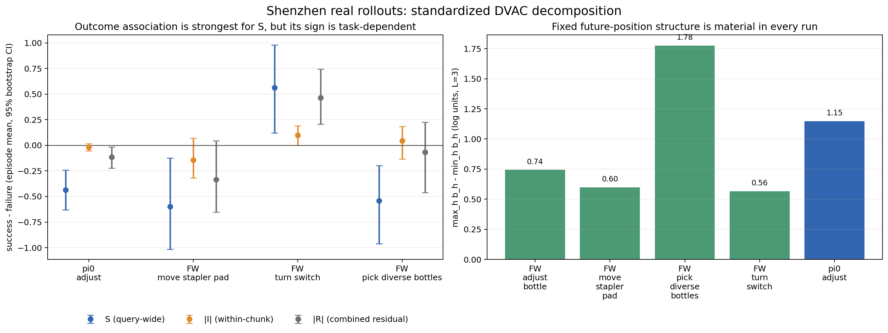
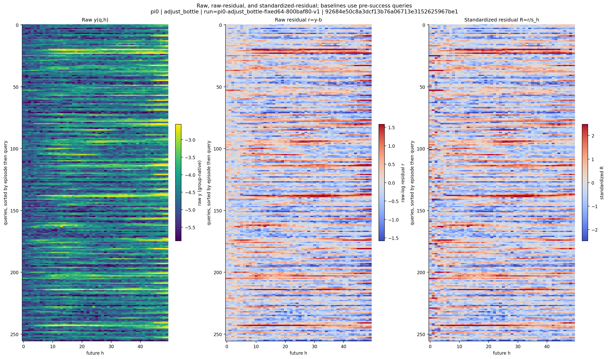
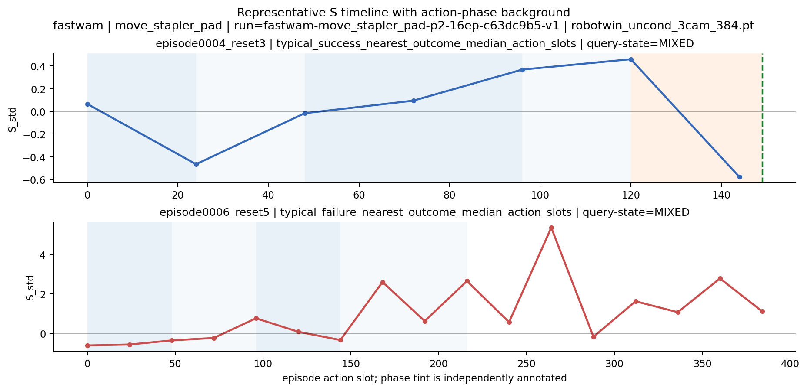

# 深圳服务器现场、GRPO v1/v2 与 π0 / Fast-WAM DVAC 教学

更新时间：2026-08-23 10:53 CST。

本文把三个容易混在一起的问题分开：服务器现在是否正常、GRPO 旧退出到底发生了什么、以及两条
official policy 上新增的 DVAC 旁路究竟记录了什么。动态状态以本页时间戳为准；逐条服务器命令见
[`evidence/16_SERVER_WHOLE_AUDIT_AND_GRPO_REFRESH_20260823.md`](evidence/16_SERVER_WHOLE_AUDIT_AND_GRPO_REFRESH_20260823.md)。

## 1. 结论先行

- **服务器当前可用且核心服务正常。** `/`、`/home`、`/data` 分别只用 18%、5%、9%，inode 最高2%；
  SSH、Mihomo、Docker、containerd均active，failed systemd unit为0，没有OOM、文件系统、I/O或NVMe错误。
- **GPU 0--3空闲；GPU 4--7只有我们的GRPO v2。** 没有其他用户GPU compute process。
- **GRPO v2仍在跑。** 10:50 CST已完整Step29并进入下一步rollout；Step29 train success=`472/512`
  （`92.1875%`）、KL=`0.016`、clip fraction=`0.066`、grad norm=`12.970`，训练标量finite，driver、
  12个worker、GCS和raylet均alive。
- **资源侧是黄灯，不是当前故障。** GRPO cgroup memory=`1553.3 GiB`、host available=`466.1 GiB`、
  swap=`5.95 GiB`且已占满；但3次`vmstat`均`si=so=0`，cgroup `oom/oom_kill/max/high=0`，CPU约96% idle。
  四个EnvWorker RSS约`316/373/377/396 GiB`，解释了绝大部分主存。
- 用户引用的“22:54八卡空闲”是**GRPO v1旧终态**。错误层级已确定为Ray GCS RPC/heartbeat控制面失联；
  底层触发原因没有证据继续下钻。v2保持完全相同训练字段，只换新run并补退出日志留存，连续29步未复现。
- π0和Fast-WAM都保持official模型、动作、环境与评估主链；新增的是**默认关闭的观测旁路与可连接的落盘元数据**，
  不含训练算法。真实数据最清楚地表明：固定chunk位置效应很强；成功/失败关联更多出现在query-wide的`S`，
  但`S`正负方向依赖任务阶段语义，不能直接叫作跨任务同号的不确定性权重。

## 2. 服务器现场与其他用户活动

### 2.1 容量与资源

| 项目 | 2026-08-23 10:51 CST现场 | 判断 |
|---|---:|---|
| CPU | 128 threads；load `5.61/6.93/7.12`；采样约96% idle | 很宽裕 |
| RAM | 2.0 TiB total；466 GiB available | 当前高占用来自GRPO EnvWorker |
| Swap | 6.0 GiB used；`si/so=0` | 已占满冷页，但没有现场换页抖动 |
| `/` | 49/296 GiB，18%；inode 2% | 正常 |
| `/home` | 94 GiB used，2.2 TiB available；inode 1% | 正常 |
| `/data` | 287 GiB used，3.0 TiB available；inode 1% | 正常 |
| GPU 0--3 | 0个compute process，约4--69 MiB/卡 | 空闲 |
| GPU 4--7 | GRPO，约65--69 GiB/卡 | 只有`chenyiteng`作业 |

相较8月22日21:21管理员基线，根盘约`+1 GiB`、`/home`无可见增长、`/data`约`+35 GiB`。这个量与
GRPO v2新增的Step10/20两个约18-GiB checkpoint一致；当前没有证据指向其他用户的异常写盘。

### 2.2 能可靠看到的“其他人做了什么”

管理员巡检只读登录记录、当前进程类别、GPU owner和一级目录元数据，没有读取任何人的shell history、
私有项目内容、token或SSH私钥。因此能下的结论是资源审计，不是逐命令监控：

- `liwenbo`保留watchdog与旧tmux；一个tmux server的启动命令来自Wan模型HF下载，但现场没有高CPU/RAM/GPU
  下载子进程，GPU占用为0。
- `zhangwei`保留tmux/Codex，RSS约0.16 GiB，GPU占用为0。
- `xiongzizhen`当前没有可见的实质用户作业；`toom`只有旧管理tmux和本次只读SSH。
- 近几天成功SSH登录只落在五个既有账号，未发现未知用户名成功登录。公网22端口存在持续扫描：当前日志
  有`438`条Failed-password与`660`条Invalid-user消息，保留日志中单个攻击源最高6,685条失败事件。
  这是安全黄灯，但日志没有给出已入侵证据；消息条数也不是独立攻击次数。

### 2.3 系统日志中的两组异常都已解释

- 8月21日GPU0的6条Xid 13/43来自已知ACT collect阶段CuRobo fused LBFGS illegal instruction；窄兼容修复后
  没有更新的Xid。
- 8月22日04:29 UTC唯一一次`python` segfault，时间、会话结束和既有流水一致，正是Fast-WAM official expert
  在MPLib 0.2.1 × NumPy 2.2.6的`Box(...)`兼容崩溃。Fast-WAM独立env把NumPy窄降为1.26.4后，official
  evaluator以及后续64条均自然完成。
- 自8月20日起OOM计数0、I/O/EXT4/NVMe错误计数0；当前failed unit=0。

## 3. GRPO v1发生了什么，为什么v2不改参数

### 3.1 v1的错误层级是清楚的

v1在Step1完整结束后进入Step2 rollout `3/4`。2026-08-22 22:31:53 CST起，Ray monitor访问GCS的
`get_all_resource_usage`超时；GCS随后把唯一node标为`UNEXPECTED_TERMINATION`，raylet/GCS RPC持续超时；
22:33:54 driver报告60秒内无法连接GCS并终止。22:54检查时driver、Ray和八卡均已释放。

可以排除的包括：

- 没有训练Traceback、NaN/Inf、CUDA OOM、NCCL错误或worker训练异常；
- 终点cgroup约543 GiB、host仍约1.45 TiB available，memory events全0；
- 没有日志可见的SIGTERM/SIGINT、`ray stop`或graceful人工停止。

因此准确表述是：**Ray控制面RPC/heartbeat链路失联导致程序退出；底层为何失联尚未被证明。** 不能把它
进一步包装成已查明的GCS内部bug、外部kill或内存故障。

### 3.2 当时的处理是重跑同一实验，不是改算法

v1只完成Step1，而save/eval interval为10，没有checkpoint可恢复。v2从同一SFT重新开始，训练字段逐字等价：
GPU4--7、128 env × 4 rollout epochs、G8、global/micro batch `2048/32`、update epochs2、fixed64、
val/save10、max100均不变。只增加wrapper的`driver.exit`以及driver结束后的GCS/raylet/monitor日志复制。

不缩并发的依据是v1退出时资源余量很大且数值正常；若当时改GRPO或并发，就会把控制面故障与算法变化混在一起。
截至本次现场，v2已连续完成29个outer steps，没有复现。**所以现在无需再次“解决后重放”；v2本身就是正在运行的
同配置重放。** 若以后同一GCS症状再次出现，再用两次完整控制面日志做Ray级窄修。

## 4. π0和Fast-WAM相对official到底加了什么

### 4.1 π0 / current RLinf

保持不变的是current RLinf `7d07a421...`、RoboTwin compatibility `0008ae68...`、official π0 SFT、
official evaluator与OpenPI sampler，以及`H=C=50 / M=4 / D=14`。

真正的信号改动是在原Euler去噪循环旁路复制已经计算的`x/v/t`，形成`x_chain`与`z_endpoint`；模型capture
本身约35行。完整telemetry runtime增量为6个逻辑文件、`+1135/-9`：

| 层 | 新增作用 | 是否改变policy |
|---|---|---|
| OpenPI model | 保存每步clean-endpoint estimate所需量 | 否 |
| HF worker | 把旁路payload传给rollout侧 | 否 |
| Env worker | 连接query、episode、reset、outcome | 否 |
| writer | 写CSV、NPZ、三相机PNG与manifest | 否 |
| opt-in YAML | `enabled=false`为默认值 | 否 |
| focused tests | 验证shape、writer与default-off合同 | 不进runtime |

后续359行real-query parity harness是验证工具，不是采集功能；用户取消Gate后没有真实执行。actual telemetry中
所有数组finite，记录链最后一步与真正model action最大误差为0，但不能把这说成“真实off/on bitwise parity已跑过”。

### 4.2 Fast-WAM

保持不变的是official `7faa711...`、release checkpoint/stats、official B=1 evaluator、vendored RoboTwin、
`H=32 / C=24 / M=10 / D=14 / sigma_shift=5.0`以及action queue。

模型内只在已有Euler loop旁路保存`x/v/timestep/delta/x_next`，约`+27/-1`；完整runtime telemetry增量为
7个文件、`+675/-3`，其余是query/episode/action-slot/video-frame join、writer、Hydra forwarding、
default-off配置和tests。`skip_get_obs_within_replan=false`是官方已有接口，本次用它保存每个实际执行动作前的
fresh observation，从而可以把`h<24`精确对齐视频帧。

另一个`+384/-1` parity child主要是harness、tests和默认不用的generator注入口，也没有运行真实Gate。
前两次采集失败——metadata/payload同一路径、clean gate误拒三个正常symlink——都是我们附加工程层的问题；
分开路径并精确允许symlink后，official rollout全部自然完成。

### 4.3 哪些必要，哪些不是

- **计算raw DVAC必需：** Euler-loop capture与最小落盘。
- **做可信视频/outcome分析必需：** query/episode/reset/action-slot/frame join、manifest、三相机输入和完整视频。
- **合理但不影响推理：** focused unit tests与default-off配置。
- **本轮不必需且未执行：** 两个real-query Gate harness，以及早期较重的packet/hash/preflight工作。
- **official部署真正必需的机器适配：** Fast-WAM独立env的NumPy 1.26.4；它解决MPLib ABI合同，不属于DVAC。

## 5. 数据规模与证据边界

最终统一分析只使用π0独立fixed-64主集和Fast-WAM四个16-episode块：

| policy / task | outcome | queries | 主要原始产物 |
|---|---:|---:|---|
| π0 / adjust bottle | 42/64 success | 256 | 4 NPZ、768 PNG、4 tiled MP4 |
| Fast-WAM / adjust bottle | 16/16 | 80 | 80 NPZ、240 PNG、16 MP4 |
| Fast-WAM / move stapler | 11/16 | 162 | 162 NPZ、486 PNG、16 MP4 |
| Fast-WAM / turn switch | 10/16 | 133 | 133 NPZ、399 PNG、16 MP4 |
| Fast-WAM / pick bottles | 12/16 | 128 | 128 NPZ、384 PNG、16 MP4 |

合计128 episodes、759 queries、70,592个`(q,h)`行；717条pre-success query进入主统计，42条π0
post-success query只进入明确标注的伴随表。Fast-WAM有11,528条真实executed-action/frame join行。

π0早先fixed-16的`12/16`只是工程首批，reset可能与fixed-64重叠，没有拼入主统计。两个模型的RoboTwin tree、
seed cohort与runtime不同，因此成功率也不能当paired模型排行榜。

## 6. 从raw DVAC到两个通道、四项分解

### 6.1 raw量到底是什么

对当前一次policy query `q`、future位置`h`和动作维`d`，每个去噪step都有clean endpoint estimate：

$$
z_i(q,h,d)=x_i(q,h,d)-t_i v_i(q,h,d).
$$

取最后`L`个去噪step，计算同一个future action在去噪尾部还“改口”多少：

$$
V_L(q,h)=\sum_d\operatorname{Var}_{i\in\text{tail}(L)} z_i(q,h,d),\qquad
y(q,h)=\ln(V_L(q,h)+10^{-12}).
$$

它不是跨episode动作方差，也不是预测失败概率；它只是同一次flow denoising path的稳定性proxy。

### 6.2 两个大通道

$$
y(q,h)=b_h+r(q,h),\qquad
R(q,h)=\frac{y(q,h)-b_h}{s_h}.
$$

其中`b_h`是同一policy/checkpoint/task/run/cohort里第`h`格的中位数，`s_h=1.4826 MAD_h`。

- **Position `b_h`：** “第h格通常就怎样”，例如chunk尾部天然更不稳定。
- **Residual `r/R`：** “同样是第h格，这次query还额外偏高或偏低多少”。
- `R=+2`只表示高于该位置约2个robust scale，不是失败概率或安全阈值。

### 6.3 四项只是继续分账

raw单位的严格恒等式是：

$$
y=\mu+P_h+S_{raw}(q)+I_{raw}(q,h).
$$

标准化单位的严格恒等式是：

$$
R=S_{std}(q)+I_{std}(q,h).
$$

| 项 | 直觉 | 在二维表中的角色 |
|---|---|---|
| `μ` | 全表共同零点 | 总均值 |
| `P_h` | 固定future位置形状 | 列效应；`μ+P_h=b_h` |
| `S(q)` | 当前query让整条chunk一起升/降 | 行效应；state/stage/difficulty混合 |
| `I(q,h)` | 该query内某个future位置额外突出 | 去掉行列效应后的局部形状 |

不能写`y=b+S_std+I_std`，因为raw log单位与标准化单位不同。最终派生的三条恒等式最大误差均小于
`1.8e-15`。

## 7. 真实观察：图应该怎么读

### 7.1 Position效应是真实主效应

L=3下，π0 adjust的`b_h`跨度为`1.148` log units；Fast-WAM adjust/move/turn/pick分别为
`0.743/0.597/0.564/1.775`。π0尾部明显上扬，Fast-WAM则更锯齿且非单调；所有MAD floor计数均为0。
因此直接按raw DVAC挑最大的future action，会把固定chunk位置偏差错当成当前状态信号。

下面三联图从左到右是raw `y`、扣除Position后的`r`、再按位置MAD标准化的`R`。左图中的固定横向/尾部
结构被移除后，才能比较不同query在同一h上的异常。

### 7.2 outcome关联目前主要在S，不在I

下面是episode-first的`success - failure`：

| 任务 | `S_std`差（95% bootstrap CI） | `abs(I_std)`差（95% CI） |
|---|---:|---:|
| π0 adjust | **-0.436 [-0.630,-0.242]** | -0.020 [-0.055,0.015] |
| FW move stapler | **-0.599 [-1.015,-0.123]** | -0.142 [-0.320,0.070] |
| FW turn switch | **+0.564 [0.119,0.979]** | +0.096 [-0.001,0.190] |
| FW pick bottles | **-0.541 [-0.965,-0.202]** | +0.039 [-0.143,0.181] |

前三个负号任务中，失败episode往往整条chunk共同偏高；但turn-switch恰好反号。典型成功轨迹真正接近并
操作开关，操作query的S很高；典型失败轨迹长期没有进入有效操作阶段，S反而低。这说明当前最合理的解释是：

> `S`主要携带query-wide执行状态、任务阶段与困难程度的混合信息，而不是跨任务同号的校准不确定性。

`I`确实保留within-chunk局部结构，但四个对照块的`abs(I)`区间均跨0，尚不支持“直接挑最大I动作训练”。

### 7.3 视频时间轴显示S与阶段有关，但证据强度不同

π0典型成功的四个query边界为`S=+0.07 → +0.50 → -1.04 → -1.34`，对应初始、接触抓取、抬起旋转、
瓶子竖直；典型失败为`+0.84 → +0.43 → +0.41 → +1.25`，后两query仍未完成。全体轨迹也从slot100
开始分叉，不只依赖代表样本。

Fast-WAM move-stapler先按视频、在不看DVAC的情况下固定选择典型成功/失败并标phase，随后才叠加S。两条
case study中，phase均值`S`依次为approach `-0.263`、grasp `-0.382`、transport `+0.229`、place
`+0.663`、verify `+0.280`；失败后段出现多个高S尖峰。

但phase统计只有2条episode，不能叫总体规律。turn-switch的正负反例进一步说明，后续最有信息量的工作不是
无差别加更多rollout，而是先独立标注turn-switch与pick-bottles阶段，再做task/phase-matched control。

### 7.4 稳健性与不能说的话

- Fast-WAM L3/L5 query rank相关为`0.946--0.980`，tail长度选择较稳；π0 L2/L3/L4为`0.666--0.855`，
  因只有4步去噪，tail选择更敏感。
- raw `V/y`绝不跨π0与Fast-WAM比较；只能比较各自位置标准化后的结构、rank和关联。
- π0只有query-boundary图，不能把`h=0..49`映射成50个真实physics frame。
- Fast-WAM只有实际执行的`h<24`能对齐fresh frame；`h=24..31`是未执行future tail。
- 当前都是观察性结果，不证明因果credit、RL收益、安全或校准不确定性。

## 8. 当前最合理的下一步

1. GRPO v2继续按现有授权自然运行；Step30会给出下一个checkpoint/fixed64信息点。资源上只需继续看
   cgroup memory是否仍随step单调增长，以及是否开始出现非零`si/so`或memory events；现在不重启、不改参数。
2. DVAC下一步优先对turn-switch和pick-bottles代表视频做独立phase标注，再看S反号是否由“有没有进入有效
   操作阶段”解释。这个信息增益高于先把每任务从16条机械扩到更多条。
3. 若未来进入训练，先把Position-only、Residual-only、S-only和I-only作为不同control；不能把当前观察直接
   压成一个“高DVAC多训练”的通用规则。

已有完整结果与表格见[`16_DVAC_FIRST_REAL_RESULT_20260822.md`](16_DVAC_FIRST_REAL_RESULT_20260822.md)，
GRPO曲线口径见[`17_GRPO_STEP27_LIVE_METRICS_AND_PPO_COMPARISON_20260823.md`](17_GRPO_STEP27_LIVE_METRICS_AND_PPO_COMPARISON_20260823.md)。
