# π0 / Fast-WAM DVAC：逐信号、逐模型、逐案例教学

更新时间：2026-08-23。本文只分析已经完成的 official π0 / Fast-WAM RoboTwin 推理，不启动新推理或训练。
最终数据单一事实源是
[`evidence/dvac-analysis-all-four-tasks-20260823`](evidence/dvac-analysis-all-four-tasks-20260823)，
本页新增图表与重算表位于
[`evidence/dvac-signal-teaching-20260823`](evidence/dvac-signal-teaching-20260823)。

## 1. 先回答：到底是 7 个指标，还是更多

**不是 7 个相互独立的指标。** “raw DVAC 1 个 + 两通道 2 个 + 四项分解 4 个”把同一张
$y(q,h)$ 表的不同观察层级重复相加了。

实际 CSV 中能看到 12 个命名量：`V`、`y`、`b_h`、`s_h`、`r`、`R`、`mu`、`P_h`、
`S_raw`、`I_raw`、`S_std`、`I_std`。但它们不是 12 个独立传感器：

- `V` 与 `y=ln(V+eps)` 是同一个 raw 信号的原尺度与对数尺度；
- `b_h=mu+P_h`，所以 `b_h` 与 `P_h` 只差一个共同零点；
- `r` 与 `R=r/s_h` 是同一个 residual 通道的 raw / standardized 单位；
- `mu` 是共同零点，`s_h` 是标准化尺子，都不是当前 case 的动态行为信号；
- `S_raw/I_raw` 与 `S_std/I_std` 是同一“整条 chunk / chunk 内局部”分账在两种单位下的版本；
- `mean abs(I_std)`、`max abs(I_std)`、episode mean `S_std` 是聚合统计，也不是新的基础信号。

因此本文固定使用 **6 个观察视图**：

1. raw `V/y`；
2. Position `b_h/P_h`，同时展示参照尺度 `s_h`；
3. raw residual `r`；
4. standardized residual `R`；
5. query-wide `S`；
6. within-query local `I`。

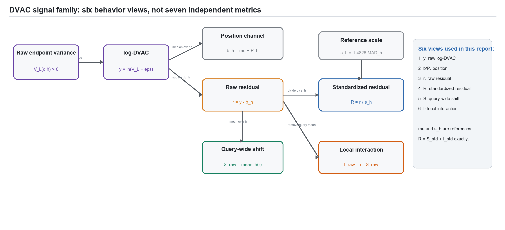

## 2. 一次推理究竟留下了什么

对一次 policy query $q$、future action 位置 $h$、动作维度 $d$，去噪第 $i$ 步有一个 clean endpoint
estimate：

$$
z_i(q,h,d)=x_i(q,h,d)-t_i v_i(q,h,d).
$$

令 $\mathcal{T}_L$ 表示最后 $L$ 个去噪步。我们看这些 endpoint 在去噪末段还改变多少：

$$
V_L(q,h)=\sum_d\operatorname{Var}_{i\in\mathcal{T}_L}z_i(q,h,d),
\qquad
y(q,h)=\ln\left(V_L(q,h)+10^{-12}\right).
$$

这里的 $V_L(q,h)$ 是**同一次去噪路径内部**的 endpoint variance。它不是跨 episode 动作方差，
不是成功概率，也不是经过校准的风险值。

两条 policy 的采样合同不同：

| 项目 | π0 / current RLinf | official Fast-WAM |
|---|---:|---:|
| denoising steps $M$ | 4 | 10 |
| predicted horizon $H$ | 50 | 32 |
| 每个 query 实际执行 $C$ | 50 | 24 |
| active action dim $D$ | 14 | 14 |
| 本文共同主口径 | $L=3$ | $L=3$ |
| 视频对齐 | 只能对齐 query 输入边界 | 对已执行 $h<24$，action slot 等于 fresh pre-action video frame |

因此 raw `V/y` 不能拿 π0 和 Fast-WAM 的绝对数值直接比大小。Fast-WAM 的 $h=24\ldots31$ 是
预测但未执行的 future tail，也不能假装有对应 physics frame。

## 3. 数据规模与主统计口径

| policy / task | success / failure | queries | 主分析 queries | 说明 |
|---|---:|---:|---:|---|
| π0 / adjust bottle | 42 / 22 | 256 | 214 | 另有42个 post-success query只作描述 |
| Fast-WAM / adjust bottle | 16 / 0 | 80 | 80 | 没有失败对照 |
| Fast-WAM / move stapler | 11 / 5 | 162 | 162 | 有两条独立人工phase案例 |
| Fast-WAM / turn switch | 10 / 6 | 133 | 133 | 无正式phase标签 |
| Fast-WAM / pick bottles | 12 / 4 | 128 | 128 | 无正式phase标签 |

合计 128 episodes、759 queries、70,592 个 horizon cells。主统计先在 episode 内聚合，再做
success/failure 描述性 bootstrap，避免一个400-action失败 episode因为 query 更多而自动获得更大统计权重。

## 4. 信号 1：raw DVAC，即 `V/y`

### 4.1 它回答什么

`V_L(q,h)` 回答：“这个 future action 在最后 $L$ 个去噪步里还改口多少？”`y` 只是取对数，让长尾数值
更容易画图。二者排序相同，不应当作两个独立信号。

### 4.2 π0 与 Fast-WAM 分别表现怎样

| policy / task | cell median `y` | `mu` | $L$ 变化后的 query rank correlation |
|---|---:|---:|---:|
| π0 / adjust | -4.557 | -4.393 | L2/L3=.855，L2/L4=.666，L3/L4=.812 |
| FW / adjust | -8.585 | -8.572 | L3/L5=.969 |
| FW / move | -8.643 | -8.647 | L3/L5=.959 |
| FW / turn | -8.572 | -8.578 | L3/L5=.946 |
| FW / pick | -8.033 | -7.850 | L3/L5=.980 |

Fast-WAM 的 rank 对 L3/L5 很稳定；π0只有4步去噪，选择最后2、3、4步会更明显改变排序。表中 π0 与
Fast-WAM 的绝对值**只用于各自 run 内描述，不能据此说谁更不确定**。

下面每个 histogram 也有自己的 x 轴。绿色/红色是 query 所属 episode 的 outcome；它只帮助看各 run
内部形态，正式 outcome 结论仍以 episode-first 表为准。

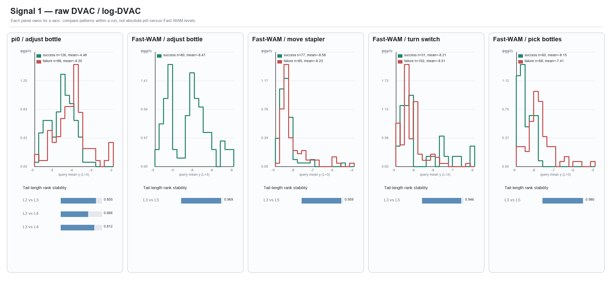

### 4.3 当前能说什么

- raw `y` 确实含 outcome / state 差异，但也明显混入固定 future-position 结构；
- π0、FW move、FW pick中失败 episode的平均 `y` 更高；FW turn中成功反而更高；
- 这个方向与后面的 `S_raw` 完全一致，因为 $\operatorname{mean}_h y=\mu+S_{raw}$；它不是第二份独立证据；
- raw值不能跨模型比较，也不能叫失败概率。

## 5. 信号 2：Position `b_h/P_h`，以及参照尺度 `s_h`

### 5.1 为什么必须先去位置

同一个 policy/checkpoint/task/run/cohort 内，对每个 future 位置分别估计：

$$
b_h=\operatorname{median}_q y(q,h),
\qquad
s_h=1.4826\operatorname{MAD}_q y(q,h).
$$

再把位置曲线写成：

$$
\mu=\operatorname{mean}_h b_h,
\qquad
P_h=b_h-\mu,
\qquad
b_h=\mu+P_h.
$$

`b_h` 回答“第 $h$ 格通常就有多高”；`P_h`只是把这条曲线移到零均值。`s_h`回答“第 $h$ 格平时
自己会波动多大”，它是一把尺子，不是当前 query 的新信号。

### 5.2 真实位置效应有多大

| policy / task | `b_h`跨度 | `s_h` min / median / max | 观察 |
|---|---:|---:|---|
| π0 / adjust | 1.148 | .363 / .633 / .962 | 尾部明显上升 |
| FW / adjust | .743 | .299 / .586 / .880 | 锯齿、非单调 |
| FW / move | .597 | .347 / .586 / .901 | 锯齿且后段尺度增大 |
| FW / turn | .564 | .259 / .506 / .719 | 固定位置形状仍清楚 |
| FW / pick | 1.775 | .324 / .849 / 1.761 | 位置效应最强，尾部尺度也最大 |

所有 $L/h$ 都没有触发 $10^{-6}$ scale floor。也就是说，标准化结果不是人为 floor 制造的。

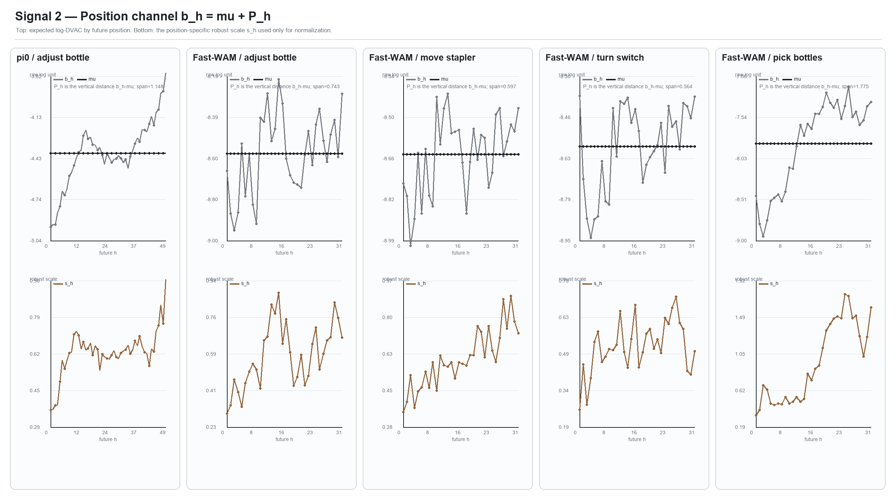

**直觉：** 如果不扣 `b_h`，π0 chunk 后部、Fast-WAM pick 的后半段会因为“这个位置通常就高”而反复
被选中；这会把固定 horizon 结构误读成当前状态的重要性。

## 6. 信号 3：raw residual `r`

### 6.1 定义与直觉

$$
r(q,h)=y(q,h)-b_h.
$$

`r=+0.8` 的含义是：“同样在这个 $h$，这一次比该位置的常态高0.8个 log unit。”它已经去掉 Position，
但不同 $h$ 自身的典型波动仍然不同。

### 6.2 π0 与 Fast-WAM 的 outcome 形态

这里用每个 episode 的 $\operatorname{mean}_{q,h}|r|$，报告 success - failure：

| task | success - failure | 95% bootstrap CI | 读法 |
|---|---:|---:|---|
| π0 adjust | -.076 | [-.148,-.013] | 成功episode residual整体较小 |
| FW move | -.229 | [-.433,+.002] | 同方向，但区间贴近/跨0 |
| FW turn | +.243 | [+.104,+.387] | 成功反而更大 |
| FW pick | -.110 | [-.428,+.149] | 本块不清楚 |

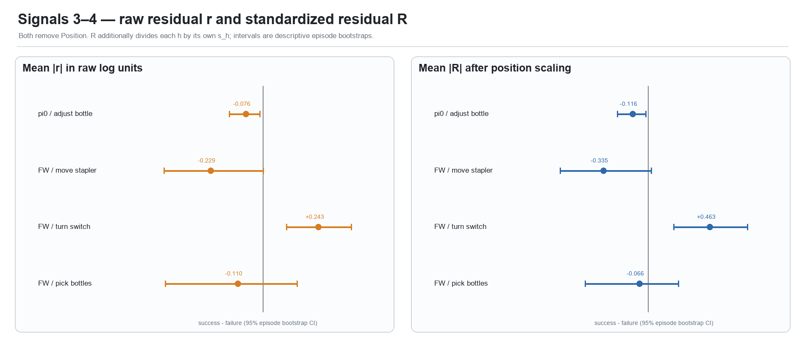

`r`仍是 raw log unit，所以只能在各自组内读。其 signed chunk mean 就是 `S_raw`；其局部剩余形状则是
`I_raw`。因此 `r`不是独立于四项分解的另一套信息。

## 7. 信号 4：standardized residual `R`

### 7.1 定义与直觉

$$
R(q,h)=\frac{r(q,h)}{s_h}.
$$

`R=+2` 的含义是：“这次在同一个 $h$ 上，高出了大约2个该位置自己的 robust scale。”它比 `r`更适合
比较同一 run 内不同 $h$，但仍不是概率、校准置信度或安全阈值。

### 7.2 episode mean `abs(R)` 的真实结果

| task | success mean | failure mean | success - failure（95% CI） |
|---|---:|---:|---:|
| π0 adjust | .753 | .869 | **-.116 [-.223,-.017]** |
| FW move | .848 | 1.184 | -.335 [-.654,+.044] |
| FW turn | 1.300 | .837 | **+.463 [+.206,+.744]** |
| FW pick | .802 | .868 | -.066 [-.463,+.225] |

π0和turn的 `abs(R)`差异比较清楚，但不能把它直接归因给局部 `I`，因为下面的恒等式永远成立：

$$
R(q,h)=S_{std}(q)+I_{std}(q,h).
$$

本批里 `R` 的 outcome差更多来自整条 query共同升降的 `S`。

## 8. 信号 5：query-wide `S`

### 8.1 raw与standardized两种单位

$$
S_{raw}(q)=\operatorname{mean}_h r(q,h),
\qquad
S_{std}(q)=\operatorname{mean}_h R(q,h).
$$

`S`回答：“当前状态让整条 future chunk 一起升高还是降低？”它是 row/query effect，更容易混合当前
task stage、是否真正接触物体、是否卡住、当前几何难度等因素。

注意：`S_std`不是把 `S_raw`除以一个常数。计算 `S_std` 时先对每个 $h$ 分别除以自己的 `s_h`，再平均；
个别 query 的 raw/std方向甚至可能变化。

### 8.2 这是目前最清楚的 outcome 关联

| task | `S_raw` success-failure（95% CI） | `S_std` success-failure（95% CI） |
|---|---:|---:|
| π0 adjust | **-.282 [-.409,-.163]** | **-.436 [-.630,-.242]** |
| FW move | **-.377 [-.650,-.093]** | **-.599 [-1.015,-.123]** |
| FW turn | **+.301 [+.076,+.500]** | **+.563 [+.119,+.979]** |
| FW pick | **-.735 [-1.056,-.461]** | **-.542 [-.962,-.199]** |

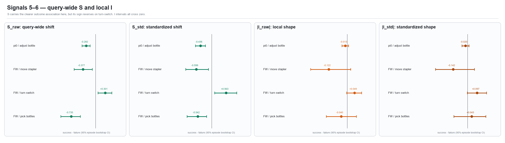

最重要的结论不是“高S等于失败”。π0 adjust、move、pick中失败更高，但turn-switch成功更高。
因此当前更合理的解释是：

> `S`是task/state/stage/difficulty的混合执行状态信号；它有信息，但没有跨任务固定符号。

## 9. 信号 6：within-query local `I`

### 9.1 定义与直觉

$$
I_{raw}(q,h)=r(q,h)-S_{raw}(q),
\qquad
I_{std}(q,h)=R(q,h)-S_{std}(q).
$$

`I`回答：“在当前 query 的整条 chunk 已经整体升高/降低之后，哪个具体 future action 还额外突出？”
因为它按构造满足 $\operatorname{mean}_h I(q,h)=0$，不能看 signed mean；必须看正负热图或
`mean abs(I)`。

### 9.2 当前 outcome 证据弱于S

| task | `abs(I_raw)` success-failure（95% CI） | `abs(I_std)` success-failure（95% CI） |
|---|---:|---:|
| π0 adjust | -.013 [-.035,+.009] | -.020 [-.055,+.015] |
| FW move | -.122 [-.242,+.023] | -.142 [-.320,+.070] |
| FW turn | +.049 [-.004,+.096] | +.097 [-.001,+.191] |
| FW pick | -.040 [-.138,+.061] | +.043 [-.135,+.184] |

四个有对照的块，`abs(I)`区间全都跨0。`I`的局部正负形状真实存在，但本批不支持“挑最大I的action就更
值得训练”这一结论。它更适合下一步与接触、放置、transition等同阶段事件做matched analysis。

## 10. π0案例：同一个任务里的成功与失败

代表 case 是在各 outcome 内按 episode动作长度接近中位数、固定 tie-break 选择的，不是按DVAC挑出来的。

| case / query slot | `S_std` | mean `abs(I_std)` | mean `abs(R)` | 视觉与统计口径 |
|---|---:|---:|---:|---|
| success q0 / 0 | +.068 | .517 | .514 | 初始水平瓶 |
| success q1 / 50 | +.496 | .714 | .850 | 接触/抓取 |
| success q2 / 100 | -1.037 | .360 | 1.040 | 已抬起并旋转；仍属pre-success |
| success q3 / 150 | -1.341 | .445 | 1.353 | **success_before=true，只作post-success描述** |
| failure q0 / 0 | +.839 | .527 | .852 | 初始 |
| failure q1 / 50 | +.433 | .816 | .881 | 抓取尝试 |
| failure q2 / 100 | +.414 | .676 | .756 | 未完成；此处总体成功/失败开始明显分叉 |
| failure q3 / 150 | +1.254 | .647 | 1.397 | 末端仍未完成 |

下面从上到下正好是逐层扣除：query帧与 `S` → raw `y` → `r=y-b` → `R=r/s` → `I=R-S`。
成功 case 的最后一行已经灰出，提醒它不能混进pre-success主统计。

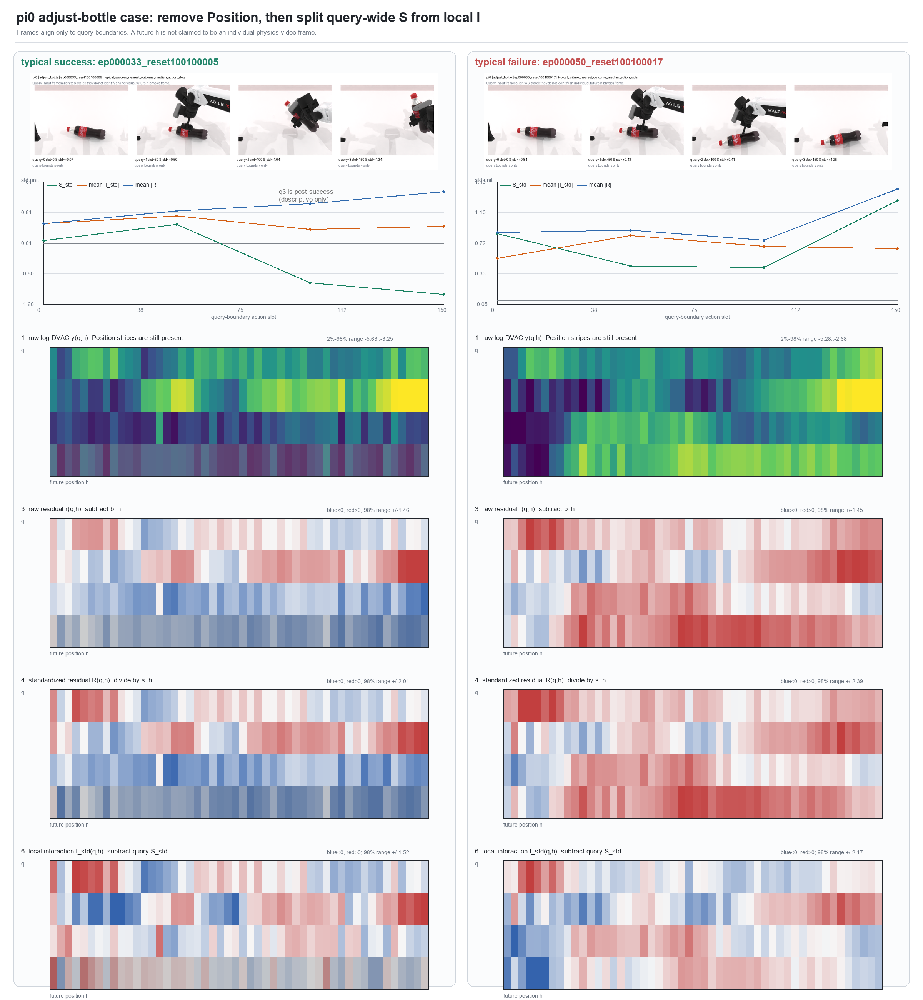

这个案例支持“失败后段整条chunk共同偏高”；不支持把某个 $h$ 映射到某一视频帧，因为π0只保存了
query-boundary输入图。

## 11. Fast-WAM adjust-bottle：同一成功轨迹中的U形阶段变化

16条全部成功，所以这里没有 outcome 对照。代表 episode 的 query `S_std` 是：

`+.779 → -.429 → -.441 → +.050 → +1.077`

图中 raw `y`与 `b_h`、`r`、`R`、`S/I`都按实际 executed action/video frame 展开：

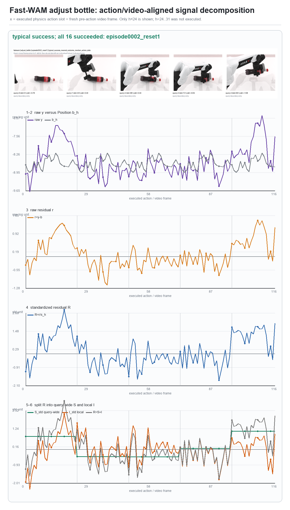

原始storyboard提供6个精确action/frame采样点：

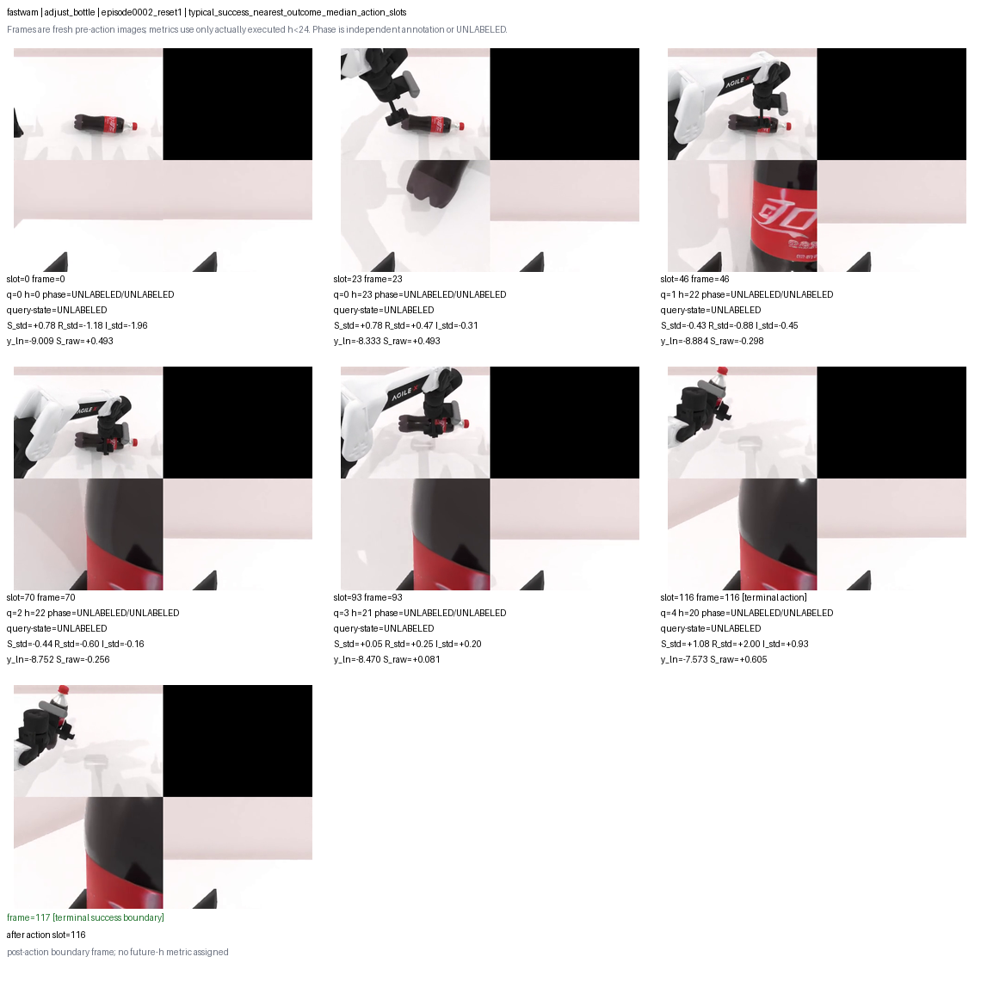

两个点最能说明 `R=S+I`：

- slot0：`S_std=+.779`，但 `I_std=-1.957`，所以具体动作 `R=-1.178`；整条chunk偏高，不代表每个h都高。
- slot116：`S_std=+1.077`，`I_std=+.925`，两者同向叠加得到 `R=+2.002`。

“先高—中段低—结束再高”的U形在16条成功轨迹中可见，但没有失败样本，不能说U形预测成功。

## 12. Fast-WAM move-stapler：目前最完整的phase案例

### 12.1 成功与失败时间轴

典型成功 `episode0004_reset3` 的 query `S_std`：

`+.065, -.466, -.017, +.094, +.368, +.460, -.579`

典型失败 `episode0006_reset5` 前段仍低，但卡住后出现尖峰：q7 `+2.596`、q9 `+2.645`、
q11 `+5.352`、q15 `+2.777`。

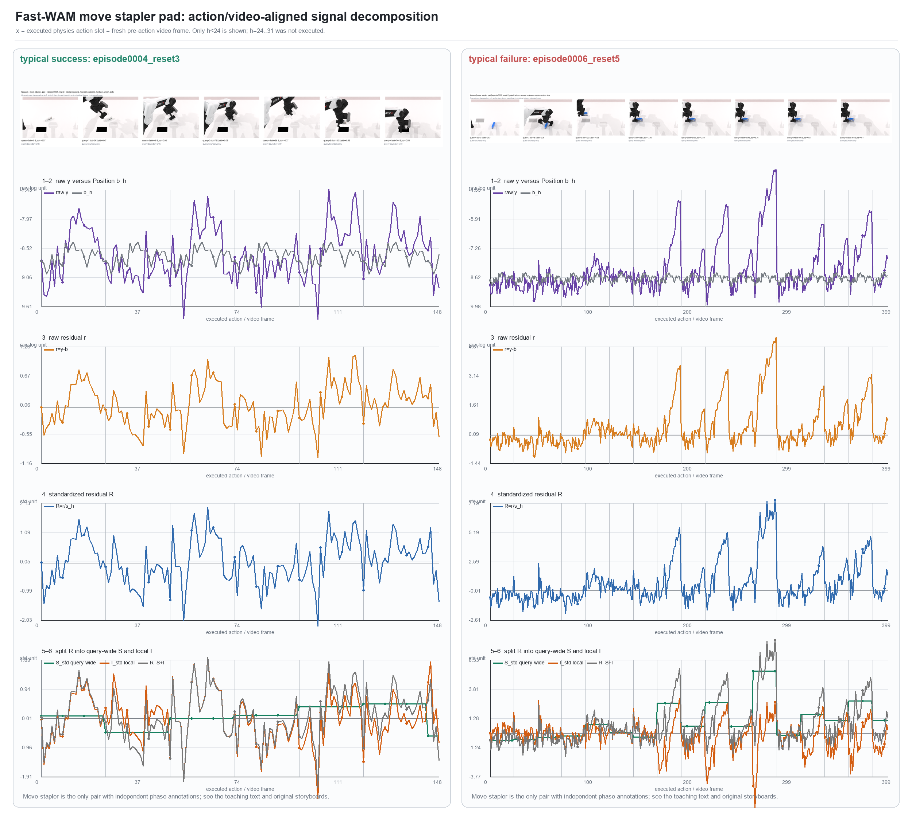

成功与失败的精确动作帧：

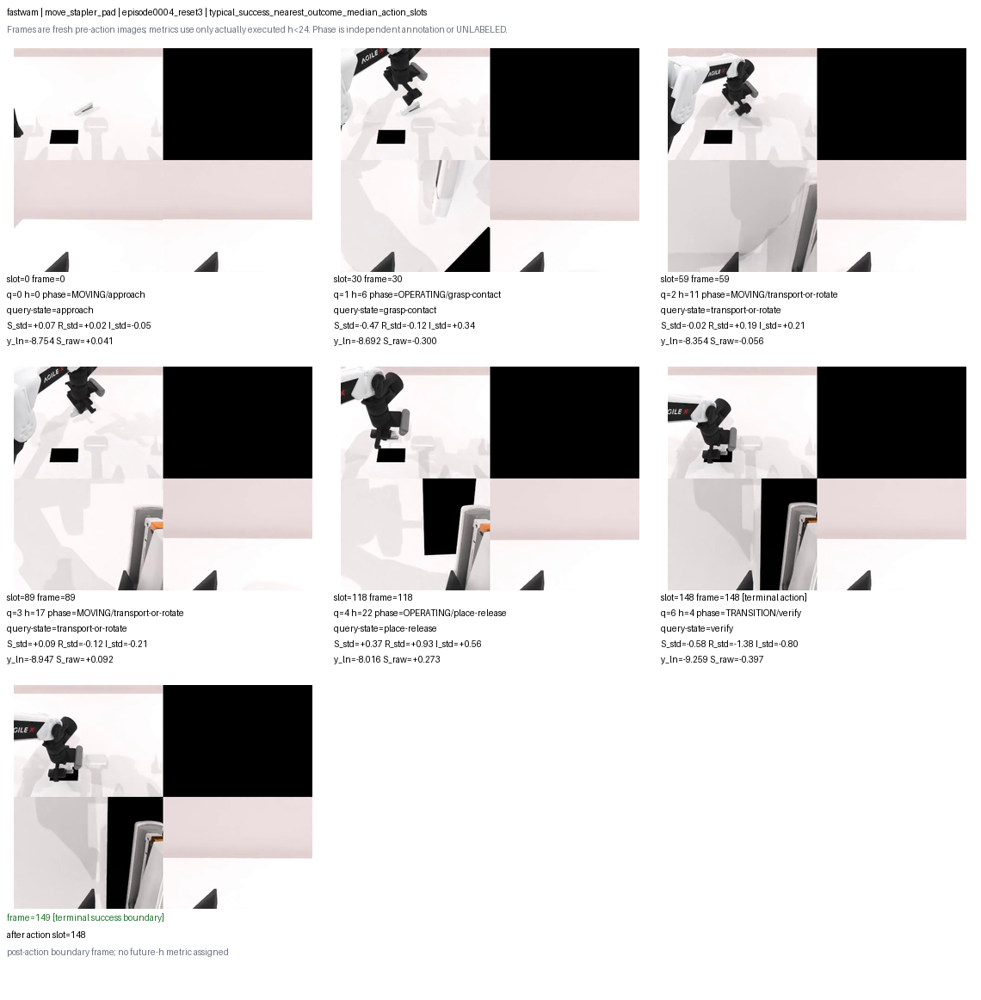

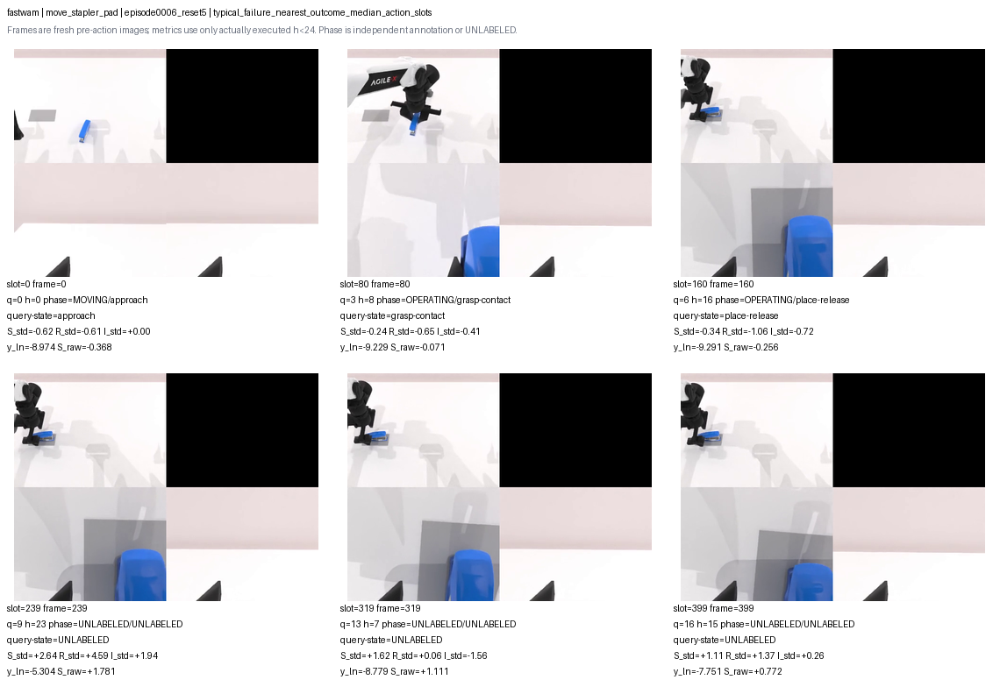

### 12.2 只有这个任务有独立人工phase标签

两条代表视频先在不看DVAC时标注，再叠加信号：

| phase | mean `S_std` | mean `abs(I_std)` | mean `abs(R)` |
|---|---:|---:|---:|
| approach | -.263 | .560 | .664 |
| grasp-contact | -.382 | .522 | .633 |
| transport-or-rotate | +.229 | .581 | .669 |
| place-release | +.663 | .888 | 1.019 |
| verify | +.280 | .478 | .546 |

这里只有2条episode，verify甚至只有1条，不能当总体phase规律。

### 12.3 两个动作点教会 `S/I` 为什么要分开

- 失败 slot239：`S_std=+2.645`、`I_std=+1.942`，同向得到 `R=+4.587`；这是“当前query整体高，
  这个future action还额外高”。
- 失败 slot319：`S_std=+1.620`、`I_std=-1.557`，抵消后 `R=+.063`；这是“query整体很高，但这个
  具体future action并不高”。

如果只看 `R`，slot319会看起来普通；如果只看 `S`，又会忽略同一query内部的抵消结构。

## 13. Fast-WAM turn-switch：为什么S会反号

典型成功只有3个query：`S_std=-.333, +4.375, -.807`。中间query对应真正接近并操作开关；典型失败
q1也曾到 `+2.534`，但随后长期没有进入有效操作，后续大多约 `-.4` 到 `+.1`。

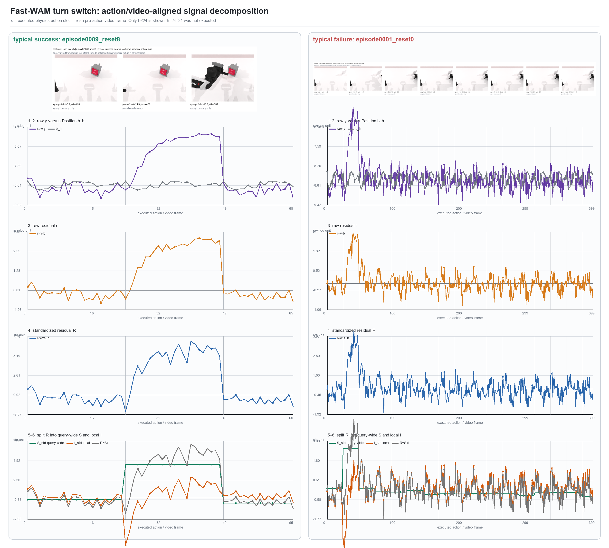

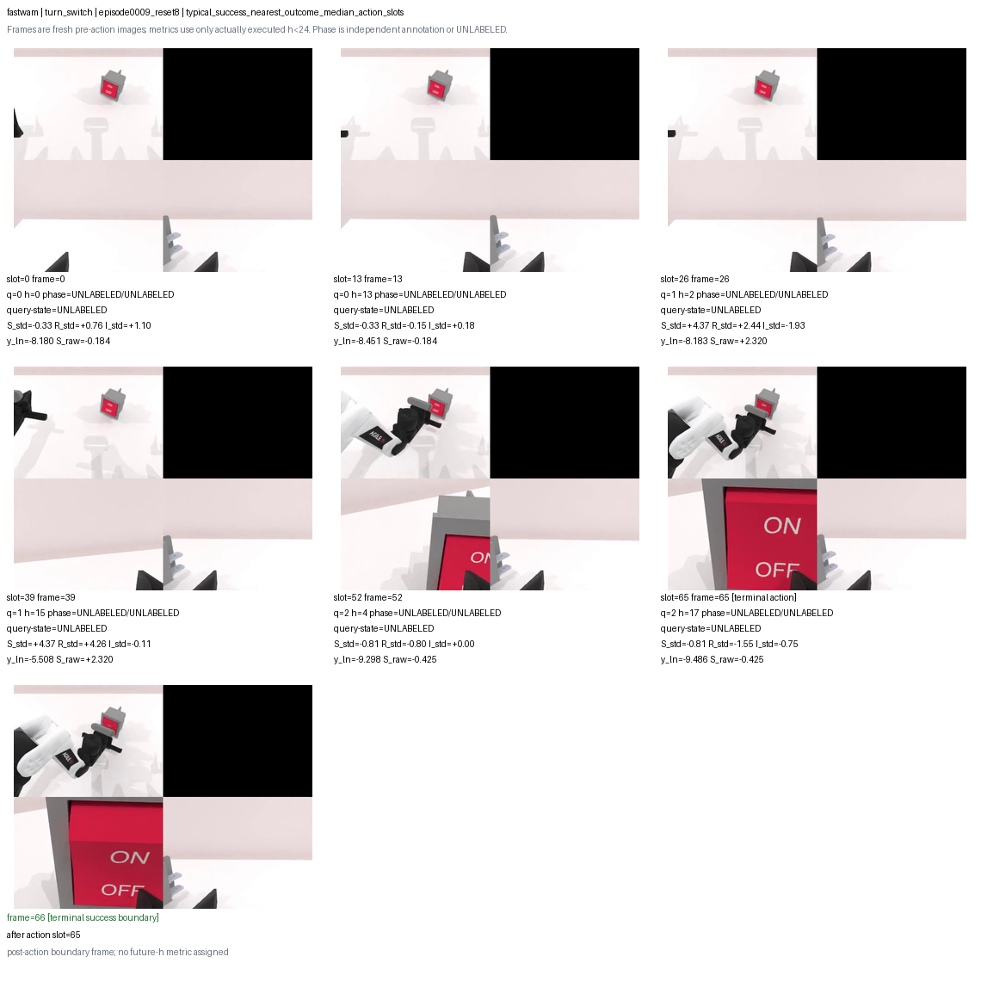

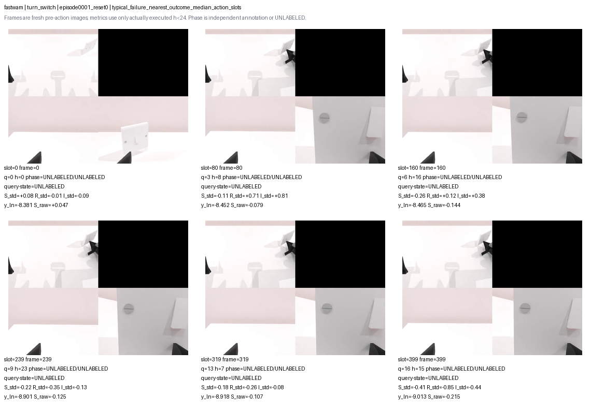

成功 slot39：`S_std=+4.375`、`I_std=-.111`、`R=+4.264`。这是非常干净的 query-wide峰，而不是单个
$h$ 的局部峰。它解释了为什么turn-switch整体是 success的S更高：在这个任务中，高S可能标记“真正进入
有效操作阶段”，而不是普遍意义的失败或风险。

turn没有独立phase标注；“接近/操作开关”是帧的视觉观察，不能冒充总体phase统计。

## 14. Fast-WAM pick-bottles：失败后段持续抬升

典型成功 `S_std=-.068,-.754,-.665,-.426,-.611`，106 actions自然成功终止。典型失败前段混合，
slot168之后逐渐抬升，q12到 `+3.504`、q15到 `+4.233`，400 actions仍未完成。

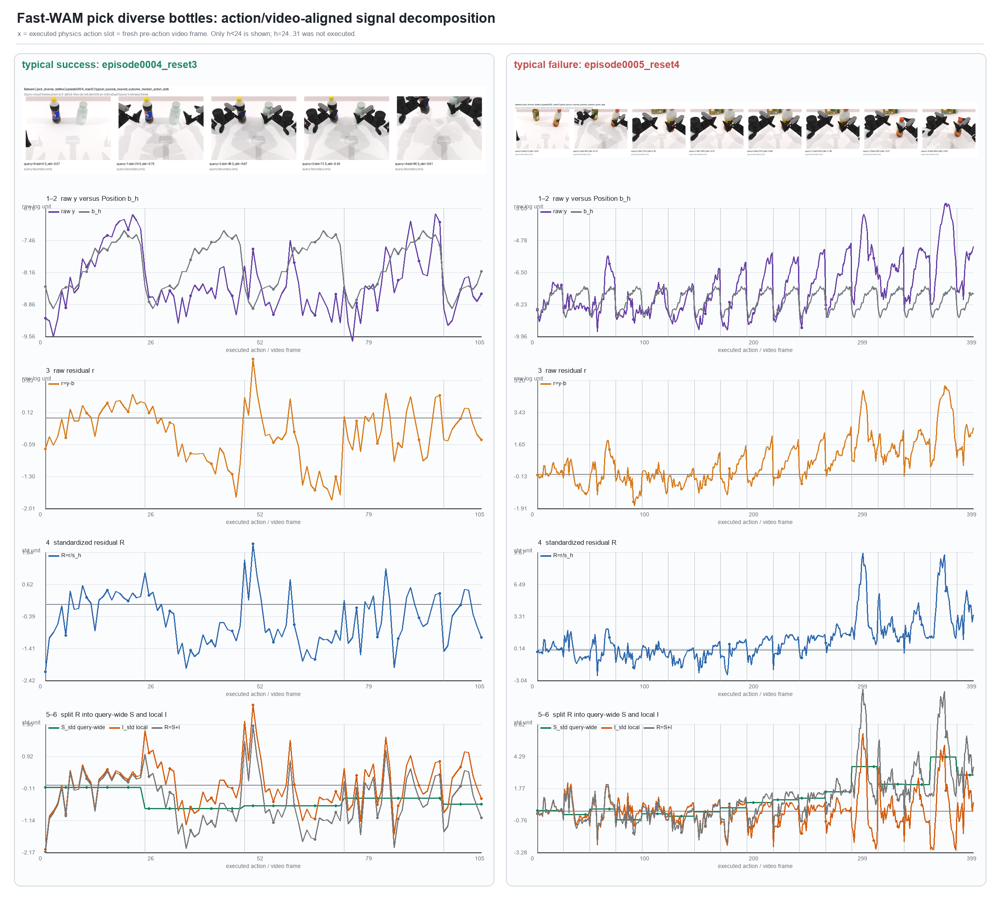

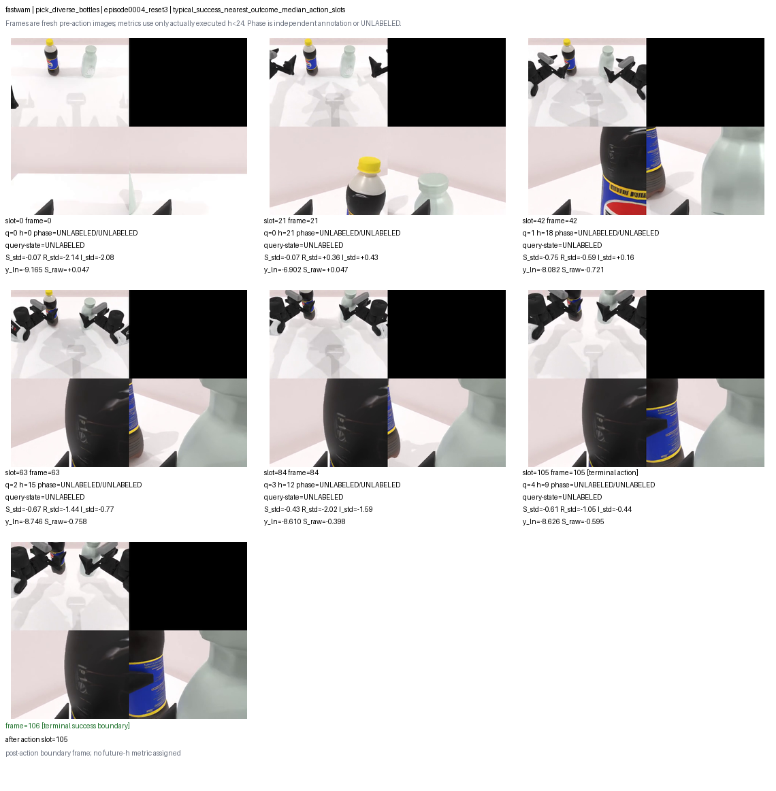

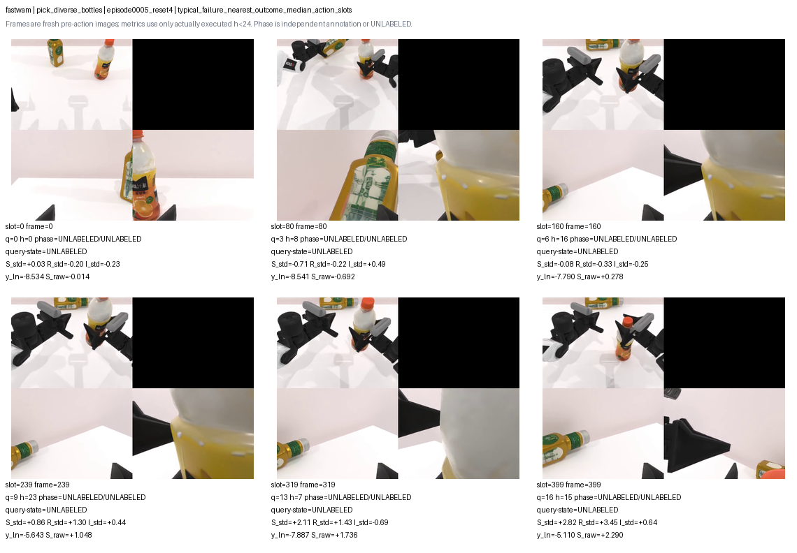

失败 slot399：`S_std=+2.815`、`I_std=+.639`、`R=+3.454`。这个case同时有持续的query-wide抬高与
局部正项；但全体4个失败episode的 `abs(I)` CI仍跨0，所以不能用一个代表case覆盖总体统计。

## 15. 六个关键 action 的完整数值怎么读

下面把 raw、Position、residual、标准化与四项分账放在同一行。所有数值都来自 `L=3`、实际执行动作：

| case / slot | q,h | `y` | `b_h` | `s_h` | `r=y-b` | `R=r/s` | `S_std` | `I_std` |
|---|---:|---:|---:|---:|---:|---:|---:|---:|
| FW adjust / 0 | 0,0 | -9.009 | -8.657 | .299 | -.352 | -1.178 | +.779 | -1.957 |
| FW adjust / 116 | 4,20 | -7.573 | -8.740 | .583 | +1.167 | +2.002 | +1.077 | +.925 |
| FW move fail / 239 | 9,23 | -5.304 | -8.778 | .757 | +3.474 | +4.587 | +2.645 | +1.942 |
| FW move fail / 319 | 13,7 | -8.779 | -8.808 | .463 | +.029 | +.063 | +1.620 | -1.557 |
| FW turn success / 39 | 1,15 | -5.508 | -8.430 | .685 | +2.922 | +4.264 | +4.375 | -.111 |
| FW pick fail / 399 | 16,15 | -5.110 | -7.676 | .743 | +2.567 | +3.454 | +2.815 | +.639 |

逐列读法：

1. `y` 是当前动作的raw log-DVAC；
2. `b_h` 是相同future位置的通常水平；
3. 相减得到 `r`；
4. 再除该位置自己的 `s_h` 得到 `R`；
5. 同一query整条chunk的平均标准化升降是 `S_std`；
6. 当前动作相对本query整体再偏多少是 `I_std`；
7. 最后一项必须满足 `R=S_std+I_std`。

## 16. 最终认识：目前每个信号各自告诉了我们什么

| 视图 | 当前最清楚的观察 | 目前不能说 |
|---|---|---|
| raw `V/y` | 去噪尾部稳定性有真实变化；FW对L3/L5 rank很稳 | 不能跨模型比绝对大小，不能叫失败概率 |
| Position `b/P` | 五个run都有强位置结构，FW pick最强 | 不能把固定chunk尾部偏高当当前state重要 |
| raw residual `r` | 去位置后仍有episode/state差异 | raw单位仍不能跨run直接比较 |
| standardized `R` | 同一run内不同h更可比；π0/turn outcome差清楚 | `R`不是独立于S/I的新传感器，也不是校准风险 |
| query-wide `S` | 当前最稳定的outcome关联；能对应执行阶段 | 符号依赖任务，不能用“越高越失败”的全局规则 |
| local `I` | 能揭示同一query内具体future action的正负突出/抵消 | 本批 `abs(I)` outcome CI全跨0，尚无top-k训练依据 |

最值得保留的认识是：**固定位置效应必须先去掉；目前最强动态信息在query-wide `S`，但它是阶段/状态混合
信号而且任务间会反号；`I`提供局部结构，却还没有总体outcome证据。** 这套结果适合指导下一轮
task/phase-matched观察与control设计，尚不足以直接证明因果credit或RL收益。

## 17. 数据、图表与复现入口

- 最终原始与派生表：
  [`query_metrics.csv`](evidence/dvac-analysis-all-four-tasks-20260823/query_metrics.csv)、
  [`query_horizon.csv`](evidence/dvac-analysis-all-four-tasks-20260823/query_horizon.csv)、
  [`fastwam_action_frame_metrics.csv`](evidence/dvac-analysis-all-four-tasks-20260823/fastwam_action_frame_metrics.csv)、
  [`outcome_summary.csv`](evidence/dvac-analysis-all-four-tasks-20260823/outcome_summary.csv)。
- 本页重算表：
  [`signal_summary.csv`](evidence/dvac-signal-teaching-20260823/signal_summary.csv)、
  [`residual_outcome_summary.csv`](evidence/dvac-signal-teaching-20260823/residual_outcome_summary.csv)、
  [`position_scale_summary.csv`](evidence/dvac-signal-teaching-20260823/position_scale_summary.csv)。
- 可复现制图脚本：
  [`render_shenzhen_dvac_signal_teaching_pillow_20260823.py`](../../local_scripts/render_shenzhen_dvac_signal_teaching_pillow_20260823.py)。
- 原始分析定义与完整pipeline：
  [`analyze_shenzhen_dvac_observation.py`](../../local_scripts/analyze_shenzhen_dvac_observation.py)。
- 本轮操作流水：
  [`evidence/17_DVAC_SIGNAL_TEACHING_REBUILD_LEDGER_20260823.md`](evidence/17_DVAC_SIGNAL_TEACHING_REBUILD_LEDGER_20260823.md)。
