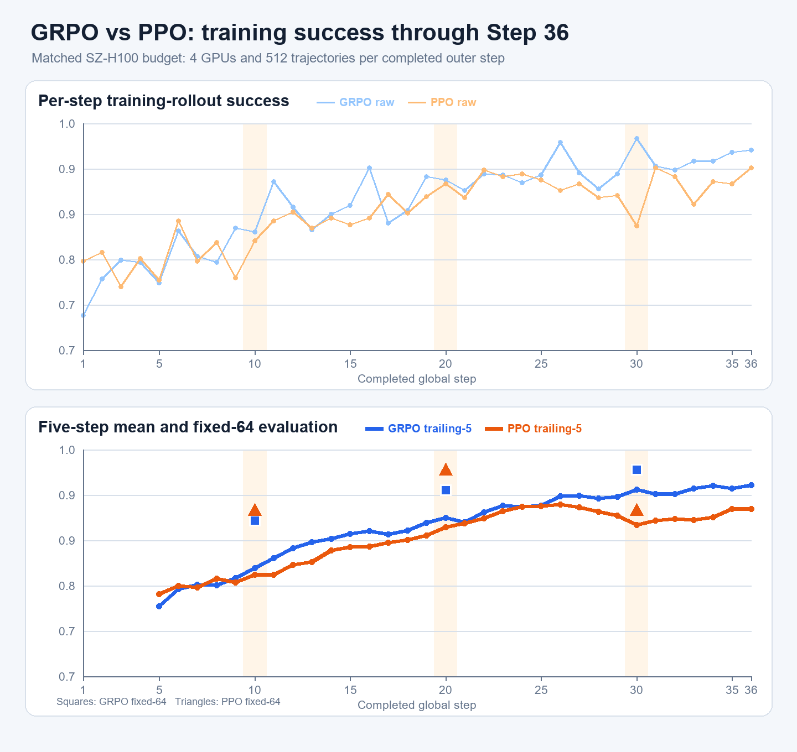
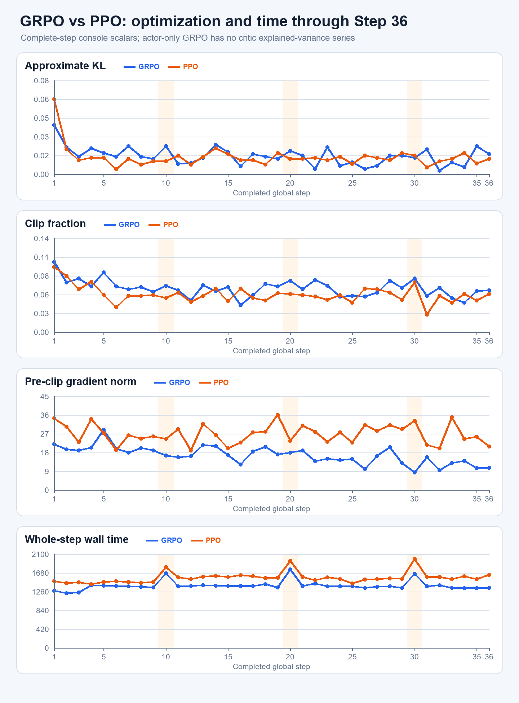
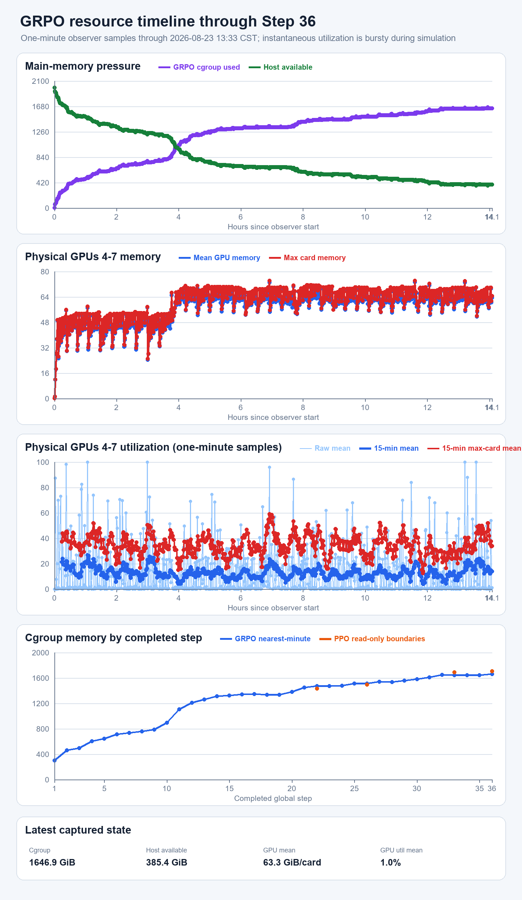

# 深圳 current RLinf GRPO：Step 36 现场、曲线、资源与 PPO 对照

取数窗口：2026-08-23 13:32–13:44 CST。服务器操作全部只读；没有停止、重启或修改训练，没有改
配置或远端文件。三张图冻结在连续完整的 Global Step 1–36；13:44 最终现场为 Step 37 rollout
`3/4`，driver、observer、4 actor、4 rollout worker、4 env worker、GCS 和 raylet 均仍存活。

## 1. 结论先行

- **训练正常继续**：完整到 Step 36，fatal-pattern 与非有限标量扫描均为 0，cgroup 的
  `oom/oom_kill/max/high` 全为 0。
- **训练成功率处于高位**：Step 36 为 `491/512 = 95.90%`，最近 5 步均值 `94.49%`，最近 10 步
  `93.79%`；Step 31–36 均值 `94.30%`。
- **第三个 fixed-64 点改善**：GRPO Step 10/20/30 为 `57/64、60/64、62/64`；PPO 同点为
  `58/64、62/64、58/64`。Step 30 上 GRPO 高 4 条成功，但只有三个评估点且不是配对随机种子 A/B，
  不能据此宣布算法胜负或完全收敛。
- **优化标量稳定**：Step 36 的 KL/clip/grad norm/ratio-abs 为
  `0.017/0.062/10.562/0.073`；Step 1–36 全段范围无持续上冲。
- **主存增长明显放慢，但还没有平台化**：Step 21–30 的近似线性增速约 `+14.01 GiB/step`，
  Step 31–36 降到 `+6.87 GiB/step`。最新约 `1.647 TiB`、观测峰值 `1.664 TiB`，主机仍有约
  `385 GiB` available；曲线斜率仍为正，因此不能称为稳定平台。

## 2. Success：逐步、5-step 与 fixed-64

| 口径 | GRPO | PPO（同 Step 1–36） | GRPO−PPO |
|---|---:|---:|---:|
| Step 36 | 95.90% | 93.16% | +2.73 pp |
| Step 1–36 平均 | 87.81% | 86.17% | +1.65 pp |
| 最新 5 步均值 | 94.49% | 90.82% | +3.67 pp |
| 最新 10 步均值 | 93.79% | 89.94% | +3.85 pp |

GRPO 分段训练 rollout success 为：Step 1–10 `78.75%`、11–20 `88.22%`、21–30 `92.58%`、
31–36 `94.30%`。这说明训练内采样曲线继续上升且没有 collapse。它仍不是独立 held-out 结论；fixed-64
三点的最稳妥读法是“57 → 60 → 62 条成功”，目前向上，但样本点仍少且已接近 64 条上限。

## 3. 优化形态与速度

| 指标 | GRPO Step 36 | GRPO Step 1–36 范围 | PPO Step 36 |
|---|---:|---:|---:|
| approximate KL | 0.017 | 0.0029–0.042 | 0.013 |
| clip fraction | 0.062 | 0.040–0.105 | 0.057 |
| pre-clip grad norm | 10.562 | 8.353–28.755 | 20.904 |
| ratio abs | 0.073 | 0.053–0.150 | — |

GRPO 是 actor-only，因此没有 critic explained variance，不补造与 PPO critic 的对照。较低 grad norm
只描述当前 group-relative actor objective 的实际梯度形态，不等于一般性的算法稳定性证明。

| Step 1–36 中位时间 | GRPO | PPO | 现场差值 |
|---|---:|---:|---:|
| whole step | 1,378.85 s | 1,551.55 s | GRPO 快 11.13% |
| rollout | 1,352.35 s | 1,518.40 s | GRPO 快 10.94% |
| actor training | 22.80 s | 22.94 s | 基本相同 |

GRPO 的 rollout 占中位 whole-step 的 `98.08%`，所以整体速度仍由 RoboTwin 仿真/策略查询主导，而不是
optimizer。Step 36 累计 elapsed 为 `13:55:33`；以最近 10 步 `1,389.34 s/step` 粗略外推，剩余
64 步约 `24.7 h`。这与日志当时的 ETA `24:45:25` 一致，但仍只是当前节奏外推。

## 4. GPU 与主存

一分钟 observer 共 843 行，覆盖 2026-08-22 23:28 至 2026-08-23 13:33 CST。

| 完整 step 附近 | cgroup memory | Host available |
|---:|---:|---:|
| 1 | 302.8 GiB | 1,681.8 GiB |
| 10 | 892.2 GiB | 1,101.0 GiB |
| 20 | 1,382.8 GiB | 623.5 GiB |
| 30 | 1,580.5 GiB | 438.8 GiB |
| 36 | 1,658.4 GiB | 373.1 GiB |

Step 对齐点反映完成时刻附近；13:38 的即时 cgroup 为 `1,646.6 GiB`，说明同一步内部也会有约十几
GiB 波动。即时 swap 为 `5.95 GiB / 6 GiB`，但 3 秒 `vmstat` 的 `si/so` 均为 0，cgroup 与整机
memory PSI 的 10/60/300 秒均为 0；当前没有活跃换页停顿或内存压力 stall。

主存归因已经很清楚：

| 进程类 | 合计 PSS | 约占当前 cgroup |
|---|---:|---:|
| 4 × EnvWorker | 1,540.4 GiB | 93.55% |
| 4 × actor | 33.3 GiB | 2.02% |
| 4 × rollout worker | 17.8 GiB | 1.08% |

cgroup `anon` 约 `1,580.3 GiB`，`file` 约 `61.2 GiB`，所以主体不是可随时回收的普通文件缓存；仍是
四个 RoboTwin EnvWorker 的匿名私有内存。四个 EnvWorker 单进程 PSS 约
`375–417 GiB`。这与 PPO 时的归因一致。

GPU4–7 在本轮即时点约 `60–70 GiB/卡`，分钟序列最高单卡 `74.1 GiB`，尚未接近 80 GiB OOM。
一分钟瞬时利用率的四卡均值：全段平均 `13.1%`、中位 `1.5%`、P90 `40.0%`、最近 15 分钟
`13.8%`；任一卡达到 80% 的分钟占 `24.1%`。这是 rollout 中仿真等待与短推理 burst 交替的形态，
不能用单个 0%/1% 快照判断“训练没工作”。

与 PPO 只能比较已有的同相位只读边界：Step 22/26 时 GRPO 分别高约 `40.8/19.0 GiB`；到 Step
33/36 时 GRPO 分别低约 `46.6/45.4 GiB`。因此 later-stage GRPO 当前略低于 PPO，但相对于约
1.6 TiB 的 EnvWorker 主体并不是数量级变化，也不足以宣称 actor-only 从根本上解决了内存增长。

## 5. 产物与健康状态

13:33 CST 只读盘点：

| 产物 | 当前状态 |
|---|---|
| run 根 | 52 GiB |
| checkpoint | `global_step_10/20/30`，各约 18 GiB |
| fixed-eval MP4 | 12 个，共 1,622,557 B |
| train MP4 | 580 个，共 146,668,706 B |
| metrics / driver / resource | 207,762 / 279,278 / 71,650 B（下载时快照） |
| TensorBoard event | 88,940 B（下载时快照） |
| 磁盘 | `/` 约 234 GiB 可用；`/data` 约 3.0 TiB 可用 |

driver/observer 尚无 exit marker，符合仍在运行；日志 fatal/nonfinite 均为 0。checkpoint、视频与完整
run 留在服务器；Windows 只保留约 1 MiB 的高信息快照和派生图。

13:44 最终续点仍是完整 Step 36、Step 37 rollout `3/4`；GPU4–7约 `60.7–63.8 GiB/卡`，cgroup
约 `1,647.8 GiB`、host available约 `383.8 GiB`、swap约 `5.95 GiB`，memory events仍全0。

## 6. 判断与下一自然信息点

当前训练行为、fixed eval 与优化数值都健康，Step 30 的 `62/64` 是积极信号；但三次 fixed-64 波动和
近 ceiling 的训练 success 还不足以宣布收敛。主存增长速度下降约一半，但斜率仍为正。

因此最自然的下一判断点仍是 **Step 40 checkpoint + fixed-64**：它能直接与 PPO Step 40 的
`62/64` 比较，并再给主存 4 个 step 判断是否真正平台化。当前没有必要额外启动评估，也没有必要仅因
一次低 GPU utilization 快照中断训练。本轮未进行任何进程干预。

## 7. 轻量证据

目录：[`evidence/grpo_v2_live_step36_20260823/`](evidence/grpo_v2_live_step36_20260823/)。

- `metrics.log`、`driver.log`、`resource.csv`、TensorBoard event：本次只读原件快照。
- `grpo_console_scalars_step1_36.csv`：连续完整 Step 1–36 标量。
- `grpo_resource_nearest_minute_by_completed_step.csv`：step 与分钟资源对齐表。
- `summary_step36.json`：本文数字摘要。
- 三张 PNG：success、optimization/time、resource。

解析绘图入口：`local_scripts/render_shenzhen_grpo_live_step36_20260823.py`。脚本要求 GRPO 恰有连续
Step 1–36、所有必需字段 finite、step/资源对齐误差不超过 31 秒；PPO 只读取既有完整 Step 1–46
证据中的前 36 步，不修改旧证据。
