# π0 / Fast-WAM DVAC：从去噪“改口”到动作时间轴的细粒度教学

日期：2026-08-23。数据来自深圳服务器已完成的 official π0 / Fast-WAM RoboTwin rollout；本轮重新取回 7 条代表 Fast-WAM 原始视频和 24 张 π0 query 输入图，在 Windows 本地对最终统一 CSV 重新分析、制图。Fast-WAM 任务图主口径改为论文默认的最后 5 个 clean endpoint estimates；π0 因为总共只有 4 个 endpoint，主口径仍为真实可计算的 $L=3$。

完整 77 图逐张图册见 [`FIGURE_GALLERY.md`](evidence/dvac-detailed-action-timeline-20260823/FIGURE_GALLERY.md)；逐图索引、marker 数值、总体曲线与 tail-length 敏感性表见本文末尾的“可复核产物”。

> **先给结论**
>
> 1. 这里不是 7 个彼此独立的神秘指标，而是 8 个量组成的一条记账链：$V 
ightarrow y 
ightarrow (b,s) 
ightarrow r 
ightarrow R 
ightarrow (S,I)$。其中 $V/y$ 是同一原始信号的两种刻度，$b/s$ 是位置参照，$r$ 是中间量，真正去位置后常看的动态视图是 $R/S/I$。
> 2. Fast-WAM 的失败后段确实能出现很高的 $S$ 和 $R$，但信号含义依任务而变：turn-switch 成功时反而有最强 $S$ 峰。因此 $S$ 更像“当前 state / task stage 让整条 chunk 一起变化”，不是通用失败分数。
> 3. $I$ 能解释同一 query 内具体 future action 为什么突出或抵消；slot239/319 是最清楚的例子。但总体 outcome 证据弱且受 $L$ 影响，不能把大 $|I|$ 直接叫作 action credit。
> 4. 固定位置基线 $b_h$ **可能**吸收与固定 $h$ 锁定的任务模式；若阶段只在 query 边界改变，它主要保留在 $S$。当前两条 move-stapler phase case 的 phase 在 $h=0,ldots,23$ 上近似平铺，没有显示固定 $h$ 锁定；π0 材料则不足以判定逐 $h$ 阶段混叠。
> 5. 这些都是 denoising stability 的观察性视图，不是校准不确定性、失败概率、安全值或已经验证的训练权重。

## 1. 先认识四个任务

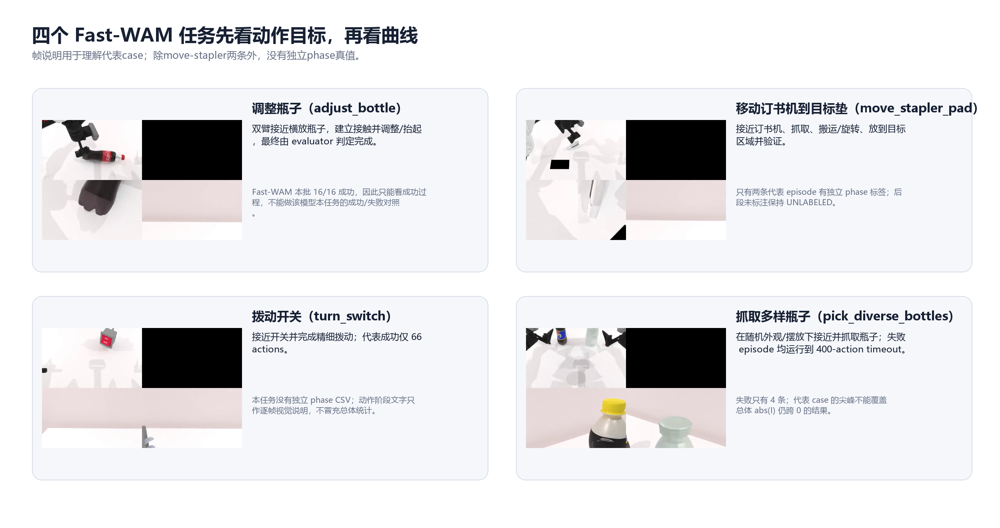

| 任务 | 动作过程 | 本批结果 | 可做什么分析 |
|---|---|---:|---|
| `adjust_bottle` | 双臂接近横放瓶子，接触、调整并抬起/竖直 | Fast-WAM `16/16`；π0 `42/64` | Fast-WAM 只能看成功过程；π0 可做同任务成功/失败对照 |
| `move_stapler_pad` | 接近订书机、抓取、搬运/旋转、放到目标垫并验证 | Fast-WAM `11/16` | 唯一有两条独立人工 phase 标注的任务；适合解释 phase 与 $S/I$ |
| `turn_switch` | 接近并精细拨动开关 | Fast-WAM `10/16` | 成功轨迹出现很强正 $S$，说明信号符号依任务阶段而变 |
| `pick_diverse_bottles` | 随机瓶型/摆放下接近、夹持并抬起 | Fast-WAM `12/16` | 代表失败在 400-action timeout 前出现持续 $S/R$ 抬升 |

## 2. 三只时钟必须分开

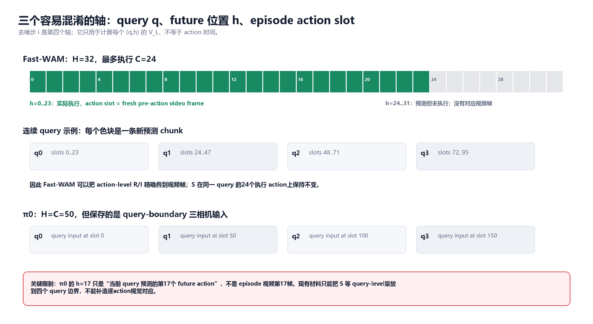

| 轴 | 符号 | 通俗含义 |
|---|---|---|
| 去噪内部时钟 | $i=0,ldots,M-1$ | 同一次 policy query 内，模型把计划修改到第几稿 |
| future-action 位置 | $h=0,ldots,H-1$ | 这份新计划里的第几个未来动作 |
| policy query | $q$ | 第几次重新观察并生成一整条新计划 |
| 环境执行时间 | action slot / video frame | 机器人在现实仿真里已经执行到第几步 |

最常见的混淆是把“最后 5 个去噪 endpoint”说成“最后 5 个动作”，或把预测的 $h$ 直接当作视频帧。

### 2.1 Fast-WAM 的精确合同

- $M=10$：一次 query 内有 $z_0,ldots,z_9$ 共 10 个 clean endpoint estimates。
- $H=32$：模型预测 32 个 future actions。
- $C=24$：本次运行每个 query 最多只执行前 24 个。
- 对已执行的 $h<24$，CSV 已逐行核验：`action_slot == fresh pre-action video frame`。
- $h=24,ldots,31$ 是预测但没执行的 future tail：可以看模型内部位置结构，但没有真实环境帧、phase 或单动作 outcome。

因此，新 case 图中的曲线只把 **已执行 $h<24$** 投到视频时间轴；而 $S(q)$ 本身是在完整 $H=32$ 上先计算，再在该 query 实际执行区间内画成常值。

### 2.2 π0 的精确合同

- $M=4$、$H=C=50$。
- 本地只有每次 query 开始时的三相机输入，不具备逐 $h$ 的 physics-frame lineage。
- 所以 π0 图只在 slot `0/50/100/150` 放 query anchor；曲线里任意 $h$ 不能被说成某张实际动作帧。
- 代表成功的 q3 已是 `success_before=true`，图中灰色标成 post-success，只用于描述，不进入 pre-success outcome 主统计。

## 3. Fast-WAM 为什么看最后 5 步；π0 为什么不能照搬

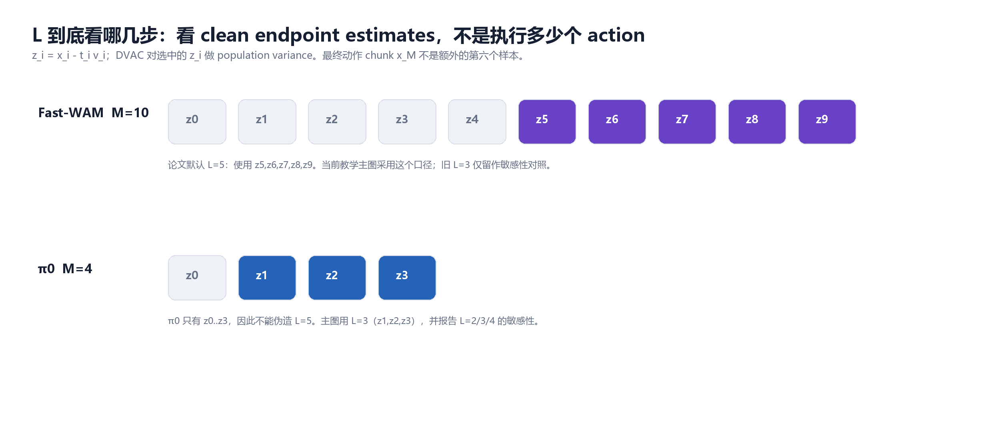

论文先把每次 velocity evaluation 转成 clean endpoint estimate：

$$
z_i(q,h,d)=x_i(q,h,d)-t_i v_i(q,h,d).
$$

对最后 $L$ 个 endpoint 做 population variance：

$$
V_L(q,h)=\sum_{d=1}^{D}\frac{1}{L}\sum_{i=M-L}^{M-1}
\left(z_i(q,h,d)-\bar z(q,h,d)\right)^2.
$$

Fast-WAM 有 $M=10$，因此本文论文口径 $L=5$ 使用 $z_5,z_6,z_7,z_8,z_9$。它不包括最终 $x_M$ 作为“第六个样本”。

π0 只有 $z_0,z_1,z_2,z_3$，因此合法的 $L$ 只有 2、3、4。本文主图取 $L=3$，并报告 $L=2/3/4$ 敏感性；不能复制 endpoint、插值或把 $x_M$ 填成第五步。

## 4. 8 个量逐个理解

### 4.1 裸 DVAC：$V_L(q,h)$

$V_L$ 回答：同一次 query 内，对第 $h$ 个 future action，最后几次 clean endpoint 还在“改口”多少？

- 最后几稿一致，$V$ 小。
- 最后几稿仍来回变化，$V$ 大。
- 它不是跨 episode 方差，不是多模型 ensemble，也不是失败概率。

### 4.2 对数视图：$y(q,h)$

$$
y(q,h)=\ln\left(V_L(q,h)+10^{-12}\right).
$$

- `ln` 是自然对数，用于压缩跨多个数量级的 $V$，像把原始声压换成分贝。
- `ln` 单调，所以 $V$ 与 $y$ 的峰位置和排序完全相同；它们不是两份独立证据。
- $10^{-12}$ 只防止 $V=0$ 时出现 $\ln 0$；它不是阈值、先验或最低不确定性。
- 当 $V\gg10^{-12}$ 时这个常数几乎没有影响。

因此“raw V/y”可以通俗地称为裸 DVAC；图里画 $y$ 是为了读数，而不是改了信号。

### 4.3 固定位置中心：$b_h$ 与 $P_h$

$$
b_h=\operatorname{median}_q y(q,h),
$$

$$
\mu=\operatorname{mean}_h b_h,\qquad P_h=b_h-\mu.
$$

$b_h$ 是“第 $h$ 格通常有多高”；$P_h$ 只是把同一位置曲线平移成均值为 0 后的相对坡度。它们是参照，不是当前 episode 的动态信号。

### 4.4 固定位置尺度：$s_h$

$$
s_h=\max\left(1.4826\operatorname{MAD}_q y(q,h),10^{-6}\right).
$$

$s_h$ 是给每个 $h$ 单独刻的一把 robust 尺子。`1.4826 × MAD` 在近似正态时与标准差同尺度，但这里仍不是校准 Gaussian z-score。

五组真实位置中心/尺度曲线：

- [π0 adjust](evidence/dvac-detailed-action-timeline-20260823/figures/position_reference_pi0_adjust_bottle.png)
- [Fast-WAM adjust](evidence/dvac-detailed-action-timeline-20260823/figures/position_reference_fastwam_adjust_bottle.png)
- [Fast-WAM move](evidence/dvac-detailed-action-timeline-20260823/figures/position_reference_fastwam_move_stapler_pad.png)
- [Fast-WAM turn](evidence/dvac-detailed-action-timeline-20260823/figures/position_reference_fastwam_turn_switch.png)
- [Fast-WAM pick](evidence/dvac-detailed-action-timeline-20260823/figures/position_reference_fastwam_pick_diverse_bottles.png)

### 4.5 去位置但未标准化：$r(q,h)$

$$
r(q,h)=y(q,h)-b_h.
$$

`r=+0.8` 表示：在相同 future 位置 $h$ 上，这一次比常态高 0.8 个 natural-log unit。它已经去掉固定位置中心，但不同 $h$ 的正常波动尺度仍不一样。

### 4.6 去位置且标准化：$R(q,h)$

$$
R(q,h)=\frac{r(q,h)}{s_h}.
$$

`R=+2` 的正确读法是：“相对同一个 $h$ 自己的典型波动，这次高约 2 个 robust scale。”它不是“两倍失败概率”，也不能直接查正态分布概率。

### 4.7 query-wide：$S(q)$

$$
S(q)=\operatorname{mean}_h R(q,h).
$$

$S$ 像当前 query 整片海面的潮位：整条 future chunk 一起升高或降低多少。它很容易携带 state、任务阶段、接触状态、几何难度或停滞状态，因此不能预设“越大越失败”。

### 4.8 query 内局部：$I(q,h)$

$$
I(q,h)=R(q,h)-S(q).
$$

$I$ 像扣掉潮位后的局部浪花：同一 query 内，第 $h$ 个 future action 还额外突出多少。

$$
R(q,h)=S(q)+I(q,h),\qquad \operatorname{mean}_h I(q,h)=0.
$$

因此不能用 signed mean $I$ 做 episode 指标；总体比较用 $\operatorname{mean}|I|$，具体 action 则看带符号的 $I(q,h)$。

另一个必须保持的单位边界是：

$$
y(q,h)=b_h+r(q,h),
$$

但不能写成 $y=b_h+S_{\mathrm{std}}+I_{\mathrm{std}}$，因为后两者已除过位置尺度 $s_h$。

## 5. 位置基线会不会把任务执行模式也过滤掉

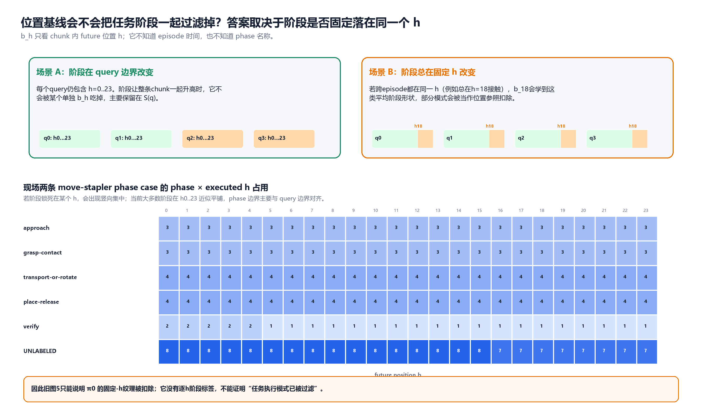

答案是：**可能，但取决于 phase 是否稳定锁在 chunk 内同一个 $h$。**

### 场景 A：phase 在 query 边界改变

如果 q0 整条 chunk 是 approach，q1 整条 chunk 是 grasp，每个 query 仍然都贡献 $h=0,ldots,23$。phase 造成的整条 chunk 共同抬升不会只落在某个 $b_h$，而会主要保留为 $S(q)$。

### 场景 B：phase 总在固定 $h$ 改变

如果大量 episode 都在每条 chunk 的 $h=18$ 接触，那么 $b_{18}$ 会学到这种平均形状。它虽然名叫“位置基线”，实际上会把与固定位置共线的任务模式也作为参照扣掉一部分。

### 当前现场数据支持哪种

两条 move-stapler 独立 phase case 中，approach、grasp、transport、place 在已执行 $h=0,ldots,23$ 上基本平铺；phase 边界主要与 query 边界对齐。当前证据更接近场景 A，没有看到固定 $h$ 的竖向集中。

所以，用户指出的担心在概念上完全成立，但旧 π0 图 5 本身只证明固定-$h$ 纹理被扣除；π0 没有逐 $h$ phase 帧，不能据此宣称“任务执行模式已经被过滤”。最准确的名称应是“固定-$h$ 参照”，而不是“纯机械位置噪声”。

## 6. 总体 outcome 结果先于代表 case

以下均为 episode-first：先把每条 episode 压成一个值，再在 outcome 间比较；差值定义为 success mean − failure mean。Fast-WAM 用本文主口径 $L=5$，π0 用 $L=3$。

| policy / task | 指标 | 成功/失败 | 差值 | episode-bootstrap 95% CI | 当前读法 |
|---|---|---:|---:|---:|---|
| π0 adjust | $S$ | 42/22 | -0.436 | [-0.635, -0.243] | 成功 episode 的 query-wide 水平更低 |
| π0 adjust | `abs(R)` | 42/22 | -0.116 | [-0.226, -0.016] | 成功的去位置标准化幅度略低 |
| π0 adjust | `abs(I)` | 42/22 | -0.020 | [-0.055, +0.014] | 区间跨 0，没有 outcome 分离 |
| FW move | $S$ | 11/5 | -0.662 | [-1.055, -0.188] | 失败 episode 的 query-wide 水平更高 |
| FW move | `abs(R)` | 11/5 | -0.435 | [-0.775, -0.030] | 失败 episode 的标准化幅度更高 |
| FW move | `abs(I)` | 11/5 | -0.181 | [-0.390, +0.036] | 区间跨 0 |
| FW turn | $S$ | 10/6 | +0.885 | [+0.351, +1.362] | **成功反而更高**，与有效操作阶段一致 |
| FW turn | `abs(R)` | 10/6 | +0.649 | [+0.292, +1.031] | 成功 episode 的标准化幅度更高 |
| FW turn | `abs(I)` | 10/6 | +0.104 | [+0.007, +0.193] | L=5 下是小正差；L=3 旧主表仍跨 0，说明该结论对 tail 口径敏感 |
| FW pick | $S$ | 12/4 | -0.759 | [-1.168, -0.442] | 失败 episode 的 query-wide 水平显著更高 |
| FW pick | `abs(R)` | 12/4 | -0.011 | [-0.439, +0.282] | 总体幅度没有清楚 outcome 分离 |
| FW pick | `abs(I)` | 12/4 | +0.096 | [-0.093, +0.240] | 区间跨 0 |

Fast-WAM adjust 为 16/16 成功，没有 failure 对照，不能补造 outcome 差。failure 数最少只有 4–6，表中区间只描述这个固定 cohort，不是总体校准结论；同时看了多个 task/metric，未做多重比较校正。

总体逐时间 mean ± 1 SD 图：

- [π0 adjust：S](evidence/dvac-detailed-action-timeline-20260823/figures/aggregate_pi0_adjust_bottle__S.png)
- [FW move：S](evidence/dvac-detailed-action-timeline-20260823/figures/aggregate_fastwam_move_stapler_pad__S.png)
- [FW turn：S](evidence/dvac-detailed-action-timeline-20260823/figures/aggregate_fastwam_turn_switch__S.png)
- [FW pick：S](evidence/dvac-detailed-action-timeline-20260823/figures/aggregate_fastwam_pick_diverse_bottles__S.png)

每张总体图上半部分把每条 episode 自己归一化到 0–1，适合看相对过程；下半部分保留绝对 action slot，并逐 bin 标 `n-at-risk`。成功 episode 自然早停、失败常走到 400，因此绝对时间后段主要由失败组成，不能把后段差当成同一风险集的成功/失败对照。阴影是 episode 间 1 SD，不是置信区间。

## 7. π0 adjust：只能做 query-boundary 视觉对应

### 7.1 成功代表

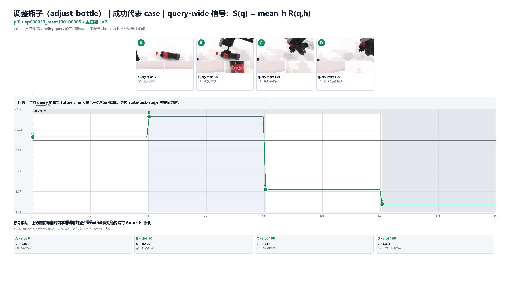

- q0/q1 的 $S=+0.068,+0.496$；从横放瓶子进入接触/抓取。
- q2 抬起并旋转时 $S=-1.037$。
- q3 已成功后的输入为 $S=-1.341$，图中单独灰出，不能放进 pre-success 主统计。

### 7.2 失败代表

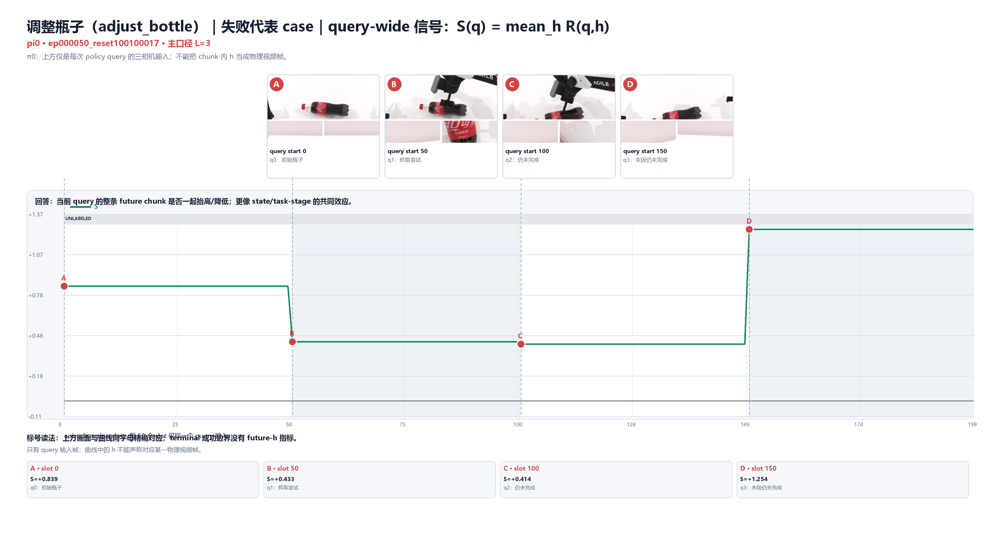

失败代表四个 query 的 $S=+0.839,+0.433,+0.414,+1.254$；末段瓶子仍横放，q3 的 query-wide 水平再次抬高。它与总体“success 的 $S$ 更低”方向一致，但仍只是代表 case，不是单条曲线证明。

分别看其他量：

- [成功：裸 DVAC](evidence/dvac-detailed-action-timeline-20260823/figures/case_pi0_adjust_success__raw_dvac.png)
- [成功：raw residual](evidence/dvac-detailed-action-timeline-20260823/figures/case_pi0_adjust_success__raw_residual.png)
- [成功：标准化 $R$](evidence/dvac-detailed-action-timeline-20260823/figures/case_pi0_adjust_success__standardized_residual.png)
- [成功：局部 $I$](evidence/dvac-detailed-action-timeline-20260823/figures/case_pi0_adjust_success__local_I.png)
- [失败五图完整组](evidence/dvac-detailed-action-timeline-20260823/FIGURE_GALLERY.md#pi0-adjust-failure)

旧图 1 的色块本质是 q×h 矩阵：行是 query，列是 future 位置，颜色代表某个量的高低。它能保留完整 horizon 形状，但不能告诉你某个色块对应哪张实际物理帧。新图把 π0 明确限制在 query anchor；不再用热图暗示逐 action 视频对齐。

## 8. Fast-WAM adjust：前后高、中段低不等于“成功模式”

[成功视频：episode0002_reset1](evidence/dvac-detailed-action-timeline-20260823/videos/fastwam_adjust_bottle_success_episode0002_reset1.mp4)

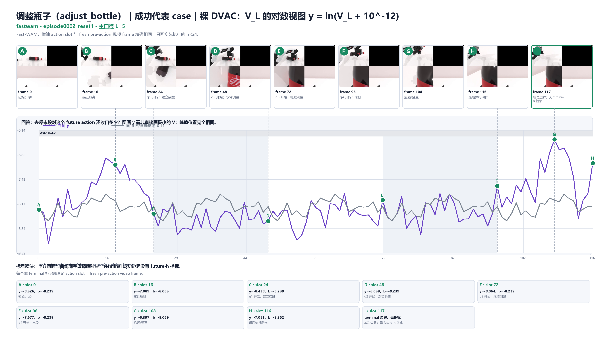

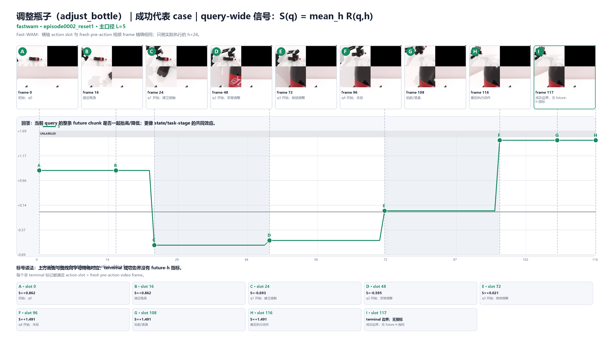

论文口径 $L=5$ 下，五个 query 的 $S$ 约为：

$$
+0.862,\;-0.693,\;-0.595,\;+0.021,\;+1.491.
$$

画面显示：初始接近时较高；接触/中段调整降低；末段抬起并趋向竖直时再次升高。16 条 Fast-WAM adjust 全部成功，没有 failure，因此只能说这批成功轨迹中存在阶段形状，不能说 U 形预测成功。

两个 action 点说明 $S/I$ 的关系：

- slot0：$S=+0.862$，但 $I=-1.195$，所以这个具体动作 $R=-0.333$。整条 query 偏高，不代表每个 $h$ 都高。
- slot116：$S=+1.491$、$I=+1.079$ 同向，得到 $R=+2.571$。

- [raw residual r](evidence/dvac-detailed-action-timeline-20260823/figures/case_fastwam_adjust_success__raw_residual.png)
- [standardized R](evidence/dvac-detailed-action-timeline-20260823/figures/case_fastwam_adjust_success__standardized_residual.png)
- [local I](evidence/dvac-detailed-action-timeline-20260823/figures/case_fastwam_adjust_success__local_I.png)

## 9. Move-stapler：phase 表到底讲什么

只有两条代表视频在不看 DVAC 时先做了独立 phase 标注：一条成功、一条失败。旧表中的 phase mean 是把这两条 episode 内属于该 phase 的 action 信号平均；它不是 16 条轨迹的总体 phase 规律。

旧表之所以难读，是因为：

- `verify` 甚至只有成功 case 的一段；样本不是均衡的。
- 失败后段 slot216 以后保持 `UNLABELED`，不能硬塞进某个动作阶段。
- phase mean 会把时间顺序和尖峰位置压掉。

所以新版本以“帧 + 时间曲线 + phase 色带”为主，phase 汇总只作为补充。

### 9.1 成功：接近、抓取、搬运、放置、验证

[成功视频](evidence/dvac-detailed-action-timeline-20260823/videos/fastwam_move_stapler_success_episode0004_reset3.mp4)

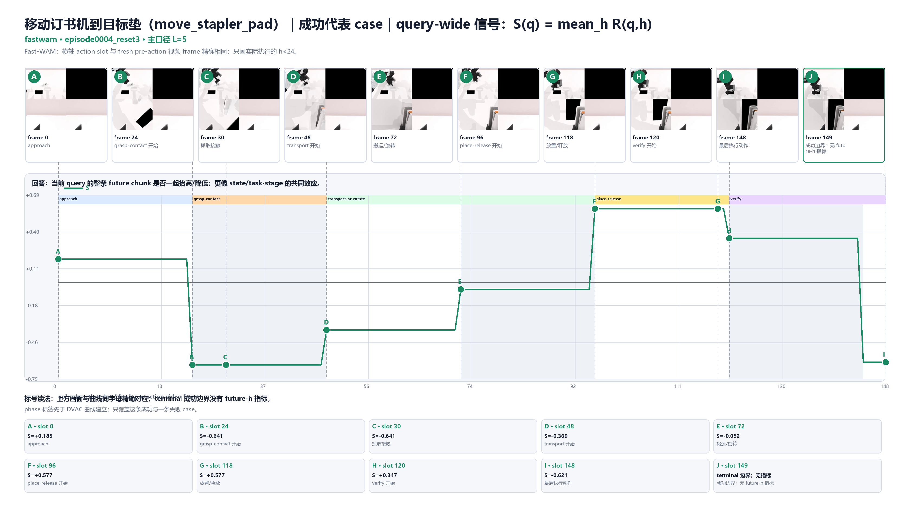

成功 case 的独立 phase 边界与 query 边界大体重合；place-release q4 的 $S=+0.577$，verify q5 先为 $+0.347$，最后一段降到 $-0.621$。这说明 $S$ 能携带阶段变化，但两条标注不足以建立总体 phase 模型。

### 9.2 失败：同一 query 的 slot239 与 slot319

[失败视频](evidence/dvac-detailed-action-timeline-20260823/videos/fastwam_move_stapler_failure_episode0006_reset5.mp4)

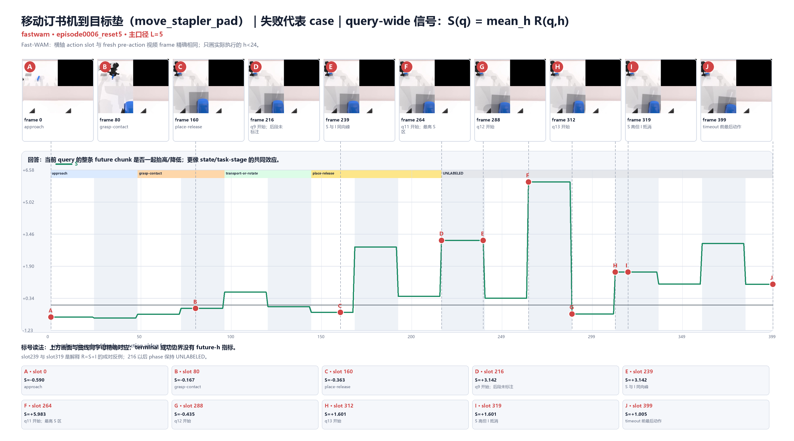

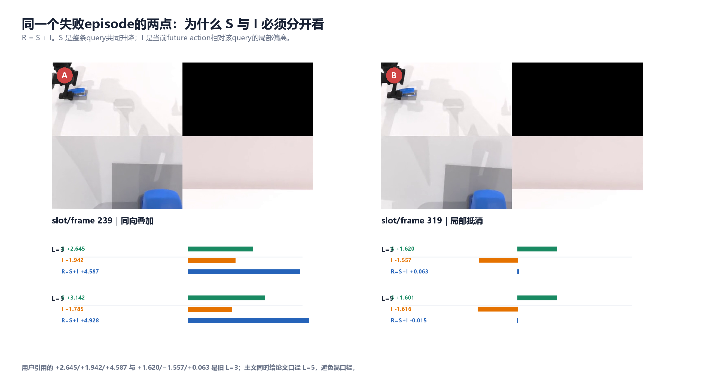

用户引用的数值来自旧 $L=3$；新图同时给出论文口径 $L=5$：

| slot/frame | L | S | I | R=S+I | 解释 |
|---:|---:|---:|---:|---:|---|
| 239 | 3 | +2.645 | +1.942 | +4.587 | query 整体高，具体 future action 还额外高 |
| 239 | 5 | +3.142 | +1.785 | +4.928 | 换成最后 5 步后，同向结构保持 |
| 319 | 3 | +1.620 | -1.557 | +0.063 | query 整体高，但该具体 action 被局部负项几乎完全抵消 |
| 319 | 5 | +1.601 | -1.616 | -0.015 | 论文口径下仍是几乎完全抵消 |

如果只看 $R$，slot319 会显得普通；如果只看 $S$，则会误以为 q13 内每个 action 都高。这里正是拆 $S/I$ 的实际价值。

- [move失败 raw residual](evidence/dvac-detailed-action-timeline-20260823/figures/case_fastwam_move_failure__raw_residual.png)
- [move失败 standardized R](evidence/dvac-detailed-action-timeline-20260823/figures/case_fastwam_move_failure__standardized_residual.png)
- [move失败 local I](evidence/dvac-detailed-action-timeline-20260823/figures/case_fastwam_move_failure__local_I.png)

## 10. Turn-switch：为什么成功时 S 会反号

[成功视频](evidence/dvac-detailed-action-timeline-20260823/videos/fastwam_turn_switch_success_episode0009_reset8.mp4)；[失败视频](evidence/dvac-detailed-action-timeline-20260823/videos/fastwam_turn_switch_failure_episode0001_reset0.mp4)。

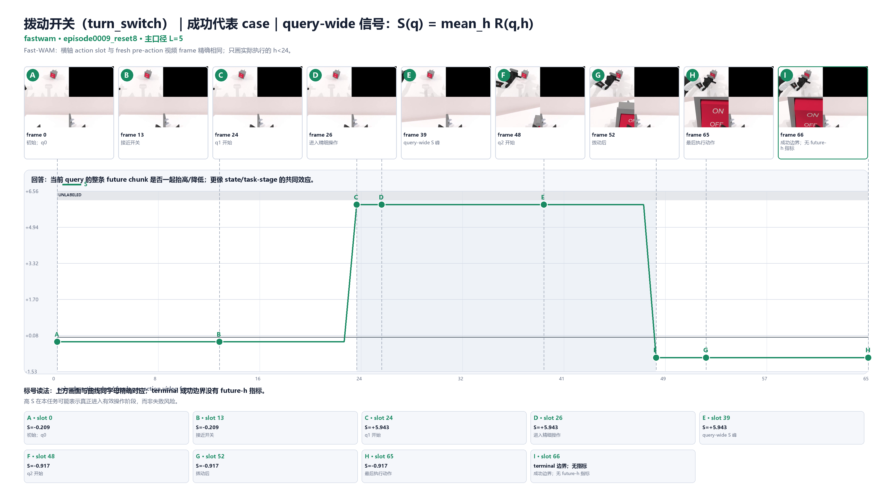

成功代表只有 3 个 query，$L=5$ 的 $S$ 为：

$$
-0.209,\;+5.943,\;-0.917.
$$

中间 q1 对应机械臂真正进入开关附近并完成精细操作。slot39 的 $S=+5.943$、$I=+1.394$、$R=+7.337$；这是 query-wide 高潮叠加一个局部正项。

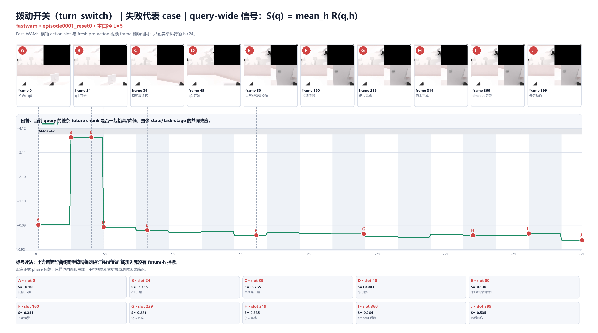

失败代表 q1 也曾有 $S=+3.735$，slot39 的 $R=+5.499$，但后续长期接近 0 或偏负并最终 timeout。由此能说的是：高 $S$ 可能标记“进入某种强操作状态”，但一次高峰本身不足以保证成功。

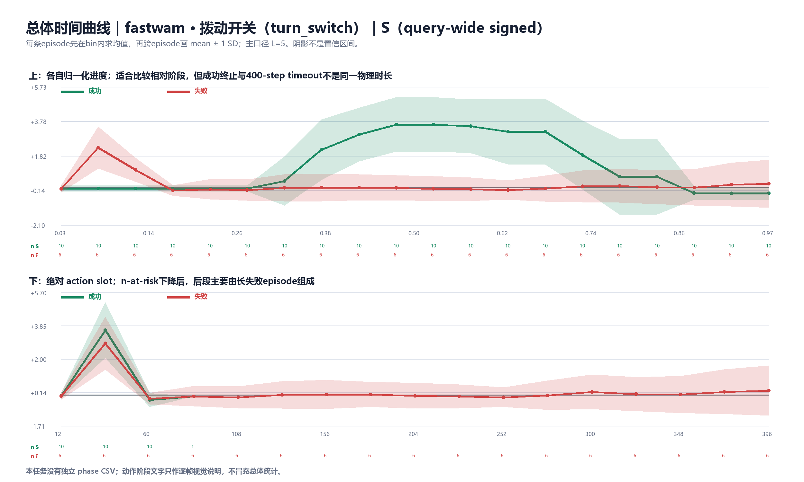

总体上成功 $S$ 比失败高 `+0.885 [0.351, 1.362]`。这正面否定了“跨任务统一把高 S 当失败风险”的用法。turn 没有独立 phase CSV，“进入有效操作”是代表帧的视觉观察，不能冒充 16 条 episode 的 phase 统计。

## 11. Pick-bottles：失败后段持续抬升

[成功视频](evidence/dvac-detailed-action-timeline-20260823/videos/fastwam_pick_bottles_success_episode0004_reset3.mp4)；[失败视频](evidence/dvac-detailed-action-timeline-20260823/videos/fastwam_pick_bottles_failure_episode0005_reset4.mp4)。

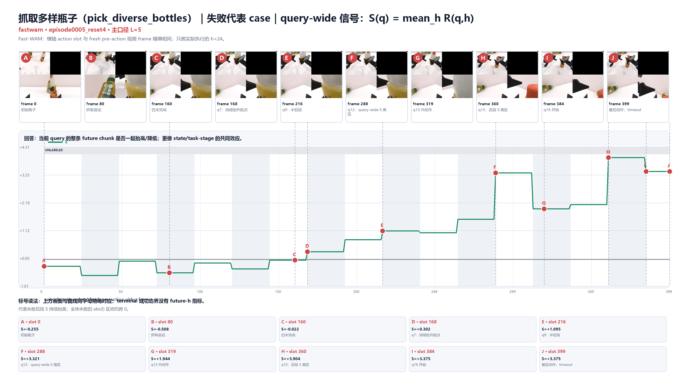

代表失败运行满 400 actions。$L=5$ 下：

- q7/slot168：$S=+0.302$，开始进入持续抬升段。
- q9/slot216：$S=+1.095$。
- q12/slot288：$S=+3.321$。
- q15/slot360：$S=+3.904$。
- q16/slot384–399：$S=+3.375$。

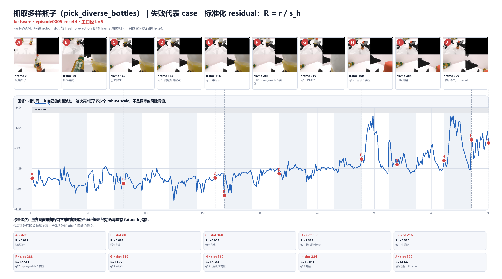

末段具体 action 并不都与 $S$ 同号。例如 slot360 的 $I=-1.590$，把 $R$ 压到 `+2.314`；slot384 的 $I=+1.676$，使 $R=+5.051$。因此后段既有 query-wide 抬升，也有局部起伏。

但总体上 pick 的 $|I|$ 差为 `+0.096 [-0.093,+0.240]`，$|R|$ 差也跨 0；一个代表失败不能覆盖总体统计。相反，最稳定的 outcome 差在 $S$：success−failure 为 `-0.759 [-1.168,-0.442]`。

- [pick成功五图](evidence/dvac-detailed-action-timeline-20260823/FIGURE_GALLERY.md#fastwam-pick-success)
- [pick失败 local I](evidence/dvac-detailed-action-timeline-20260823/figures/case_fastwam_pick_failure__local_I.png)
- [pick总体 S](evidence/dvac-detailed-action-timeline-20260823/figures/aggregate_fastwam_pick_diverse_bottles__S.png)
- [pick总体 |I|](evidence/dvac-detailed-action-timeline-20260823/figures/aggregate_fastwam_pick_diverse_bottles__abs_I.png)

## 12. $L=3$ 与 $L=5$ 是否讲同一件事

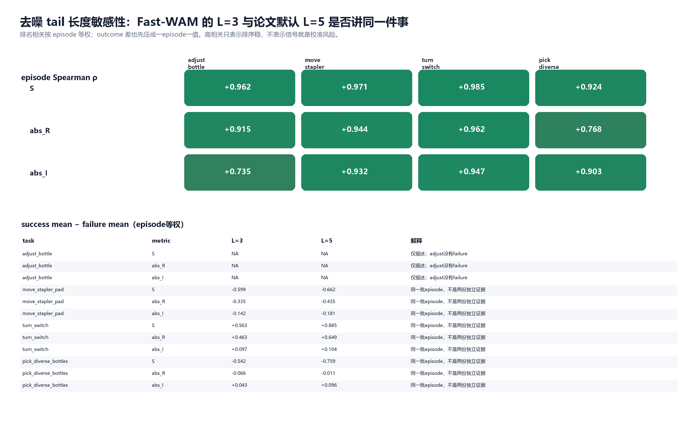

Fast-WAM 同一 episode 在 $L=3$ 与 $L=5$ 下的 episode-level 排名相关：

| 任务 | S | mean abs(R) | mean abs(I) |
|---|---:|---:|---:|
| adjust | 0.962 | 0.929 | 0.597 |
| move | 0.971 | 0.974 | 0.909 |
| turn | 0.985 | 0.950 | 0.935 |
| pick | 0.924 | 0.765 | 0.971 |

大部分排名较稳定，但并非所有统计结论不变：turn 的 $|I|$ outcome CI 在旧 $L=3$ 中跨 0，在新 $L=5$ 中下界刚高于 0。这说明：

- $L=5$ 适合作为 Fast-WAM 的论文一致主口径；
- $L=3$ 仍有历史可比价值；
- 不能把仅在一个 tail 口径下出现的边界性结果写成稳健机制。

π0 的 raw $V_{\text{total}}$ query 排名相关为：L2/L3 `0.855`、L2/L4 `0.666`、L3/L4 `0.812`。π0 的去噪步只有 4 个，因此 tail 选择本来就更敏感。

## 13. 旧热图还有没有额外信息

有，但它回答的是另一个问题：

- q×h 热图完整保留每个 query 的全部 horizon 形状，包括 Fast-WAM 未执行的 $h=24,ldots,31$。
- action timeline 只显示实际执行的动作，更适合对应视频与任务过程。
- $I(q,h)$ 的“同一 query 内局部形状”在热图中最完整；单条时间曲线只展示实际执行 prefix。

因此新版本不是说热图无用，而是把它从“主教学图”降为模型内部结构补充。要解释真实动作，应优先看 action/frame 对齐曲线；要研究未执行 future tail，再回到 q×h 热图，而且必须明确没有环境帧和 outcome。

## 14. 7 条代表视频

| task | outcome | 本地视频 |
|---|---|---|
| adjust | success | [`fastwam_adjust_bottle_success_episode0002_reset1.mp4`](evidence/dvac-detailed-action-timeline-20260823/videos/fastwam_adjust_bottle_success_episode0002_reset1.mp4) |
| move | success | [`fastwam_move_stapler_success_episode0004_reset3.mp4`](evidence/dvac-detailed-action-timeline-20260823/videos/fastwam_move_stapler_success_episode0004_reset3.mp4) |
| move | failure | [`fastwam_move_stapler_failure_episode0006_reset5.mp4`](evidence/dvac-detailed-action-timeline-20260823/videos/fastwam_move_stapler_failure_episode0006_reset5.mp4) |
| turn | success | [`fastwam_turn_switch_success_episode0009_reset8.mp4`](evidence/dvac-detailed-action-timeline-20260823/videos/fastwam_turn_switch_success_episode0009_reset8.mp4) |
| turn | failure | [`fastwam_turn_switch_failure_episode0001_reset0.mp4`](evidence/dvac-detailed-action-timeline-20260823/videos/fastwam_turn_switch_failure_episode0001_reset0.mp4) |
| pick | success | [`fastwam_pick_bottles_success_episode0004_reset3.mp4`](evidence/dvac-detailed-action-timeline-20260823/videos/fastwam_pick_bottles_success_episode0004_reset3.mp4) |
| pick | failure | [`fastwam_pick_bottles_failure_episode0005_reset4.mp4`](evidence/dvac-detailed-action-timeline-20260823/videos/fastwam_pick_bottles_failure_episode0005_reset4.mp4) |

每条 Fast-WAM case 图的 A/B/C… 都是从这些原视频按相同 frame index 抽出；terminal 成功边界（117/149/66/106）是 action 后一帧，明确标成“无 future-h 指标”。

## 15. 证据边界与下一步应该怎样用

### 现在已经能说

- 固定 future 位置结构明显存在，直接看 raw $y$ 会混入 $b_h$。
- 去位置后，$S$ 通常比总体 $|I|$ 更稳定地携带 outcome/阶段关联，但符号依任务。
- 具体 action 的 $R$ 可以由高 $S$ 与正/负 $I$ 叠加或抵消；slot239/319 已精确验证。
- Fast-WAM action/frame lineage 能支持逐 action 视频教学；π0 当前只能支持 query-boundary 视觉 anchor。

### 现在还不能说

- 不能把 $V/R/S/I$ 称为校准 uncertainty、失败概率或安全值。
- 不能把代表 case 的尖峰称为因果 action credit。
- 不能把 turn 的高 $S$ 或 pick 的后段高 $S$ 跨任务统一解释。
- 不能由两条 move phase 标注建立总体 phase 规律。
- 不能把 fixed-chunk telemetry 说成已经验证了 online DVAC adaptive chunking 的收益。

若后续进入训练实验，最干净的第一层消融仍是：Position-only 与去位置 Residual 分开；在 Residual 内再比较 query-wide $S$ 与 local $I$。但训练设计必须另立计划、resolved config 和正式授权，本文只完成观测、分解与教学。

## 16. 可复核产物

根目录：[`dvac-detailed-action-timeline-20260823`](evidence/dvac-detailed-action-timeline-20260823/)

- 完整图册：[`FIGURE_GALLERY.md`](evidence/dvac-detailed-action-timeline-20260823/FIGURE_GALLERY.md)
- 77 图索引：[`figure_index.csv`](evidence/dvac-detailed-action-timeline-20260823/figure_index.csv)
- 代表 marker 的 $V/y/b/s/r/R/S/I$ 精确值：[`case_marker_index.csv`](evidence/dvac-detailed-action-timeline-20260823/case_marker_index.csv)
- 总体 normalized-progress / absolute-slot mean±SD 与 n-at-risk：[`aggregate_time_curves.csv`](evidence/dvac-detailed-action-timeline-20260823/aggregate_time_curves.csv)
- episode-level tail 排名敏感性：[`tail_length_rank_sensitivity.csv`](evidence/dvac-detailed-action-timeline-20260823/tail_length_rank_sensitivity.csv)
- L3/L5 outcome 差与 bootstrap CI：[`tail_length_outcome_sensitivity.csv`](evidence/dvac-detailed-action-timeline-20260823/tail_length_outcome_sensitivity.csv)
- slot239/319 双口径值：[`slot239_319_L3_L5_values.csv`](evidence/dvac-detailed-action-timeline-20260823/slot239_319_L3_L5_values.csv)
- phase×h 占用：[`position_phase_aliasing.csv`](evidence/dvac-detailed-action-timeline-20260823/position_phase_aliasing.csv)
- 生成器：[`render_shenzhen_dvac_detailed_timeline_20260823.py`](../../local_scripts/render_shenzhen_dvac_detailed_timeline_20260823.py)
- 本轮细粒度操作账：[`19_DVAC_DETAILED_TIMELINE_REBUILD_LEDGER_20260823.md`](evidence/19_DVAC_DETAILED_TIMELINE_REBUILD_LEDGER_20260823.md)

论文方法和图形语法的一手来源是 arXiv v1 的 Figure 1、Figure 4、Figure 11 与 Eq. (2)–(9)。本文借用了“帧在时间轴上、query/chunk 分区、失败反例优先”的可视化语法，但本项目的 $b/s/r/R/S/I$ 是离线分析分解，不是论文原算法。
