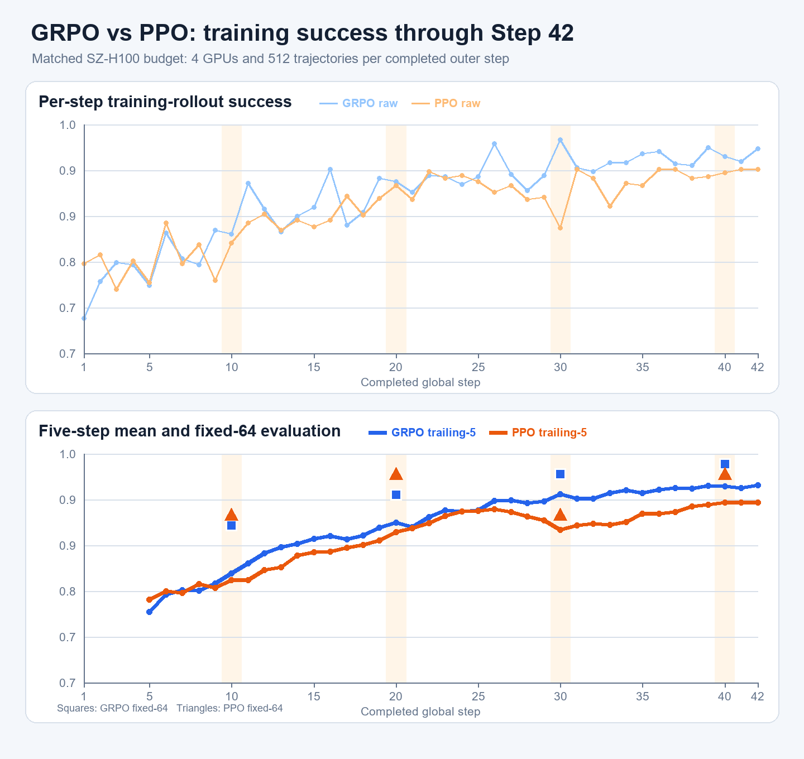
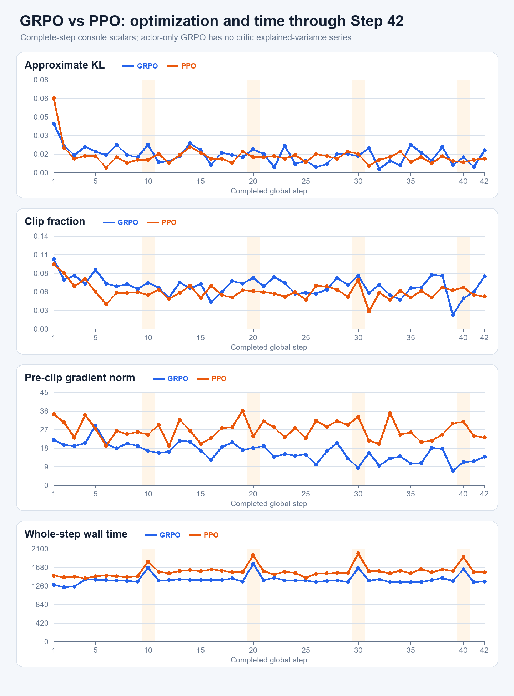
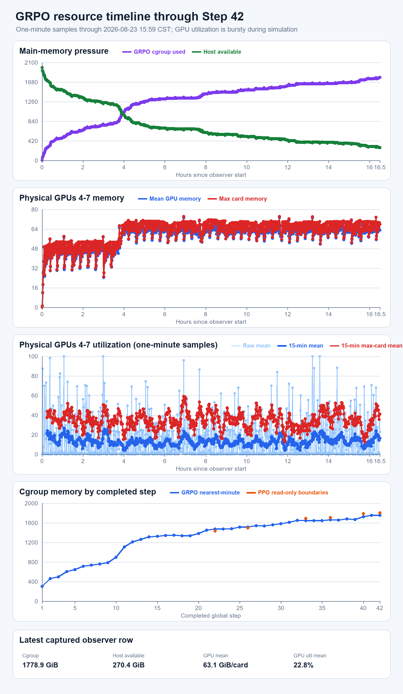

# 深圳 GRPO Step 42 现场指标、资源与 PPO 同轴刷新

> 现场截点：2026-08-23 15:59:59 CST。本文只描述这一截点已经完整落盘的 Step 1–42；截点时 Step 43 正在第 2/4 个 rollout epoch。服务器训练未被本轮检查干预。

## 1. 先给结论

GRPO 的训练链当前是健康的，而且行为成功率已经进入约 95% 的高位区间：

- 最新完整 Step 42：训练 rollout `493/512 = 96.29%`；
- 最近 5 步均值：`95.20%`；最近 10 步均值：`94.96%`；
- Step 40 fixed-64：`63/64 = 98.44%`，Step 10/20/30/40 为 `57/60/62/63`，连续提高；
- Step 1–42 的 KL、clip fraction、grad norm、ratio deviation 全部有限，日志中没有 traceback、OOM、worker crash 或非有限值。

但是资源结论和训练指标不同：**主机内存仍在增长，不能说已经平台化。** 截点 observer 的 cgroup 使用约 `1778.9 GiB`，主机 available 约 `270.4 GiB`；Step 37–42 的线性斜率约 `+21.81 GiB/step`，明显高于 Step 31–36 的 `+6.87 GiB/step`。现场还没有换页抖动、memory pressure 或 OOM event，但余量不足以支持“按当前趋势一定能自然到 Step 100”的判断。

因此当前判断是：

- 优化与成功率：绿；
- GPU 显存：可运行，峰值约 `74.1 GiB/卡`；
- 主机内存：黄偏红，是唯一主要运行风险；
- 存储：正常，`/data` 仍约 `3.0 TiB` 可用；
- 本轮动作：只读检查和本地画图，没有停止、重启或更改训练。

## 2. 现场运行状态

| 项目 | 15:59:59 CST 现场 |
|---|---:|
| 最新完整 step | `42/100` |
| 正在执行 | Step 43 rollout `2/4` |
| driver / resource observer | alive / alive |
| Ray workers | actor `4`、rollout `4`、EnvWorker `4` |
| Ray control plane | GCS `1`、raylet `1` |
| fatal pattern | `0` |
| metrics 非有限 token | `0` |
| driver/observer exit marker | 均未出现，符合仍在运行 |

这里的 `4` 个 EnvWorker 不是只有 4 个仿真环境；每个 worker 承担配置分给它的一批环境，总并发仍是 `128 train env`。

## 3. 成功率：Step 1–42 全历史与 PPO 同轴

### 3.1 GRPO 自身的阶段变化

| 完整 step 区间 | GRPO 训练 rollout 成功率均值 |
|---|---:|
| 1–10 | `78.75%` |
| 11–20 | `88.22%` |
| 21–30 | `92.58%` |
| 31–40 | `94.51%` |
| 41–42 | `95.31%` |

曲线说明成功率已经从前 10 步的约 79% 提升到最近约 95%，但最近十余步主要是围绕高位波动，而不是继续以早期速度上升。可以称为“接近高位平台”，不能仅凭 42 步证明最终完全收敛。

### 3.2 fixed-64 是更重要的同种子比较

| checkpoint | GRPO fixed-64 | PPO fixed-64 | GRPO − PPO |
|---:|---:|---:|---:|
| Step 10 | `57/64` | `58/64` | `-1/64` |
| Step 20 | `60/64` | `62/64` | `-2/64` |
| Step 30 | `62/64` | `58/64` | `+4/64` |
| Step 40 | `63/64` | `62/64` | `+1/64` |

GRPO 最近 10 步训练 rollout 均值为 `94.96%`，同轴 PPO 为 `91.82%`，差 `+3.14` 个百分点；最近 5 步差 `+2.66` 个百分点。训练 rollout 是各自当前策略产生的 on-policy 样本，不是 held-out 评估。fixed-64 的 Step 40 差距只有一条 episode，也不能单独当作显著优于 PPO 的结论。可以确认的是：GRPO 没有因为 current-base 迁移而退化，且 fixed-64 已到 `63/64`。

## 4. 优化指标与每步耗时

| 指标 | GRPO 最新 Step 42 | GRPO 最近 10 步均值 | GRPO Step 1–42 范围 | PPO 最近 10 步均值 |
|---|---:|---:|---:|---:|
| approximate KL | `0.019` | `0.0132` | `0.0029–0.042` | `0.0117` |
| clip fraction | `0.079` | `0.0581` | `0.021–0.105` | `0.0534` |
| pre-clip grad norm | `13.832` | `12.688` | `6.817–28.755` | `25.947` |
| ratio abs | `0.077` | `0.0695` | `0.043–0.150` | — |
| policy loss abs | `0.133` | `0.1545` | 有限 | — |

这些序列没有单向爆炸或突然塌到零。GRPO 的 grad norm 比 PPO 小并不自动意味着“更好”，因为这里是 group-relative、actor-only 更新，而 PPO 还有 critic/GAE 路径；它能支持的结论只是当前更新强度稳定，没有梯度失控。

耗时口径：

| 项目 | GRPO | PPO 同轴 |
|---|---:|---:|
| 完整 step 中位数 | `1378.85 s = 22m59s` | `1563.10 s = 26m03s` |
| rollout 中位数 | `1350.15 s = 22m30s` | `1535.15 s = 25m35s` |
| actor update 中位数 | `22.78 s` | `22.94 s` |
| 最近 10 步均值 | `1388.44 s = 23m08s` | `1613.50 s = 26m54s` |

GRPO 的中位完整 step 比 PPO 快约 `11.8%`；最近十步快约 `14.0%`。两者 actor update 几乎相同，GRPO 的观测差距来自 rollout 段。GRPO 自身约 `97.9%` 的完整 step 时间都在 rollout。Step 40 的 `1634.4 s` 比邻近步长，是 fixed-64 与 checkpoint 的周期性开销，不是训练卡死。

Step 42 日志给出的 ETA 为约 `22h30m`；按最近十步均值独立估算剩余 58 步也约 `22h23m`。这个时间估计只在进程和资源能够继续维持时成立。

## 5. 资源全时序：显存够，主存未平台

分钟级 observer 共 `988` 条有效样本，从 08-22 23:28:57 CST 连续到 08-23 15:59:14 CST；最大相邻间隔 `61 s`，没有资源曲线断档。

### 5.1 当前与峰值

| 资源 | 当前/最近采样 | 全段峰值或最低余量 |
|---|---:|---:|
| cgroup memory | `1778.9 GiB` | `1779.0 GiB` |
| host available | `270.4 GiB` | 最低 `270.4 GiB` |
| GPU mean memory | `63.1 GiB/卡` | 单卡最高 `74.1 GiB` |
| GPU 1-minute mean utilization | 当前 `22.8%` | 全段均值 `13.2%`、P90 `40.3%` |

15:59:59 CST 的直接 `nvidia-smi` 处在一轮较低显存相位：GPU 4–7 分别为 `59901/60763/61571/60069 MiB`，利用率 `2/0/2/0%`。一分钟采样的低中位利用率不表示 GPU 一直空闲：仿真、环境同步和模型推理是突发交替的；全段有 `24.4%` 的分钟样本至少一张卡达到 80% 利用率。

### 5.2 主存由哪里来

现场 cgroup 选定分项：

| 分项 | 现场量 |
|---|---:|
| anonymous memory | `1694.1 GiB` |
| file cache | `78.5 GiB` |
| shmem | `23.2 GiB` |
| page tables | `3.6 GiB` |
| slab | `1.85 GiB` |

进程 RSS 聚合为：4 个 EnvWorker 约 `1655.1 GiB`，4 个 actor 约 `37.2 GiB`，4 个 rollout worker 约 `21.2 GiB`。RSS 含共享页，不能把这些数直接相加当 cgroup 总量；但它和 `1694.1 GiB` anonymous memory 一起明确说明，主存主体仍在仿真 EnvWorker，而不是 checkpoint 文件缓存或 actor 权重。

Swap 已使用约 `5.95/6.0 GiB`，但三次 `vmstat` 的 `si/so` 都为 `0/0`，cgroup 与主机 memory PSI 的 10/60/300 秒平均都为 `0`，`memory.events` 的 `high/max/oom/oom_kill` 全为 `0`。也就是说“目前没有换页抖动或 OOM”，不等于“后续余量充足”。

### 5.3 为什么不能继续说增长已经放慢

| 对齐点 | cgroup memory |
|---:|---:|
| Step 30 | `1580.5 GiB` |
| Step 36 | `1658.4 GiB` |
| Step 37 | `1654.8 GiB` |
| Step 38 | `1680.0 GiB` |
| Step 39 | `1668.0 GiB` |
| Step 40 | `1724.8 GiB` |
| Step 41 | `1751.2 GiB` |
| Step 42 | `1753.4 GiB` |

- Step 31–36：约 `+6.87 GiB/step`；
- Step 37–42：约 `+21.81 GiB/step`；
- Step 31–42 合并：约 `+11.74 GiB/step`。

Step 37/39 的回落说明分钟对齐值受 rollout 相位影响；Step 40 又包含 fixed eval/checkpoint，所以不能把最近六步直线当成精确内存泄漏速率。但 Step 41/42 仍保持在新高位，足以否定“已经稳定在约 1.65 TiB”的旧判断。若只做示意性线性外推，当前约 270 GiB 余量只对应约 12–23 个近期 step，明显少于剩余 58 步；这不是预测 OOM 的精确时刻，但说明 formal-100 不能在没有进一步观测的情况下被视为资源上稳妥。

当前只读证据能定位到“EnvWorker 一侧的匿名内存保留量继续抬高”，还不能在不增加进程内观测的情况下区分：Python/SAPIEN 对象真正不可达却未释放、仿真资源仍被引用，或 allocator 只保留了已经用过的高水位内存。因此本文称它为**持续增长/未平台**，不把它冒充成已经定位到具体对象的 memory leak。

## 6. 主要产物与磁盘

| 产物 | 现场 |
|---|---:|
| run 根目录 | `69 GiB`（`du -sh`） |
| checkpoints | Step `10/20/30/40`，各约 `18 GiB` |
| train MP4 | `680` 个，约 `163.5 MiB` |
| eval MP4 | `16` 个，约 `2.06 MiB` |
| TensorBoard event | `104,004 bytes` |
| `/` | 296 GiB 总，234 GiB 可用，18% 使用 |
| `/data` | 3.5 TiB 总，约 3.0 TiB 可用，10% 使用 |

训练产物位于 `/data/chenyiteng/results/...`，没有挤根分区。Windows 本地只取回日志、CSV、JSON 和三张 PNG，共约 `1.02 MiB`；没有下载 checkpoint 或全量视频。

## 7. 本轮可复核入口

- 全历史训练标量：[`grpo_console_scalars_step1_42.csv`](evidence/grpo_v2_live_current_20260823/grpo_console_scalars_step1_42.csv)
- Step 对齐资源：[`grpo_resource_nearest_minute_step1_42.csv`](evidence/grpo_v2_live_current_20260823/grpo_resource_nearest_minute_step1_42.csv)
- 分钟原始资源：[`resource.csv`](evidence/grpo_v2_live_current_20260823/resource.csv)
- 原始 metric table：[`metrics.log`](evidence/grpo_v2_live_current_20260823/metrics.log)
- 原始 driver 输出：[`driver.log`](evidence/grpo_v2_live_current_20260823/driver.log)
- 机器可读汇总：[`summary_step42.json`](evidence/grpo_v2_live_current_20260823/summary_step42.json)
- 逐命令流水：[`evidence/20_GRPO_CURRENT_REFRESH_LEDGER_20260823.md`](evidence/20_GRPO_CURRENT_REFRESH_LEDGER_20260823.md)
