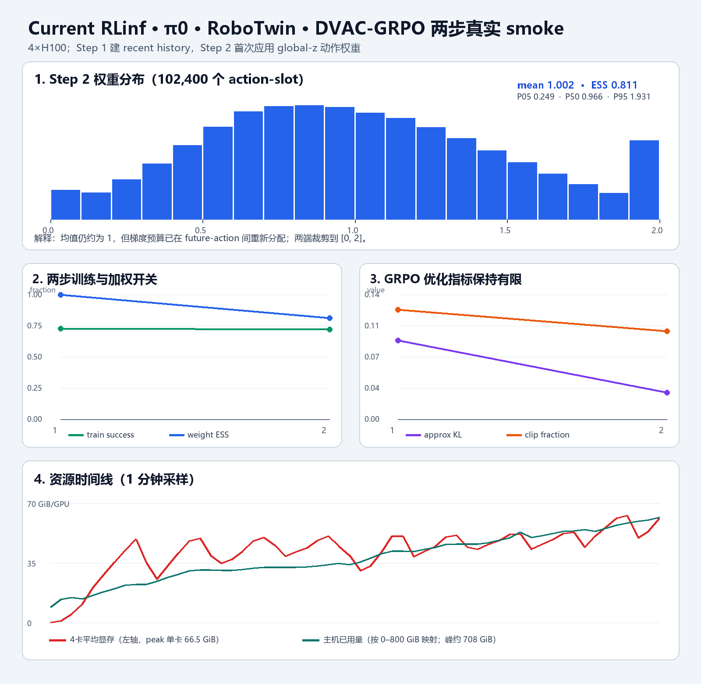

# current RLinf × π0 × RoboTwin DVAC-GRPO：两步真实 smoke 结果

## 结论

实现与端到端运行均已闭环。4 卡真实 smoke 在 2026-08-24 17:13:51--18:11:07 CST 自然完成，
`exit_code=0`；Step 1 建立 recent history，Step 2 首次应用非均匀 global-z 权重，随后完成 GRPO
optimizer update、fixed-64 和 `global_step_2` checkpoint。

## 关键结果

| 项目 | Step 1 | Step 2 |
|---|---:|---:|
| train success | 72.85% | 71.88% |
| DVAC warm-up | 是 | 否 |
| weight mean | 1.000 | 1.002 |
| weight ESS fraction | 1.000 | 0.811 |
| weight P05 / P50 / P95 | 1 / 1 / 1 | 0.249 / 0.966 / 1.931 |
| approx KL | 0.088 | 0.030 |
| clip fraction | 0.123 | 0.099 |
| grad norm | 29.715 | 29.729 |

Step 2 fixed-64 为 `49/64=76.56%`。这是工程 smoke，不用两步 success 判断方法收益。

Step 2 汇总了 4 ranks 共 102,400 个 action-slot：权重范围 `[0,2]`，均值保持约 1，说明总梯度尺度
基本保持，同时确实在 future-action 间重新分配；低/高 z 裁剪比例分别约 0.98% / 4.10%。

## 资源与产物

- physical GPU 0--3；单卡峰值约 61.8--66.5 GiB。
- driver 存活期主机 available 最低约 1,307 GiB，即本 run 峰值使用约 708 GiB；退出后恢复约 1.86 TiB。
- 完整 checkpoint 包含 4 个 DCP shard、metadata、约 8.07 GB full weights 和 4 个
  `dvac_state_rankNNNN.json` exact-resume sidecar。
- RLT 同期在 physical GPU 4--5 正常运行，资源和 Ray namespace 未混用。



## formal 参数判断

不建议把本次高负载验证用的 `128 env × 4 rollout epochs / B2048` 原样跑 100 步。它每步 512 条
trajectory，并复现了常驻 env 主存逐步抬高；旧深圳 GRPO 正是在同轴配置下于 Step 53 触发 Ray 95%
内存阈值。

推荐正式首格回到 current recipe 与旧 AutoDL DVAC 成功预算共同支持的：

```text
4×H100
32 train env × 8 rollout epochs = 256 trajectories/step
G=8（32 groups）
actor global batch 512 / micro batch 32 / update epochs 2
global-z L=3 / recent-5 / warm-up 1 / weight [0,2]
100 outer steps；fixed-64 + checkpoint 每 10 步
```

它不改模型、算法、group 数、每组大小或单步有效样本定义，只把深圳此前翻倍的 trajectory/B2048
预算恢复到 current/AutoDL DVAC 有直接依据的 256/B512，并显著降低常驻 simulator 主存风险。

## 证据入口

- 轻量原始材料：[`evidence/current-dvac-grpo-smoke2-20260824/`](evidence/current-dvac-grpo-smoke2-20260824/)
- 实施流水：[`evidence/22_CURRENT_RLINF_DVAC_GRPO_IMPLEMENTATION_AND_SMOKE_LEDGER_20260824.md`](evidence/22_CURRENT_RLINF_DVAC_GRPO_IMPLEMENTATION_AND_SMOKE_LEDGER_20260824.md)
- 实现分支：`personal/codex/sz-current-pi0-dvac-grpo`，commit `66c863bc5a45e90cb5161b30af54355b1104c810`

