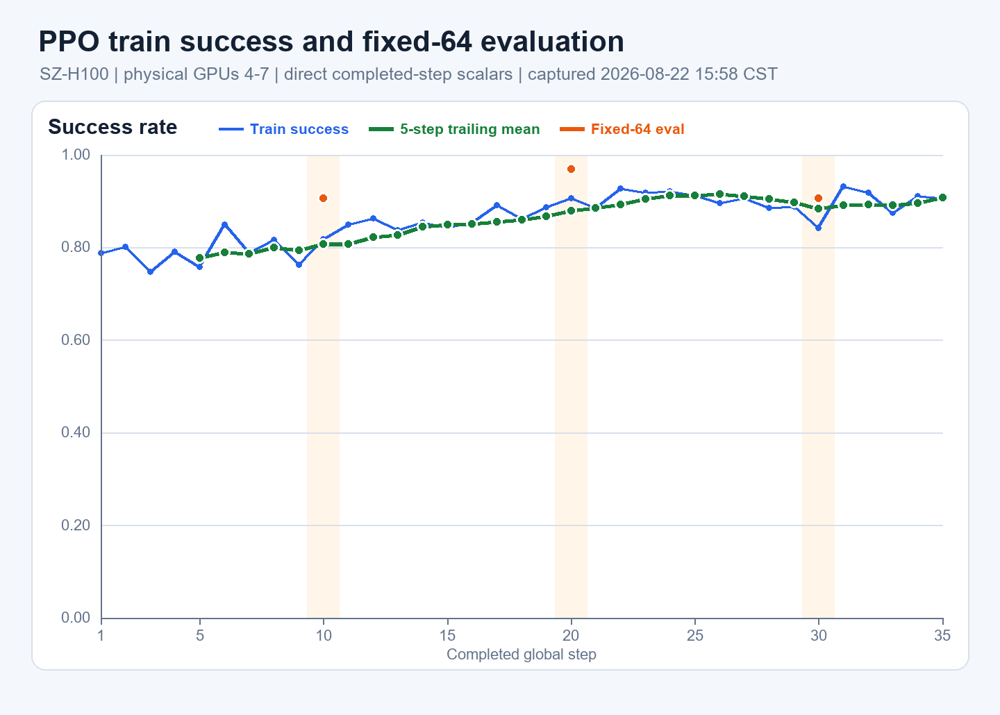
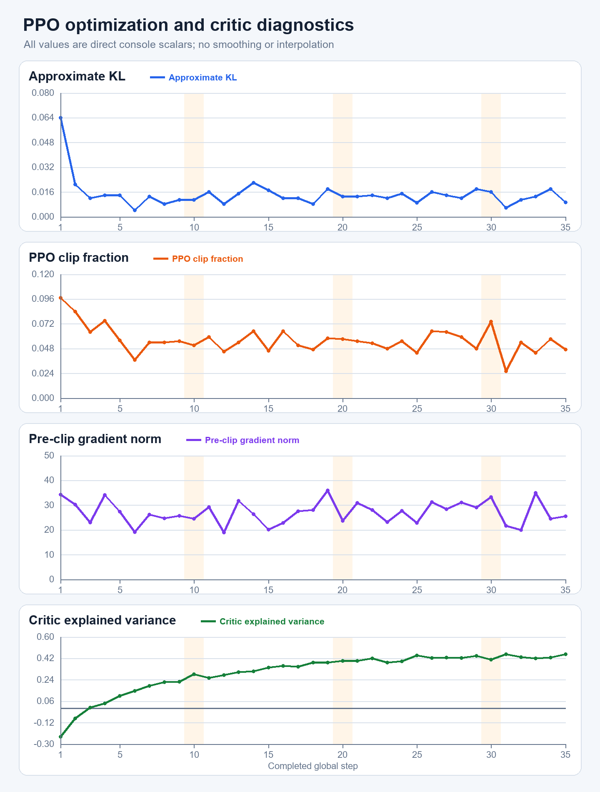
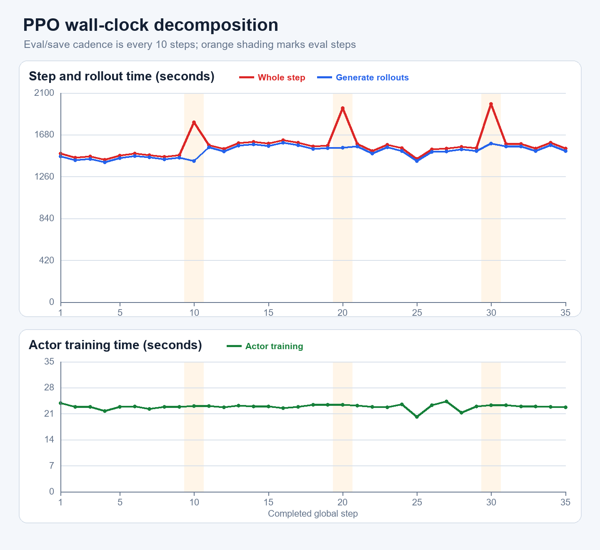
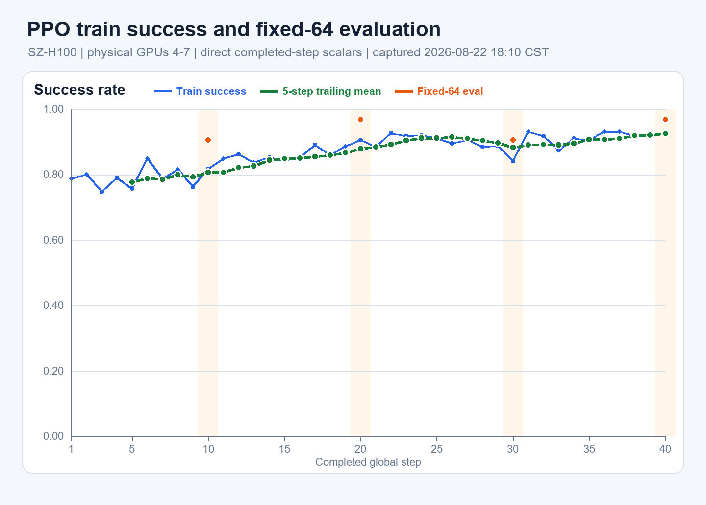
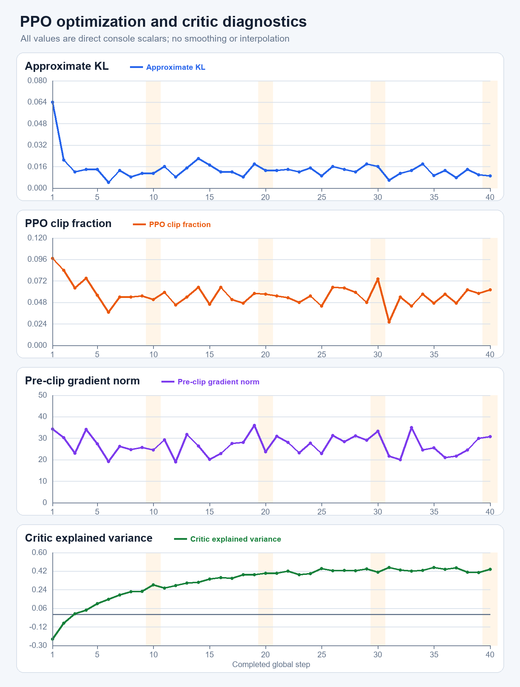
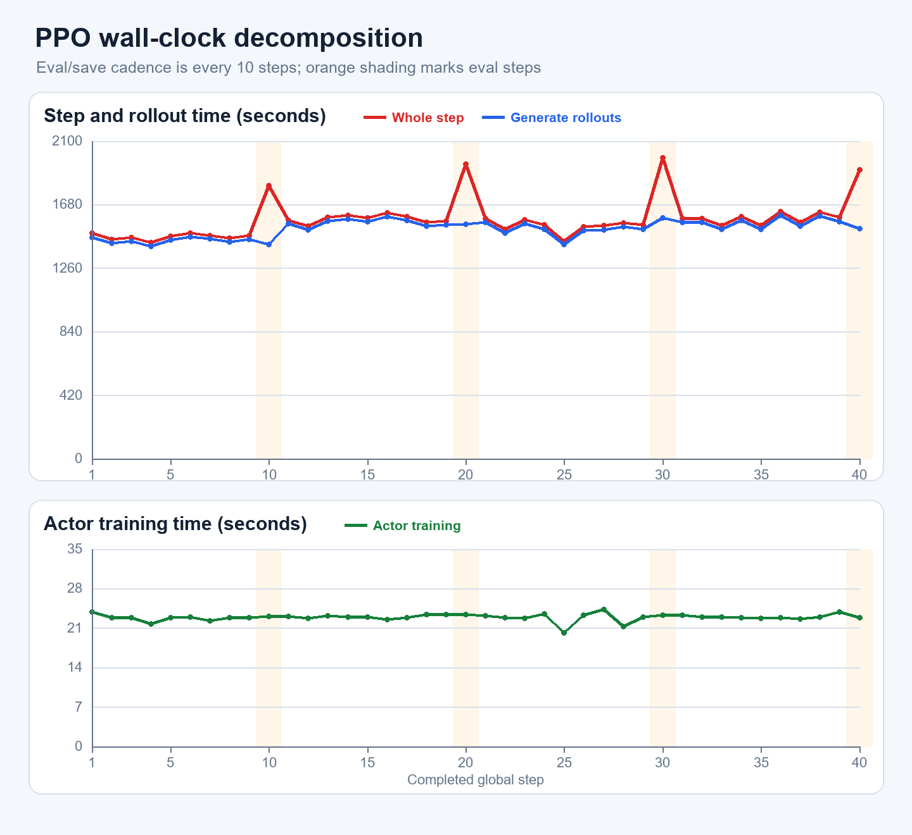
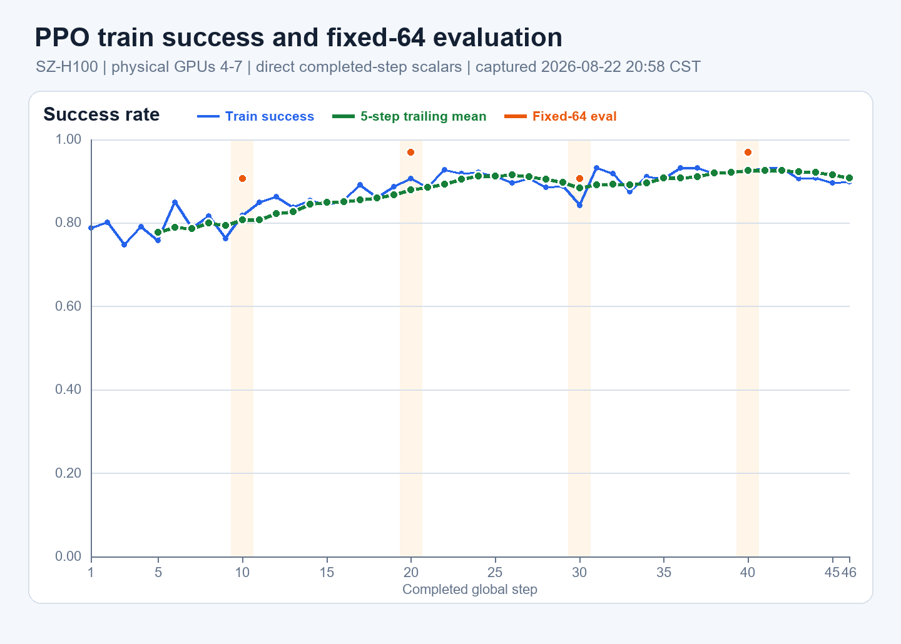
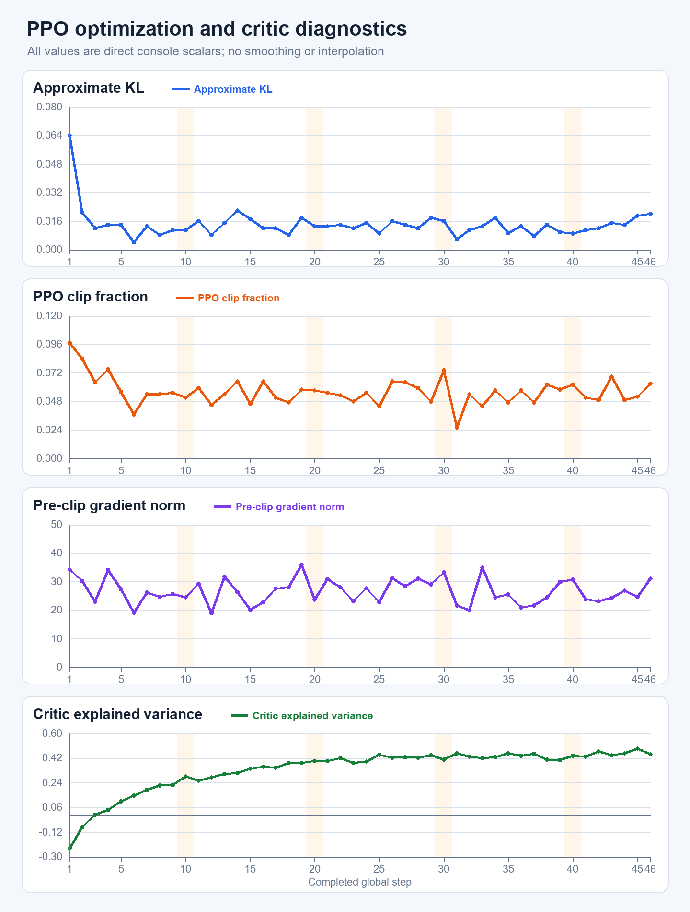
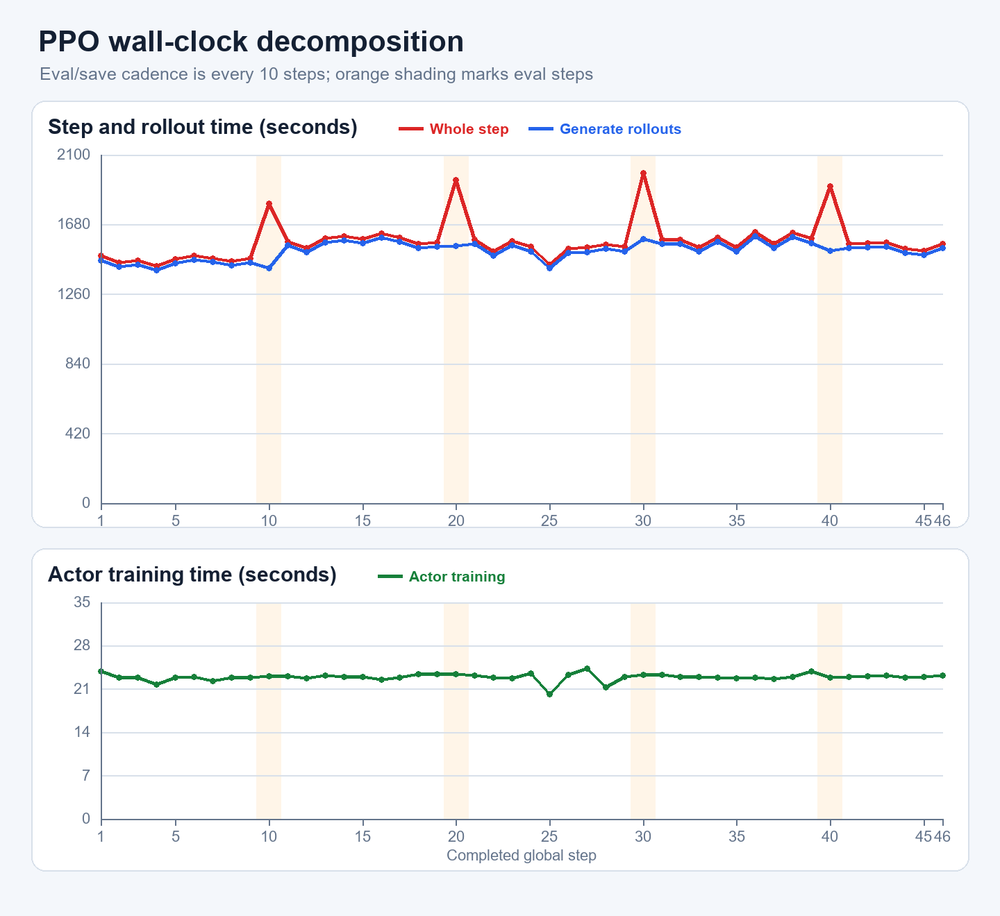
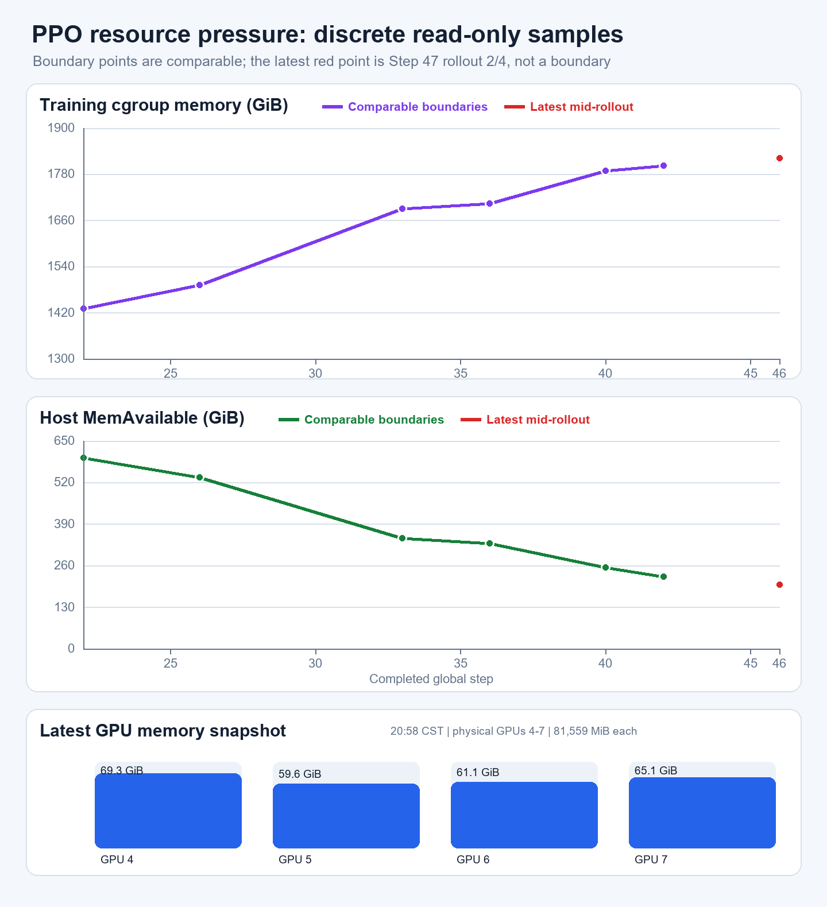

# SZ-H100 PPO Step 1–40 训练曲线与内存复核（2026-08-22）

取数窗口：2026-08-22 15:58–16:05 CST。服务器操作全部只读；没有控制进程、修改训练、写服务器文件或
运行 GPU benchmark。

## 1. 当前现场

- driver PID `1375834` 与 Ray alive；15:58 已完整输出 `Global Step 35/100`，随后进入下一步 rollout
  `1/4`；fatal 扫描为 `0`。
- checkpoint 为 `global_step_10/20/30`；Step 40 尚未到达。
- GPU 0–3 无 compute process；GPU 4–7 全部属于本次 PPO，现场约 `59.9–61.1 GiB/卡`。
- cgroup `memory.current=1,819,746,865,152 B=1.655 TiB`，host
  `MemAvailable=356,529,264 KiB=340.0 GiB`，swap.current=0，
  `high/max/oom/oom_kill=0/0/0/0`。
- 当前内存点位于下一步 rollout `1/4`，不能和 15:00 的 next `0/4` 点直接算同相位斜率；此前
  Step 26→33 的同相位增长风险仍见
  [`08_SERVER_PPO_LIVE_REFRESH_20260822.md`](08_SERVER_PPO_LIVE_REFRESH_20260822.md)，本图包不宣称内存已经平台化。

## 2. 数据口径与复现

只读 command file：

| 文件 | SHA256 | 结果 |
|---|---|---|
| `local_scripts/remote_commands/shenzhen_ppo_curve_source_refresh_20260822.sh` | `17fa16a31ca8514e08ae5287890a325e1c8171948f4b669962a819f955ba38eb` | `chenyiteng / exit 0`；PID、progress、source、checkpoint、GPU/RAM |
| `local_scripts/remote_commands/shenzhen_h100_topology_readonly_20260822.sh` | `9f81b31ce9d5c8724b5d77f88d73cc178f78f10109c565fced0f056856c05ae6` | `chenyiteng / exit 0`；型号、PCI BDF、`topo -m`、NVLink status |
| `local_scripts/render_shenzhen_ppo_curves_20260822.py` | `6b495a47d5829d9d9592b4a4eaad423a8db8243a62f8676311bae3fd2cbd0bd2` | 本地解析、连续性/finite 检查与 PNG 渲染 |

固定 host-key 的 Paramiko/SFTP 将运行中的只读快照复制到本地：

| 本地证据 | bytes | SHA256 |
|---|---:|---|
| [`ppo_formal100_events_live_20260822.tfevents`](ppo_formal100_events_live_20260822.tfevents) | 101,266 | `37e396d4f9b085063dcf5dea06e81e3cd4e0cc04b6a86c15334a491605837938` |
| [`ppo_formal100_metrics_live_20260822.log`](ppo_formal100_metrics_live_20260822.log) | 235,812 | `9d982913eda5a15c202a75d58185619d769818b43bb4117bfbd682182b3822cb` |
| [`ppo_formal100_console_scalars_step1_35_20260822.csv`](ppo_formal100_console_scalars_step1_35_20260822.csv) | 2,282 | `53651b560f17d066565e585390b3354e4176209cf00372c4197d0a79ed026c9b` |

曲线从第一个真实 `Global Step 1` 开始，到本次快照最新完整 Step 35，共 35 行连续记录；不构造 Step 0。
图中 train/optimizer/time 均取 `metrics.log` 的完整 console table，以包含尚未异步 flush 到 TensorBoard 的
最新完整 step；TensorBoard event 原件同时保留供后续精确标量复核。35 行所需字段全部存在且 finite。

- `5-step trailing mean` 只在凑齐 5 个真实点后的 Step 5 开始，不用短窗口补前四点。
- fixed-64 eval 只有 Step 10/20/30 三个真实点；图中不连接、不插值。
- run 内没有 `.csv`、resource/monitor 时序文件，只有 `metrics.log` 和 TensorBoard event；因此本轮不画
  cgroup/MemAvailable 曲线，也不把零散只读快照伪装成连续时序。

## 3. Success 与 fixed-64 eval

- train success：Step 1 `78.71%`，Step 35 `90.63%`；全段均值 `85.97%`，最新完整 5-step 均值
  `90.82%`。最低为 Step 3 `74.80%`，最高为 Step 31 `93.16%`。
- fixed-64 eval：Step 10/20/30 分别为 `58/64=90.63%`、`62/64=96.88%`、`58/64=90.63%`。
  训练 success 的平滑趋势向上，但三次 held-out 点并不单调；当前可以说训练正常，不能据三点声称
  fixed-eval 持续提升。

## 4. PPO 优化与 critic

- approximate KL 范围 `0.0043–0.064`，Step 35 为 `0.0092`；首步较高后进入约 `0.01–0.02` 主体区间。
- clip fraction 范围 `0.026–0.097`，Step 35 为 `0.047`；没有持续上冲。
- pre-clip grad norm 范围 `18.993–36.021`，Step 35 为 `25.563`；全部 finite。
- critic explained variance 从 Step 1 的 `-0.240` 上升到 Step 35 的 `0.455`，全段最高 `0.456`；这是
  当前最清楚的优化侧改善信号。

## 5. 时间分解

- 全段中位数：whole step `1,544.6 s`、generate rollouts `1,518.3 s`、actor training `22.954 s`。
- 中位比例约为 rollout `98.35%`、actor training `1.48%`；瓶颈明确在 simulator rollout，不在 optimizer。
- 非 eval step 的 step-time 中位数为 `1,543.2 s`。Step 10/20/30 的 whole-step 为
  `1,807.0 / 1,949.0 / 1,987.3 s`，对应定期 eval/save 峰值。

## 6. 只读硬件拓扑补充

8 张卡现场查询名均为 `NVIDIA H100 80GB HBM3`、`81,559 MiB`、PCI device ID `0x233010DE`，driver
`575.57.08`。`nvidia-smi topo -m` 显示任意 GPU 对均为 `NV18`；每卡 Link 0–17 均报告
`26.562 GB/s`。GPU 0–3 位于 NUMA 0，GPU 4–7 位于 NUMA 1，因此当前 4–7 卡训练处在同一 NUMA 节点。
这里只记录可见拓扑，不把 link status 当吞吐 benchmark。

## 7. 16:20 CST live addendum

图表仍严格止于已解析并保存在本地的 Step 1–35；本节只追加一个更晚的服务器现场点，不把它伪装进
既有曲线。

- 16:20:35 CST 已完整输出 `Global Step 36/100`，随后进入下一步 rollout `0/4`；driver/Ray alive，
  fatal 扫描仍为 `0`，checkpoint 仍为 `global_step_10/20/30`。
- GPU 4–7 约 `57.4–58.9 GiB/卡`，GPU 0–3 无 compute process。
- cgroup `memory.current=1,829,376,409,600 B=1.664 TiB`，host
  `MemAvailable=346,214,632 KiB=330.2 GiB`，`high/max/oom/oom_kill=0/0/0/0`。
- 与 Step 33 后同为 next `0/4` 的点相比，Step 33→36 cgroup 共增加约 `13.42 GiB`，三步均摊约
  `+4.47 GiB/step`；MemAvailable 共下降约 `14.80 GiB`，均摊约 `-4.93 GiB/step`。这比 Step 26→33
  的近期斜率明显减缓，但窗口只有三步且仍为正增长，故只能说**增长暂时放缓**，不能宣称内存已经
  平台化或据此外推到 Step 100。

## 8. 18:10 CST Step 40 完整刷新

本节重新下载完整 `metrics.log` 并将曲线扩展到连续 Step 1–40；旧 Step 1–35 原件仍保留，不覆盖。

| 新证据 | bytes | SHA256 |
|---|---:|---|
| [`ppo_formal100_metrics_live_step1_40_20260822.log`](ppo_formal100_metrics_live_step1_40_20260822.log) | 270,056 | `50783a5fa4983c90d1ada92789face2caa721709be5ba26066a5262412400c7b` |
| [`ppo_formal100_console_scalars_step1_40_20260822.csv`](ppo_formal100_console_scalars_step1_40_20260822.csv) | 2,597 | `3261b9b013254ebaf2e1b048699e94494b036374b64b4c129388b88d4ca514f9` |
| [`ppo_formal100_success_eval_step1_40_20260822.png`](ppo_formal100_success_eval_step1_40_20260822.png) | 54,385 | `1b8b6343734bf493d8bad79432aa31323446c20173c897a1bc0b4a8f6d809f92` |
| [`ppo_formal100_optimization_step1_40_20260822.png`](ppo_formal100_optimization_step1_40_20260822.png) | 109,010 | `11df2854fd079d712b57b3c1f962d857904f5c78897130543a40f13ba1170d13` |
| [`ppo_formal100_timing_step1_40_20260822.png`](ppo_formal100_timing_step1_40_20260822.png) | 69,581 | `e59e1fb3702850b5cc367deee5ded30a505b9b9dd77c773df76f484c1a0a1e8a` |

只读 closeout command SHA256 为
`f7ae802cb2b1c962518f75a064e421c7ec3e70e644d8697848ccb7f20fb9a02b`；本地解析/绘图脚本 SHA256 为
`222d81b687955d303190a31b68f1e27cec2895efdeb94c43ba329e82044995fd`。

- Step 40 train success=`92.58%`；Step 36–40 的完整5步均值=`92.54%`。Step 1–40均值=`86.79%`。
- fixed-64 eval在Step 10/20/30/40依次为`58/62/58/62`，即`90.63/96.88/90.63/96.88%`；
  曲线正常但仍不能由4点宣称单调提升。

- Step 40的KL=`0.0089`、clip fraction=`0.062`、pre-clip grad norm=`30.747`、critic explained
  variance=`0.437`；全部finite，且仍位于既有Step 1–40范围内。没有优化器发散信号。

- 全段中位数：whole step=`1,561.85 s`、rollout=`1,528.05 s`、actor training=`22.94 s`；瓶颈仍是
  simulator rollout。Step 40含eval/save共`1,908.6 s`。
- Step 40 checkpoint已完整出现，fixed-64 eval完成，随后已进入Step 41的`0/4`；driver仍alive，fatal与
  cgroup `high/max/oom/oom_kill`均为0。
- Step 40同相位：`memory.current=1,920,436,883,456 B≈1.747 TiB`，host
  `MemAvailable=266,727,452 KiB≈254.4 GiB`。相对Step 36同为next `0/4`，4步内cgroup增加约
  `84.8 GiB`（约`+21.2 GiB/step`），MemAvailable下降约`75.8 GiB`（约`-18.95 GiB/step`）。

结论：训练数值和checkpoint均正常，但主存增长**没有平台化，反而比Step 33→36短窗明显加快**。
因此不建议为了“再看看”继续等到Step 60；Step 40是已有完整checkpoint/eval的自然停止点。停止仍需用户明确授权。

## 9. 19:02 CST 只读状态补充

- 曲线仍只画到已完整下载解析的Step 40，不把后续现场点伪装成曲线数据。
- 现场已完整到Step42并进入Step43 `0/4`；driver alive，fatal与cgroup OOM事件仍为0。
- cgroup约`1.760 TiB`、host `MemAvailable≈225.4 GiB`；相对Step40同为next-step `0/4`，两步后仍为
  cgroup约`+14.1 GiB`、host available约`-29.0 GiB`。因此Step42边界没有改变“不等Step60”的判断。
- 本次仍只读，未向owned driver发送signal。

## 10. 20:58 CST：曲线扩展到最新完整 Step 46

本次重新SFTP下载运行中的完整`metrics.log`与TensorBoard event，解析连续Step1–46；旧Step1–40原件和
PNG全部保留，没有覆盖。远端只读command SHA256为
`a33f38347e6812c9552366cb0de2349e8c5f5ac2718e8ec29032b95098e87bcf`；本地解析/绘图脚本SHA256为
`7677a2fa0bfdef95297ef3726185947420cee53cf102000c7a2ea5ea0f3b9bc9`。

| 新证据 | bytes | SHA256 |
|---|---:|---|
| [`ppo_formal100_metrics_live_step1_46_20260822.log`](ppo_formal100_metrics_live_step1_46_20260822.log) | 309,980 | `ae633a12667cba3be32d7c47a667d84c77eb75404b06000a2ba718dae4b8de73` |
| [`ppo_formal100_events_step1_46_20260822.tfevents`](ppo_formal100_events_step1_46_20260822.tfevents) | 133,122 | `8daa0b7aa15dbd3d8c12b286a5bdaae84f4c420f80579f2b159884f908bbe215` |
| [`ppo_formal100_console_scalars_step1_46_20260822.csv`](ppo_formal100_console_scalars_step1_46_20260822.csv) | 2,958 | `e73a7320d9128222eb82a9a4a8afc35941638a4050d3a7beec662650b78cc626` |
| [`ppo_formal100_success_eval_step1_46_20260822.png`](ppo_formal100_success_eval_step1_46_20260822.png) | 55,345 | `0f2d6a124d9966229bcdb94cec7018f32d973bb7d2f5026caf7d1a4836603f4b` |
| [`ppo_formal100_optimization_step1_46_20260822.png`](ppo_formal100_optimization_step1_46_20260822.png) | 111,579 | `cb6ee3dbcf681683e9b772902f13c5962f079a32e3acfb14a7d431fcf89ffc0d` |
| [`ppo_formal100_timing_step1_46_20260822.png`](ppo_formal100_timing_step1_46_20260822.png) | 71,036 | `46aa3966cc639322fc1ae790576d1c190cf9c81f17674bd52fd6da9be1aace14` |
| [`ppo_formal100_resource_discrete_samples_through_step46_20260822.csv`](ppo_formal100_resource_discrete_samples_through_step46_20260822.csv) | 1,002 | `40138b698287e2767cf0495efcd8b9582bcc3e84e464934f1b390c4b69202624` |
| [`ppo_formal100_resource_discrete_through_step46_20260822.png`](ppo_formal100_resource_discrete_through_step46_20260822.png) | 97,093 | `d88be4365fd1cfaebb562636e3559c8916eb83e18b7bd4d631d4ff89adcc72c1` |

### 10.1 Success 与 fixed-64

- Step46 train success=`89.84%`；Step42–46均值=`90.82%`，最近10步均值=`91.68%`，Step1–46均值
  `87.36%`。十步分段均值为`79.18 → 86.47 → 89.82 → 91.68%`（Step1–40），Step41–46为
  `91.21%`。这更像到达约`90–92%`的高位平台后正常波动，而非仍在持续快速上升。
- fixed-64在Step10/20/30/40仍为`58/62/58/62`；没有Step46新评估点。四个点说明策略没有held-out
  collapse，但不支持“单调提高”或“已经统计收敛”两种更强断言。

### 10.2 优化与critic

- Step46的KL/clip fraction/grad norm/critic explained variance为
  `0.020/0.063/30.992/0.447`；仍在Step1–46既有范围内且全部finite。
- critic EV由Step1的`-0.240`升至高位约`0.4–0.49`；actor KL、clip和grad只有有界波动，没有持续
  上冲。当前没有训练数值发散证据。

### 10.3 时间分解

- Step1–46中位数：whole step=`1563.05 s`、rollout=`1535.15 s`、actor training=`22.94 s`。
- 非eval step均值=`1545.35 s`；Step10/20/30/40四个eval/save step均值=`1912.97 s`。墙钟仍由
  simulator rollout主导，optimizer不是四卡速度瓶颈。

### 10.4 离散资源曲线与最新GPU快照

本run没有resource monitor CSV/log；上图不是伪造的逐step曲线。紫/绿折线只连接Step22/26/33/36/40/42
的既有完整step边界快照；20:58 CST的红点是已完整Step46、正在Step47 rollout `2/4`的中段瞬时值，
故不与边界点相连。

- 最新cgroup=`1,955,901,038,592 B=1821.58 GiB≈1.779 TiB`；host
  `MemAvailable=210,635,256 KiB=200.88 GiB`。memory events仍为0，但可用内存约只剩整机的10%。
- 四个EnvWorker RSS合计约`1.679 TiB`，继续是cgroup主体；这不是GPU OOM或checkpoint page cache主导。
- GPU4–7瞬时显存为`69.3/59.6/61.1/65.1 GiB`；GPU0–3没有本次compute app。显存尚有余量，主存才是
  当前停止判断的决定性资源。

### 10.5 当前产物与决策边界

- run总量约`69.01 GiB`；Step10/20/30/40四个checkpoint各约`17.21 GiB`，各含约`7.514 GiB`
  `full_weights.pt`。train/eval视频为`743/16`个，日志和TensorBoard event持续更新。
- 最新完整训练指标是Step46，但最新**可恢复、同时带fixed-64 eval**的自然产物仍是Step40。
- 指标侧可以总结为“高位平台、无崩坏、优化稳定”；资源侧则已从黄灯进入很窄的主存余量。本次仍只读，
  没有stop/signal；是否用Step40停止由用户决定。

## 11. 21:20 CST 终态

用户审阅上述曲线后决定切换到正式 GRPO。停止前 PPO 已自然完整到 Step47；exact owned process group
先收 SIGINT，120秒后仍alive才收SIGTERM，随后退出，没有使用SIGKILL。约90秒后的管理员只读复核确认
GPU compute process为0、`MemAvailable≈1.948 TiB`。因此本run的训练标量终点是Step47，最新带fixed-64
评估且可恢复的checkpoint仍是Step40；本节已有Step1–46 PNG不重画一个几乎重合的Step47版本。
