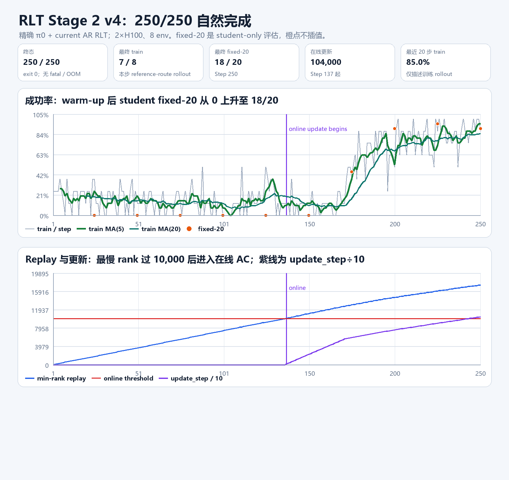

# RLT Stage 2 v4：Step 250 自然完成与资源判断

## 1. 当前状态

2026-08-24 19:57 CST，RLT v4 已自然完成 Step `250/250`，wrapper退出、`exit_code=0`，无 fatal/OOM/nonfinite；最终 `global_step_250` checkpoint 已存在。

- 最终 Step 250 train=`7/8`，fixed-20=`18/20`。
- fixed-20 轨迹：Step 175=`9/20`，Step 200=`18/20`，Step 225=`19/20`，Step 250=`18/20`。
- 最终 `update_step=104,000`；actor loss=`-0.090`、critic loss=`0.0014`，均为有限值。

最终三张图、逐步CSV、原始日志、TensorBoard与875,060-byte轻量ZIP统一见
[14号终态产物文档](14_RLT_STAGE2_V4_FINAL250_LIGHT_ARTIFACTS_20260824.md)。

## 2. 两卡资源与单卡判断

- GPU 4/5 显存峰值约 `21.7 GiB/card`，平均利用率约 `25.1%`，利用率随 RoboTwin rollout 呈脉冲。
- observer 期间主机 `MemAvailable` 最低约 `1309 GiB`；cgroup OOM/OOM-kill 均为 0。
- 因此从**容量**看，一张 H100 能装下模型；但当前两卡并不是为装下模型，而是历史可比的两 rank 合同。直接改一张卡会把 world size 从 2 改为 1，并改变梯度累积、每 rank replay/warm-up 分片和吞吐。
- 当前可比 baseline 继续保留两卡。若以后只求节省卡，应单独生成 1-GPU 配置，显式保持全局 replay/warm-up 与 batch 预算，而不是把当前命令机械砍成一卡。

## 3. 250 与 480

Step 250 是 AutoDL 已验证的正式基线终点：8 env × 250 cycles=`2,000` train episodes。Step 251–480 是同一 Stage 2、相同参数的 strict resume 延长线，不是第三阶段；历史 AutoDL 到 250 的 fixed-20 为 `18/20`，延长到 480 后为 `17/20`，说明后段主要验证高平台维持而非保证继续上升。

当前已完成250并核到final checkpoint/fixed-20。到250提醒已完成并删除；等待用户决定是否从完整 Step 250 按相同配置严格续到480，不自动启动。
